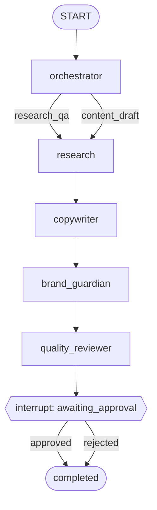

# SMM OS — Phase 0 Product Implementation

**Версия:** 1.0  
**Канон:** [SMM-OS-PRODUCT-ARCHITECTURE.md](./SMM-OS-PRODUCT-ARCHITECTURE.md) §15 P0  
**Длительность:** 4–8 недель (solo-realistic)  
**Цель:** первый платящий pilot может подключить Drive, получить grounded ответ, черновик поста и approve в UI.

---

## 0. Scope Freeze

### In P0

| Area | Deliverable |
|---|---|
| Tenancy | orgs, workspaces, members, RLS |
| Auth | Supabase Auth + JWT in FastAPI |
| Knowledge | Drive + manual PDF upload → parse → Qdrant |
| Agents | LangGraph: Orchestrator → Research → Copywriter → Brand Guardian → Quality Reviewer → HITL |
| API | runs, approvals, search, documents, sources |
| UI | minimal Vercel dashboard: login, upload/connect, ask, draft, approve |
| Obs | Langfuse + Sentry |
| Eval | 30 retrieval questions + 10 agent cases |

### Explicitly out of P0

- Notion / Slack / Telegram ingest (stub webhook only)
- Publish to social (Buffer etc.)
- Learning / Analytics agents
- Billing
- Hybrid search
- All 13 agents (only 5 nodes in graph)
- n8n business logic
- Self-serve signup polish

---

## 1. Exit Criteria (DoD)

| ID | Criterion | Proof |
|---|---|---|
| E1 | Tenant isolation: workspace A cannot read B rows or vectors | Automated tests green |
| E2 | ≥10 docs ingested from Drive and/or PDF for pilot workspace | Admin checklist |
| E3 | Retrieval precision@5 ≥70% on eval set | `eval/reports/p0-retrieval.md` |
| E4 | Research answers 8/10 questions with valid chunk citations | Eval sheet |
| E5 | End-to-end: brief → draft → Brand+QC scorecard → approval card | Demo recording |
| E6 | HITL: reject/edit/approve persists; no side effect without approve | Test |
| E7 | Every run visible in Langfuse with model+cost | Screenshot |
| E8 | Sentry receives a test error | Confirmed |
| E9 | Deployed: API on Railway, UI on Vercel, Supabase+Qdrant cloud | URLs |

**Pilot promise:** «Connect Drive → ask about your product → get on-brand draft → you approve.»

---

## 2. Week Plan

| Week | Focus | Output |
|---|---|---|
| 1 | Repo, Supabase schema+RLS, Auth, FastAPI hello | Migrated DB, `/health`, login works |
| 2 | Qdrant, embed pipeline, PDF upload, Drive via n8n webhook | Search API returns citations |
| 3 | Eval harness + retrieval tuning | precision@5 ≥70% or documented gap ≤1 week |
| 4 | LangGraph 5-node + LiteLLM router | Research+Copy runs traced |
| 5 | Brand Guardian + Quality Reviewer + interrupt HITL | Approval cards in DB |
| 6 | Vercel UI (runs list, draft view, approve) | Clickable pilot path |
| 7 | Hardening: isolation tests, cost caps, runbooks | E1,E7,E8 |
| 8 | Buffer / pilot onboard + P0 gate review | Go/No-Go → P1 |

Solo compressed: merge 6–7; do not cut E1–E6.

---

## 3. Repository Structure

```
smm-os/
├── apps/
│   ├── api/                 # FastAPI
│   │   ├── app/
│   │   │   ├── main.py
│   │   │   ├── deps.py      # auth, workspace scope
│   │   │   ├── routers/
│   │   │   ├── services/
│   │   │   ├── agents/      # LangGraph
│   │   │   ├── workers/     # ingest jobs
│   │   │   └── core/        # config, llm, qdrant, supabase
│   │   ├── tests/
│   │   └── pyproject.toml
│   └── web/                 # Next.js on Vercel
├── packages/
│   └── shared-types/        # optional OpenAPI types
├── supabase/
│   ├── migrations/
│   └── seed.sql
├── n8n/
│   └── workflows/           # export JSON: drive-notify
├── eval/
│   ├── retrieval.yaml
│   └── agent_cases.yaml
├── docs/
└── .github/workflows/ci.yml
```

---

## 4. Supabase Schema (P0)

### 4.1 Principles

- Every business table has `workspace_id uuid NOT NULL`
- RLS: access only if `is_workspace_member(workspace_id)`
- Service role used by backend for writes that bypass RLS carefully; user JWT for read paths where possible
- Soft deletes via `deleted_at` on documents/sources

### 4.2 Migration sketch

```sql
-- supabase/migrations/20260720000000_p0_foundation.sql

create extension if not exists "pgcrypto";

-- Orgs & tenancy
create table public.organizations (
  id uuid primary key default gen_random_uuid(),
  name text not null,
  created_at timestamptz not null default now()
);

create table public.workspaces (
  id uuid primary key default gen_random_uuid(),
  org_id uuid not null references public.organizations(id),
  name text not null,
  slug text not null,
  settings jsonb not null default '{}',
  created_at timestamptz not null default now(),
  unique (org_id, slug)
);

create type public.member_role as enum ('owner', 'admin', 'editor', 'viewer');

create table public.workspace_members (
  workspace_id uuid not null references public.workspaces(id) on delete cascade,
  user_id uuid not null references auth.users(id) on delete cascade,
  role public.member_role not null default 'editor',
  created_at timestamptz not null default now(),
  primary key (workspace_id, user_id)
);

-- Helper for RLS
create or replace function public.is_workspace_member(ws uuid)
returns boolean
language sql
stable
security definer
set search_path = public
as $$
  select exists (
    select 1 from public.workspace_members m
    where m.workspace_id = ws and m.user_id = auth.uid()
  );
$$;

-- Sources (connectors metadata; secrets not here)
create type public.source_type as enum ('google_drive', 'upload', 'notion', 'url');
create type public.source_status as enum ('active', 'paused', 'error');

create table public.sources (
  id uuid primary key default gen_random_uuid(),
  workspace_id uuid not null references public.workspaces(id) on delete cascade,
  type public.source_type not null,
  name text not null,
  config jsonb not null default '{}', -- folder_id, etc. (non-secret)
  status public.source_status not null default 'active',
  last_sync_at timestamptz,
  created_at timestamptz not null default now()
);

-- Document registry (knowledge metadata; vectors in Qdrant)
create type public.doc_partition as enum (
  'brand', 'product', 'icp', 'strategy', 'research',
  'competitor', 'content_history', 'other'
);

create table public.documents (
  id uuid primary key default gen_random_uuid(),
  workspace_id uuid not null references public.workspaces(id) on delete cascade,
  source_id uuid references public.sources(id),
  title text not null,
  source_uri text,
  mime_type text,
  partition public.doc_partition not null default 'other',
  authority smallint not null default 3 check (authority between 1 and 5),
  content_hash text not null,
  storage_path text, -- Supabase Storage
  language text,
  source_updated_at timestamptz,
  indexed_at timestamptz,
  deleted_at timestamptz,
  metadata jsonb not null default '{}',
  created_at timestamptz not null default now(),
  unique (workspace_id, content_hash)
);

create table public.document_chunks (
  id uuid primary key default gen_random_uuid(),
  workspace_id uuid not null references public.workspaces(id) on delete cascade,
  document_id uuid not null references public.documents(id) on delete cascade,
  chunk_index int not null,
  qdrant_point_id text not null,
  token_count int,
  created_at timestamptz not null default now(),
  unique (document_id, chunk_index)
);

-- Structured memories (P0: brand + decisions stub)
create table public.brand_profiles (
  workspace_id uuid primary key references public.workspaces(id) on delete cascade,
  positioning text,
  tone_of_voice jsonb not null default '{}', -- do/dont, adjectives
  banned_claims text[] not null default '{}',
  examples jsonb not null default '[]',
  version int not null default 1,
  updated_at timestamptz not null default now()
);

create type public.decision_status as enum ('pending', 'approved', 'rejected', 'applied');

create table public.decisions (
  id uuid primary key default gen_random_uuid(),
  workspace_id uuid not null references public.workspaces(id) on delete cascade,
  summary text not null,
  rationale text,
  affects text[] not null default '{}', -- brand|icp|strategy|product
  status public.decision_status not null default 'pending',
  proposed_by uuid references auth.users(id),
  approved_by uuid references auth.users(id),
  created_at timestamptz not null default now(),
  decided_at timestamptz
);

-- Agent runs & HITL
create type public.run_status as enum (
  'queued', 'running', 'awaiting_approval', 'completed', 'failed', 'cancelled'
);

create table public.agent_runs (
  id uuid primary key default gen_random_uuid(),
  workspace_id uuid not null references public.workspaces(id) on delete cascade,
  created_by uuid references auth.users(id),
  kind text not null, -- 'content_draft' | 'research_qa'
  status public.run_status not null default 'queued',
  input jsonb not null,
  state jsonb not null default '{}', -- LangGraph checkpoint mirror / summary
  langfuse_trace_id text,
  error text,
  created_at timestamptz not null default now(),
  updated_at timestamptz not null default now()
);

create type public.approval_status as enum ('pending', 'approved', 'rejected', 'edited');

create table public.approvals (
  id uuid primary key default gen_random_uuid(),
  workspace_id uuid not null references public.workspaces(id) on delete cascade,
  run_id uuid not null references public.agent_runs(id) on delete cascade,
  kind text not null, -- 'publish_draft' | 'apply_decision' (P0: publish_draft only as card, no publish)
  payload jsonb not null, -- draft, scorecard, citations
  status public.approval_status not null default 'pending',
  reviewer_id uuid references auth.users(id),
  reviewer_note text,
  edited_payload jsonb,
  created_at timestamptz not null default now(),
  resolved_at timestamptz
);

create table public.content_items (
  id uuid primary key default gen_random_uuid(),
  workspace_id uuid not null references public.workspaces(id) on delete cascade,
  run_id uuid references public.agent_runs(id),
  platform text, -- linkedin|instagram|x|blog
  status text not null default 'draft', -- draft|approved|rejected
  title text,
  body text not null,
  citations jsonb not null default '[]',
  scorecard jsonb,
  created_at timestamptz not null default now()
);

-- Cost / usage (margin awareness)
create table public.usage_events (
  id uuid primary key default gen_random_uuid(),
  workspace_id uuid not null references public.workspaces(id) on delete cascade,
  run_id uuid references public.agent_runs(id),
  provider text not null,
  model text not null,
  input_tokens int not null default 0,
  output_tokens int not null default 0,
  cost_usd numeric(12,6) not null default 0,
  created_at timestamptz not null default now()
);

-- LangGraph checkpoints (official pattern: Postgres saver)
-- Use langgraph-checkpoint-postgres tables OR single blob table in P0:
create table public.graph_checkpoints (
  thread_id text not null,
  checkpoint_id text not null,
  workspace_id uuid not null references public.workspaces(id) on delete cascade,
  parent_checkpoint_id text,
  checkpoint jsonb not null,
  metadata jsonb not null default '{}',
  created_at timestamptz not null default now(),
  primary key (thread_id, checkpoint_id)
);

-- RLS
alter table public.organizations enable row level security;
alter table public.workspaces enable row level security;
alter table public.workspace_members enable row level security;
alter table public.sources enable row level security;
alter table public.documents enable row level security;
alter table public.document_chunks enable row level security;
alter table public.brand_profiles enable row level security;
alter table public.decisions enable row level security;
alter table public.agent_runs enable row level security;
alter table public.approvals enable row level security;
alter table public.content_items enable row level security;
alter table public.usage_events enable row level security;
alter table public.graph_checkpoints enable row level security;

-- Example policies (repeat pattern for each table with workspace_id)
create policy workspaces_member_select on public.workspaces
  for select using (public.is_workspace_member(id));

create policy documents_member_all on public.documents
  for all using (public.is_workspace_member(workspace_id))
  with check (public.is_workspace_member(workspace_id));

-- ... same for sources, agent_runs, approvals, content_items, etc.
```

**P0 note:** Backend often uses **service role** for ingest/agents; still **must** pass `workspace_id` from authenticated membership check in `deps.py` — never from client body alone without verify.

### 4.3 Storage buckets

- `raw-documents` — private, path `{workspace_id}/{document_id}/...`

---

## 5. Qdrant Design (P0)

### Collection

- Name: `smm_os_chunks`
- Vectors: cosine, dim = embedding model (e.g. 3072 for `text-embedding-3-large` or 1536 if `small` — **lock in ADR**)
- **Filter mandatory on every query:** `workspace_id`

### Point payload

```json
{
  "workspace_id": "uuid",
  "document_id": "uuid",
  "chunk_id": "uuid",
  "source_type": "google_drive|upload",
  "partition": "brand|product|icp|...",
  "authority": 5,
  "title": "Brand Book",
  "text": "chunk text...",
  "language": "ru",
  "updated_at": "2026-07-20T00:00:00Z"
}
```

### Isolation test (required)

```
create two workspaces → ingest unique secret string in A only
→ search as user of B with same query → must return 0 points from A
```

---

## 6. API Surface (P0)

Base: `https://api.<domain>/v1`  
Auth: `Authorization: Bearer <supabase_jwt>`  
Header: `X-Workspace-Id: <uuid>` (validated against membership)

### Health & meta

| Method | Path | Notes |
|---|---|---|
| GET | `/health` | no auth |
| GET | `/v1/me` | user + workspaces |

### Knowledge

| Method | Path | Notes |
|---|---|---|
| GET | `/v1/sources` | list |
| POST | `/v1/sources` | create Drive source config |
| POST | `/v1/documents/upload` | multipart PDF/DOCX/MD |
| GET | `/v1/documents` | registry |
| POST | `/v1/search` | `{ query, top_k, partitions? }` → hits+citations |
| POST | `/webhooks/n8n/drive` | HMAC; body: file metadata + download URL |

### Brand (read + propose only in P0)

| Method | Path | Notes |
|---|---|---|
| GET | `/v1/brand` | brand_profiles |
| PUT | `/v1/brand` | **editor+**; creates version; optional re-index summary doc |

### Runs & HITL

| Method | Path | Notes |
|---|---|---|
| POST | `/v1/runs` | start graph; body below |
| GET | `/v1/runs/{id}` | status + summary state |
| GET | `/v1/runs` | list |
| GET | `/v1/approvals?status=pending` | inbox |
| POST | `/v1/approvals/{id}/approve` | `{ edited_payload? }` |
| POST | `/v1/approvals/{id}/reject` | `{ reason }` |

### `POST /v1/runs` body

```json
{
  "kind": "content_draft",
  "input": {
    "brief": "Пост про новую фичу X для ICP Y",
    "platform": "linkedin",
    "language": "ru",
    "constraints": { "max_chars": 1300 }
  }
}
```

Kinds in P0: `content_draft` | `research_qa` (`input.question`).

---

## 7. LangGraph — P0 Graph

### 7.1 Graph topology



For `research_qa`: skip Copywriter; Research → light QC → return (optional soft HITL off).

### 7.2 State schema (conceptual)

```python
class RunState(TypedDict):
    workspace_id: str
    run_id: str
    kind: str
    brief: str
    platform: str
    question: str
    retrieval: list[Citation]
    research_brief: str
    draft: str
    brand_report: dict
    scorecard: dict
    approval_id: str
    error: str
```

### 7.3 Node contracts

| Node | Model tier | Tools | Writes |
|---|---|---|---|
| **orchestrator** | cheap/strong | none | sets plan flags |
| **research** | strong | `kb_search`, `kb_get_doc` | `research_brief`, `retrieval` |
| **copywriter** | strong | read brand profile + retrieval | `draft` |
| **brand_guardian** | strong | brand_profiles + brand partition | `brand_report` |
| **quality_reviewer** | strong/cheap | retrieval fact check | `scorecard` |
| **hitl** | — | interrupt | creates `approvals` row; status `awaiting_approval` |

### 7.4 HITL resume

1. Graph interrupts after QC.  
2. API creates `approvals` + `content_items` (status=draft).  
3. `agent_runs.status = awaiting_approval`.  
4. On approve: update content_items → `approved`; resume graph to terminal (P0: **no publish side effect**).  
5. On reject: store reason; Learning hook stub (log only).

### 7.5 Idempotency

- `thread_id = run_id`  
- Checkpoint in `graph_checkpoints` / LangGraph Postgres saver  
- Re-POST approve is no-op if already resolved  

---

## 8. LLM Gateway (P0)

LiteLLM proxy or in-process router:

| Task | Default | Fallback |
|---|---|---|
| Orchestrator classify | Gemini Flash / Haiku | GPT mini |
| Research / Copy / Brand / QC | Claude Sonnet or GPT-4.1-class | cross-vendor fallback |
| Embeddings | `text-embedding-3-large` (or agreed) | — |

Every completion → `usage_events` + Langfuse generation.

**Budget:** env `WORKSPACE_DAILY_USD_CAP` (default 20); refuse new runs if exceeded.

---

## 9. Ingestion (P0)

### Path A — Upload

`POST /documents/upload` → Storage → worker parse → chunk → embed → Qdrant → `documents`/`document_chunks`.

### Path B — Google Drive

```
Drive change → n8n → HMAC POST /webhooks/n8n/drive
  → download via n8n-provided short-lived URL or backend OAuth later
  → same worker pipeline
```

P0 OAuth pragmatism: n8n holds Drive OAuth; backend trusts signed webhook + content hash.  
P1: native Google OAuth in product.

### Parsers P0

- PDF (pypdf/unstructured light)
- DOCX
- Markdown / plain text  
Google Docs: export as DOCX/MD via n8n before send.

### Chunking defaults (ADR-lock)

- 512–768 tokens target, 64–96 overlap  
- Preserve headings in chunk prefix: `"# Section\n..."`  

---

## 10. n8n Role in P0 (thin)

**One workflow:** `drive-folder-sync`

1. Trigger: schedule 15 min or Drive watch  
2. List new/changed files in folder ID from config  
3. Download  
4. HTTP Request → backend webhook with HMAC header  
5. On error → notify Telegram/email (optional)

No filtering by «importance», no summarization for KB truth in n8n.

---

## 11. Frontend (Vercel) — Minimal screens

1. **Login** (Supabase Auth)  
2. **Workspace home** — doc count, last sync  
3. **Knowledge** — upload + list documents  
4. **New run** — brief form  
5. **Run detail** — research, draft, scorecard  
6. **Approvals** — Approve / Edit & Approve / Reject  

No marketing site required for P0 pilot.

---

## 12. Eval Harness

### `eval/retrieval.yaml`

```yaml
- id: Q001
  workspace: pilot
  question: "Who is our ICP for LinkedIn?"
  must_doc_titles: ["ICP v2"]
```

Script: `apps/api/scripts/eval_retrieval.py` → precision@5, MRR.

### `eval/agent_cases.yaml`

10 cases: 5 research_qa, 5 content_draft.  
Pass: citations present; no invented product claims (human rubric).

Gate: retrieval ≥0.70; agent human pass ≥8/10.

---

## 13. Observability & Ops

| Tool | Wiring |
|---|---|
| Langfuse | trace per run_id; user_id; workspace_id metadata |
| Sentry | FastAPI integration; release = git sha |
| PostHog | P0 optional on web only (approve clicked) |
| Cloudflare | DNS + proxy to Railway/Vercel |

### Runbooks (write in P0)

- `docs/runbooks/ingest-failure.md`  
- `docs/runbooks/rotate-llm-keys.md`  
- `docs/runbooks/tenant-isolation-check.md`  

---

## 14. Environment Variables

```bash
# Supabase
SUPABASE_URL=
SUPABASE_ANON_KEY=
SUPABASE_SERVICE_ROLE_KEY=
DATABASE_URL=   # for checkpoints / migrations if needed

# Qdrant
QDRANT_URL=
QDRANT_API_KEY=
QDRANT_COLLECTION=smm_os_chunks

# LLM
OPENAI_API_KEY=
ANTHROPIC_API_KEY=
GEMINI_API_KEY=
LITELLM_DEFAULT_STRONG=anthropic/claude-sonnet-4-20250514
LITELLM_DEFAULT_CHEAP=gemini/gemini-2.0-flash
EMBEDDING_MODEL=text-embedding-3-large

# Security
N8N_WEBHOOK_SECRET=
WORKSPACE_DAILY_USD_CAP=20

# Obs
LANGFUSE_PUBLIC_KEY=
LANGFUSE_SECRET_KEY=
LANGFUSE_HOST=
SENTRY_DSN=
```

---

## 15. Security Checklist (P0 gate)

- [ ] Membership check on every workspace-scoped route  
- [ ] Qdrant filter `workspace_id` in single code path (`search_workspace()`)  
- [ ] Webhook HMAC + timestamp skew  
- [ ] No secrets in `sources.config`  
- [ ] Storage paths not listable across tenants  
- [ ] Isolation e2e test in CI  
- [ ] Rate limit `/v1/runs` per workspace  

---

## 16. Cost Guardrails

| Control | Value |
|---|---|
| Daily USD cap / workspace | configurable, default $20 |
| Max concurrent runs / workspace | 2 |
| Max retrieval top_k | 12 |
| Max draft regenerations / run | 2 |

---

## 17. P0 → P1 Handoff

When DoD green, P1 starts with:

1. Notion source via n8n  
2. Founder Assistant + Decision apply HITL  
3. Knowledge partitions UX + authority admin  
4. Eval continuous in CI  

Do **not** start publish integrations until approval UX is stable.

---

## 18. Immediate Next Actions (engineering)

1. Create GitHub repo + this folder layout.  
2. Supabase project + apply migration + RLS policies complete.  
3. Qdrant Cloud collection + embedding ADR (dim/model).  
4. FastAPI `/health` + JWT dependency + workspace guard.  
5. Upload→index→`/v1/search` happy path.  
6. Only then LangGraph.

---

## 19. Document Status

| Doc | Status |
|---|---|
| `SMM-OS-PRODUCT-ARCHITECTURE.md` | Product north star |
| **`PHASE-0-PRODUCT.md`** | **Active implementation plan** |
| `PHASE-0-IMPLEMENTATION.md` | Legacy eng draft — ignore |
| `SMM-OS-NOCODE.md` | Non-product prototype |

**Owner:** Founder-architect  
**Review:** weekly P0 gate (E-criteria)  
**Next artifact after first code:** OpenAPI snapshot + ADR-001 embeddings.
