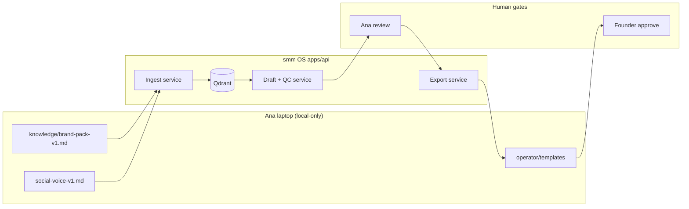

# MVP Implementation Plan — Planning Only

> **Status:** Slice 2 done 2026-07-27 — drafts + brand QC. Next: Slice 3 export.  
> **Canon for scope:** [`SOW.md`](../SOW.md) · **Tasks:** [`TODO-MVP.md`](./TODO-MVP.md) · **Gap:** [`GAP-ANALYSIS.md`](./GAP-ANALYSIS.md)

---

## 1. Problem statement

Ana spends significant time on repeatable work: drafting posts from brand-pack, checking claims/CTAs, and filling approval templates. The org built a full SMM OS (`AiFinPay-smm`); the developer asked for a **smaller, operator-centric tool** planned before further coding. Ana's file-based workflow already works — the product should **accelerate** it, not replace it with a 28-agent platform.

---

## 2. Target architecture (trimmed)

### 2.1 Principles

1. **Operator-first** — markdown templates remain valid outputs until UI exists.
2. **Brand-pack is law** — no claim without citation; `TBD` blocks export.
3. **Human approval always** — no publish adapter in MVP.
4. **Single workspace** — AiFinPay only; auth deferred.
5. **Cursor-compatible** — CLI/API callable from existing skills.

### 2.2 Logical components

### 2.3 Stack (MVP)

| Layer | Choice | Notes |
|-------|--------|-------|
| API | **FastAPI** (existing) | Keep `/health`, extend routers |
| Vector | **Qdrant Cloud** or local Docker | Already in skeleton |
| Embeddings | **Gemini** (config exists) or OpenAI | One provider only |
| LLM | **One** strong model via env | No LiteLLM router yet |
| Storage | **JSON/SQLite local** for drafts | No Supabase in MVP |
| UI | **None required** | Cursor + markdown; optional static page in slice 4 |
| Auth | **None** (local) | `demo_workspace_id` until v2 |
| Jobs | **Sync HTTP** | No Celery |

### 2.4 What we deliberately omit from Phase 0 docs

From `PHASE-0-PRODUCT.md`: Supabase RLS, LangGraph 5-node graph, Vercel dashboard, n8n Drive, Langfuse — **all deferred**. Reuse concepts (HITL, citations) without the infrastructure.

---

## 3. API surface (MVP target)

Base: `http://localhost:8000`

| Method | Path | Purpose |
|--------|------|---------|
| GET | `/health` | Exists |
| POST | `/v1/ingest/text` | Exists — brand-pack chunks |
| POST | `/v1/search` | Exists — citation retrieval |
| POST | `/v1/drafts` | **New** — brief → draft + scorecard |
| GET | `/v1/drafts/{id}` | **New** — retrieve draft |
| POST | `/v1/drafts/{id}/export` | **New** — `{ format: "founder" \| "image-prompts" \| "content-plan-row" }` |

No `/v1/runs`, no `/v1/approvals` DB until slice 3 justifies it.

---

## 4. First three build slices

### Slice 1 — Knowledge (≈2–3 days)

**Goal:** Brand-pack searchable with citations.

- Ingest script reading local `knowledge/*.md` (path via env, not committed).
- 10-question eval checklist in `eval/brand_questions.yaml`.
- README: how to run with `.env`.

**Done when:** 8/10 eval questions return correct brand-pack sections.

### Slice 2 — Draft + QC (≈2–3 days)

**Goal:** One-call grounded draft with flags.

- Prompt: platform + theme + retrieved chunks + social-voice rules.
- Post-process: regex/LLM check for `TBD`, non-`aifinpay.io` URLs, banned claims list from brand-pack.
- Return `{ draft, citations, scorecard, pass }`.

**Done when:** LI-1 regeneration matches quality of manual Wave 1 draft; flags catch intentional test violations.

### Slice 3 — Export (≈1–2 days)

**Goal:** Zero manual template filling.

- Map draft → `post-for-approval.md` sections.
- Map draft → `image-prompt-pack.md` sections.
- Optional: emit content-plan row markdown for paste.

**Done when:** Ana runs one command and sends founder pack without editing structure.

---

## 5. Integration with Cursor / operator

| Today | After MVP |
|-------|-----------|
| `brand-grounded-copy` skill reads files | Skill calls `/v1/drafts` or CLI wrapper |
| Manual paste into templates | `/export` writes to `operator/outbox/` |
| `content-plan-14d.md` hand-edited | Helper emits row snippet |

**Do not remove skills** until API path is stable — parallel run during transition.

---

## 6. Risks & mitigations

| Risk | Impact | Mitigation |
|------|--------|------------|
| Founder expects full `AiFinPay-smm` on GitHub | Misaligned expectations | Send `SOW.md` summary tonight; show planning progress |
| Ana asked to docker-compose Postiz | Blocked, tired operator | Explicit out-of-scope; defer to dev |
| Two repos diverge | Confusion | Document: Ana repo = operator tool; org repo = reference/future merge |
| Brand-pack `TBD` lines | Bad drafts | Hard block on export if unresolved TBD in output |
| No GitHub org access for issues | Can't track in Jira/GitHub | Use local `TODO-MVP.md` until access fixed |
| Qdrant/LLM keys missing | Can't run slice 1 | `.env.example` + ask dev for shared dev keys |

---

## 7. Open questions for founder / dev

| # | Question | For |
|---|----------|-----|
| Q1 | Confirm **thin tool in Ana repo** vs continuing on `coinsecuritiescompany/AiFinPay-smm` | Dev (daochild / dev group) |
| Q2 | Can Ana get **read access** to org repo + GitHub issues? | Founder / platform |
| Q3 | Which **LLM key** should Ana use for local dev (DeepSeek/OpenAI)? | Dev |
| Q4 | Is **Qdrant Cloud** ok or local Docker only? | Dev |
| Q5 | Founder still **paused on content** until repo clear? | Founder |
| Q6 | Should planning docs be **committed/pushed** to Ana's remote now? | **Yes** — pushed 2026-07-24; ongoing product docs only |
| Q7 | Any **compliance** requirement to keep all generation on VPN/VPS? | Dev / compliance |

---

## 8. Success metrics (engineering)

| Metric | Target (MVP) |
|--------|--------------|
| Retrieval precision@5 | ≥70% on 10 brand questions |
| Draft generation latency | &lt;60s |
| False negative on TBD block | 0 on test set |
| Operator steps saved | ≥3 manual steps per post |

---

## 9. Relationship to full SMM OS vision (do not stop at MVP)

`docs/SMM-OS-PRODUCT-ARCHITECTURE.md` + org repo `AiFinPay-smm` remain the **scale target**. Ana MVP is a **strangler**: ship value now, grow toward the farm — not a dead-end prototype.

### Why two stores (remember this)

| Store | Job | Now (MVP) | Later (scale toward reference) |
|-------|-----|-----------|--------------------------------|
| **Qdrant** | Vector search over brand text (“find relevant chunks”) | **In use** — brand-pack + social-voice chunks | Same role; more docs, hybrid search, per-workspace filters |
| **Supabase / Postgres** | Source of truth: users, workspaces, drafts, approvals, audit | Keys in `.env` from early setup; **API not using DB yet** (drafts still markdown) | Wire auth, RLS, tables for drafts/approvals — as in Phase 0 / AiFinPay-smm Postgres |

Qdrant ≠ database of posts. It is the **memory index** so drafts stay grounded. Supabase is the **system of record** when we leave “files only.”

### Scale ladder (after Slice 2–3)

1. Keep thin draft/QC/export working for Ana.
2. Move draft + approval state from markdown → **Postgres (Supabase)** — same shapes as org repo where possible.
3. Cherry-pick from `AiFinPay-smm`: HITL gates, tests, channel previews — **not** full 28-agent autopilot until Ana path is stable.
4. Optional merge: Ana modules → org farm when @pironmind / founder ask.

If the org later merges Ana's tool into `AiFinPay-smm`, slices 1–3 become modules (`knowledge`, `workflow`, `export`) — not throwaway work.

---

## 10. Immediate next actions

1. **Slice 2** — implement `POST /v1/drafts` + brand guardian (TODO 2.1–2.3).
2. Dev/founder: remaining open items in §7 (Q4–Q5, Q7) as needed for keys/compliance.
3. **Client content** runs in local `operator/` — not tracked here; does not block Slice 2.

---

*Last updated: 2026-07-27 · Slice 1 shipped; Slice 2 next*
