# SMM Operating System (SMM OS)
## Техническая архитектура AI-команды для замены SMM-отдела

**Версия документа:** 1.0  
**Статус:** Architecture Design (Greenfield)  
**Аудитория:** Platform Engineers, AI/ML Engineers, Product, Founders  
**Уровень детализации:** Production-grade system design

---

## Содержание

1. [Vision](#1-vision)
2. [Goals](#2-goals)
3. [Functional Requirements](#3-functional-requirements)
4. [Non-functional Requirements](#4-non-functional-requirements)
5. [Architecture](#5-architecture)
6. [Agents](#6-agents)
7. [Memory](#7-memory)
8. [Knowledge System](#8-knowledge-system)
9. [Integrations/Tools](#9-integrationstools)
10. [Workflows](#10-workflows)
11. [Pipelines](#11-pipelines)
12. [Roadmap](#12-roadmap)
13. [Risks](#13-risks)
14. [Scaling Strategy](#14-scaling-strategy)
15. [Security](#15-security)
16. [Future Features](#16-future-features)

**Специализированные разделы:**
- [Communication Ingestion Pipeline](#communication-ingestion-pipeline)
- [Request Processing Lifecycle](#request-processing-lifecycle)
- [Quality Control System](#quality-control-system)
- [Learning System](#learning-system)

---

## 1. Vision

### 1.1. Миссия

**SMM OS** — это не чат-бот и не «один универсальный агент с промптом». Это **распределённая AI-операционная система**, которая воспроизводит функции полноценного SMM-отдела: стратегию, исследования, контент, дистрибуцию, аналитику, оптимизацию, community management и непрерывное обучение — с единым «корпоративным сознанием», постоянно синхронизированным с реальностью компании.

Система должна **думать как команда**: CEO-агент ставит направление, Research-агент собирает контекст, Brand-агент удерживает идентичность, платформенные агенты адаптируют формат, Analytics-агент замыкает петлю обратной связи. Каждый агент — специалист с ограниченной зоной ответственности, но общей памятью, знаниями и протоколами взаимодействия.

### 1.2. Ключевая парадигма

| Традиционный SMM-отдел | SMM OS |
|---|---|
| Люди читают документы вручную | Автоматическая инgestion всех источников знаний |
| Знания в головах сотрудников | Структурированная многоуровневая память |
| Решения в чатах теряются | Communication Ingestion Pipeline |
| Контент создаётся ad hoc | Workflow-оркестрация с QC-воротами |
| Аналитика — раз в неделю | Continuous learning loop |
| Онбординг нового SMM — месяцы | Мгновенный доступ к полному контексту |

### 1.3. Архитектурная философия

1. **Team, not chatbot** — оркестрация множества специализированных агентов с явными контрактами (inputs/outputs/tools).
2. **Knowledge-first** — любое решение агента обосновано retrievable knowledge, а не «галлюцинацией».
3. **Always current** — founder сказал «меняем positioning» сегодня → все агенты знают завтра.
4. **Human-in-the-loop by design** — критические решения (бюджет, юридические риски, публичные заявления) проходят approval gates.
5. **Observable & auditable** — каждое решение трассируется до источника знания и агента-автора.
6. **Fail-safe defaults** — при неопределённости система эскалирует, а не публикует.

### 1.4. Границы системы

**В scope:**
- Стратегия SMM, контент-планирование, создание, публикация, community, аналитика, оптимизация.
- Ingestion корпоративных знаний и коммуникаций.
- Multi-platform presence (LinkedIn, Instagram, TikTok, YouTube, X и др.).

**Out of scope (v1):**
- Полная замена performance marketing (Meta/Google Ads) — интеграция есть, но автономное управление бюджетом требует отдельного домена.
- Юридическое одобрение контента (legal review agent — future).
- Прямые продажи и CRM-автоматизация (интеграция через API возможна).

---

## 2. Goals

### 2.1. Бизнес-цели

| ID | Цель | Метрика успеха |
|---|---|---|
| G-01 | Заменить функционал SMM-отдела из N человек | ≥90% задач выполняются без human intervention |
| G-02 | Сократить time-to-publish | С 5 дней → <4 часов для стандартного поста |
| G-03 | Единый brand voice across platforms | Brand consistency score ≥95% (QC Agent) |
| G-04 | Непрерывная актуальность знаний | Knowledge staleness <24h для critical decisions |
| G-05 | Data-driven optimization | +20% engagement за 6 месяцев |
| G-06 | Масштабируемость без линейного роста headcount | 10x контент-объём при тех же ресурсах |

### 2.2. Технические цели

| ID | Цель | Критерий |
|---|---|---|
| TG-01 | Multi-agent orchestration | ≥30 специализированных агентов с контрактами |
| TG-02 | Sub-second knowledge retrieval | p95 latency RAG <500ms |
| TG-03 | Real-time communication ingestion | Founder chat → agent awareness <1h |
| TG-04 | Full audit trail | 100% outputs traceable to sources |
| TG-05 | Graceful degradation | Partial agent failure не блокирует систему |
| TG-06 | Cost efficiency | Cost per published post < human equivalent / 10 |

### 2.3. Принципы приоритизации

1. **Correctness > Speed** — лучше задержать публикацию, чем опубликовать off-brand контент.
2. **Source of truth hierarchy** — Founder decision > Strategy doc > Historical content > Agent inference.
3. **Incremental autonomy** — Phase 0: human approves всё → Production: autonomous для low-risk tasks.

---

## 3. Functional Requirements

### 3.1. Knowledge Management

| ID | Требование | Приоритет |
|---|---|---|
| FR-KM-01 | Ingestion из Google Drive/Docs/Sheets, Notion, PDF, Word, Markdown, websites | P0 |
| FR-KM-02 | Автоматическая синхронизация при изменении source documents | P0 |
| FR-KM-03 | Versioning знаний с temporal queries («что мы знали 1 марта?») | P1 |
| FR-KM-04 | Conflict detection при противоречивых источниках | P0 |
| FR-KM-05 | Knowledge validation workflow (human approval для critical updates) | P0 |
| FR-KM-06 | Metadata enrichment (author, date, source type, confidence, tags) | P0 |
| FR-KM-07 | Graph relationships между entities (product ↔ feature ↔ ICP ↔ competitor) | P1 |

### 3.2. Communication Ingestion

| ID | Требование | Приоритет |
|---|---|---|
| FR-CI-01 | Ingestion из Slack, Telegram, Discord (founder chat, team chats) | P0 |
| FR-CI-02 | Автоматическое извлечение decisions, ideas, action items | P0 |
| FR-CI-03 | Summarization длинных тредов | P0 |
| FR-CI-04 | Entity extraction (people, products, dates, metrics) | P0 |
| FR-CI-05 | Priority tagging (founder statement = highest priority) | P0 |
| FR-CI-06 | Deduplication и merge с existing knowledge | P1 |

### 3.3. Content Lifecycle

| ID | Требование | Приоритет |
|---|---|---|
| FR-CL-01 | Content calendar planning (weekly/monthly/quarterly) | P0 |
| FR-CL-02 | Multi-format content generation (text, carousel, video script, thread) | P0 |
| FR-CL-03 | Platform-specific adaptation | P0 |
| FR-CL-04 | SEO optimization для blog/YouTube | P1 |
| FR-CL-05 | Visual brief generation для Figma/Canva | P1 |
| FR-CL-06 | Scheduling и publishing через platform APIs | P0 |
| FR-CL-07 | A/B variant generation | P2 |

### 3.4. Strategy & Planning

| ID | Требование | Приоритет |
|---|---|---|
| FR-SP-01 | Alignment с company goals и roadmap | P0 |
| FR-SP-02 | ICP-aware content targeting | P0 |
| FR-SP-03 | Competitor monitoring и response strategy | P1 |
| FR-SP-04 | Campaign planning с KPIs | P0 |
| FR-SP-05 | Trend detection и opportunistic content | P1 |

### 3.5. Analytics & Optimization

| ID | Требование | Приоритет |
|---|---|---|
| FR-AO-01 | Aggregation metrics из все platforms | P0 |
| FR-AO-02 | Performance reports (daily/weekly/monthly) | P0 |
| FR-AO-03 | Content success analysis (best/worst performers) | P0 |
| FR-AO-04 | Strategy adjustment recommendations | P1 |
| FR-AO-05 | Attribution tracking (content → leads/conversions) | P2 |

### 3.6. Quality Control

| ID | Требование | Приоритет |
|---|---|---|
| FR-QC-01 | Multi-layer QC перед публикацией | P0 |
| FR-QC-02 | Brand voice compliance check | P0 |
| FR-QC-03 | Factual accuracy verification against knowledge base | P0 |
| FR-QC-04 | Strategy/ICP/goal alignment check | P0 |
| FR-QC-05 | Repetition detection (не публиковать похожий контент) | P1 |
| FR-QC-06 | Human approval gates для high-risk content | P0 |

### 3.7. Agent Orchestration

| ID | Требование | Приоритет |
|---|---|---|
| FR-AO-01 | Intent detection и routing | P0 |
| FR-AO-02 | Task decomposition для complex requests | P0 |
| FR-AO-03 | Parallel agent execution где возможно | P1 |
| FR-AO-04 | Inter-agent communication protocol | P0 |
| FR-AO-05 | Escalation to human при low confidence | P0 |

### 3.8. Learning System

| ID | Требование | Приоритет |
|---|---|---|
| FR-LS-01 | Analyze content performance post-publish | P0 |
| FR-LS-02 | Update procedural memory (what works) | P1 |
| FR-LS-03 | Trend learning from external sources | P1 |
| FR-LS-04 | Decision memory (why we chose X over Y) | P0 |
| FR-LS-05 | Feedback loop from human corrections | P0 |

---

## 4. Non-functional Requirements

### 4.1. Performance

| ID | Требование | Target |
|---|---|---|
| NFR-P-01 | RAG retrieval latency | p95 <500ms, p99 <1s |
| NFR-P-02 | Simple request (1 post) end-to-end | <5 min (excluding human approval) |
| NFR-P-03 | Complex request (campaign plan) | <30 min |
| NFR-P-04 | Communication ingestion latency | <1h from message to agent awareness |
| NFR-P-05 | Knowledge sync from source change | <15 min |
| NFR-P-06 | Concurrent agent executions | ≥50 parallel tasks |

### 4.2. Availability & Reliability

| ID | Требование | Target |
|---|---|---|
| NFR-A-01 | System uptime | 99.9% |
| NFR-A-02 | Data durability | 99.999999999% (11 nines) |
| NFR-A-03 | Graceful degradation | Core functions при partial outage |
| NFR-A-04 | Disaster recovery RTO | <4 hours |
| NFR-A-05 | Disaster recovery RPO | <1 hour |

### 4.3. Scalability

| ID | Требование | Target |
|---|---|---|
| NFR-S-01 | Knowledge base size | 10M+ chunks |
| NFR-S-02 | Daily content outputs | 100+ pieces |
| NFR-S-03 | Communication messages/day | 10,000+ |
| NFR-S-04 | Horizontal scaling agents | Linear до 100 agents |

### 4.4. Security & Compliance

| ID | Требование | Target |
|---|---|---|
| NFR-SEC-01 | Encryption at rest | AES-256 |
| NFR-SEC-02 | Encryption in transit | TLS 1.3 |
| NFR-SEC-03 | RBAC для human users | Role-based access |
| NFR-SEC-04 | Audit logging | 100% agent actions logged |
| NFR-SEC-05 | PII handling | GDPR-compliant |
| NFR-SEC-06 | Secret management | Vault/KMS, no secrets in prompts |

### 4.5. Observability

| ID | Требование | Target |
|---|---|---|
| NFR-O-01 | Distributed tracing | OpenTelemetry, 100% requests |
| NFR-O-02 | Agent decision logging | Full reasoning chain |
| NFR-O-03 | Cost tracking per agent/task | Real-time dashboards |
| NFR-O-04 | Quality metrics dashboard | Brand score, factual accuracy, etc. |
| NFR-O-05 | Alerting | PagerDuty/Slack для critical failures |

### 4.6. Cost

| ID | Требование | Target |
|---|---|---|
| NFR-C-01 | LLM cost per post | <$0.50 (standard), <$2 (complex) |
| NFR-C-02 | Infrastructure cost | <$500/month (Phase 1), scalable |
| NFR-C-03 | Cost attribution | Per-campaign, per-agent breakdown |

### 4.7. Maintainability

| ID | Требование | Target |
|---|---|---|
| NFR-M-01 | Agent prompt versioning | Git-based, rollback capable |
| NFR-M-02 | Knowledge schema evolution | Backward compatible migrations |
| NFR-M-03 | Integration modularity | Plug-and-play connectors |
| NFR-M-04 | Documentation | Auto-generated agent contracts |

---

## 5. Architecture

### 5.1. High-Level Architecture

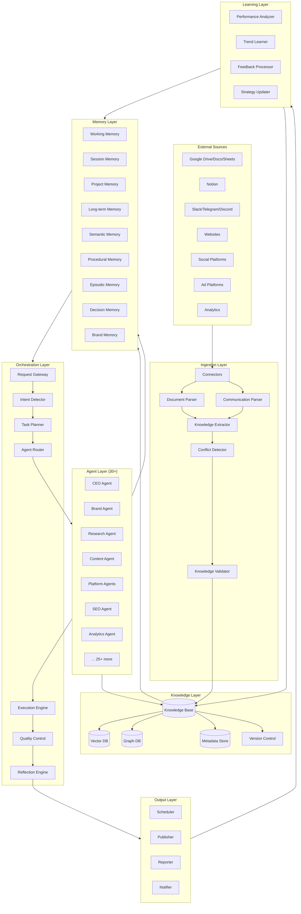

### 5.2. Layer Responsibilities

#### 5.2.1. Ingestion Layer
- **Connectors**: OAuth-based integrations с external sources.
- **Document Parser**: PDF, Word, Markdown, Google Docs → structured text + metadata.
- **Communication Parser**: Chat messages → threads, speakers, timestamps, context.
- **Knowledge Extractor**: NER, fact extraction, decision detection, action items.
- **Conflict Detector**: Semantic similarity + contradiction detection.
- **Knowledge Validator**: Human-in-the-loop для critical updates.

#### 5.2.2. Knowledge Layer
- **Knowledge Base**: Canonical store всех facts, decisions, strategies.
- **Vector DB**: Embeddings для semantic search.
- **Graph DB**: Entity relationships (product-feature-ICP-competitor).
- **Metadata Store**: Source, author, date, confidence, tags, version.
- **Version Control**: Temporal queries, rollback capability.

#### 5.2.3. Memory Layer
- Multi-type memory system (см. Section 7).
- Unified API для agents.
- Automatic promotion/demotion между tiers.

#### 5.2.4. Orchestration Layer
- **Request Gateway**: Entry point, authentication, rate limiting.
- **Intent Detector**: Classify request type, urgency, complexity.
- **Task Planner**: Decompose complex requests into subtasks.
- **Agent Router**: Assign tasks to appropriate agents.
- **Execution Engine**: Parallel/sequential execution, retries, timeouts.
- **Quality Control**: Multi-gate validation.
- **Reflection Engine**: Post-execution analysis, learning signals.

#### 5.2.5. Agent Layer
- 30+ specialized agents (см. Section 6).
- Each agent: bounded context, explicit tools, input/output contracts.
- Inter-agent communication via message bus.

#### 5.2.6. Output Layer
- **Scheduler**: Content calendar, optimal posting times.
- **Publisher**: Platform API integrations.
- **Reporter**: Dashboards, alerts, summaries.
- **Notifier**: Human notifications для approvals, alerts.

#### 5.2.7. Learning Layer
- Continuous improvement loop.
- Performance analysis → strategy updates → memory updates.

### 5.3. Data Flow Architecture

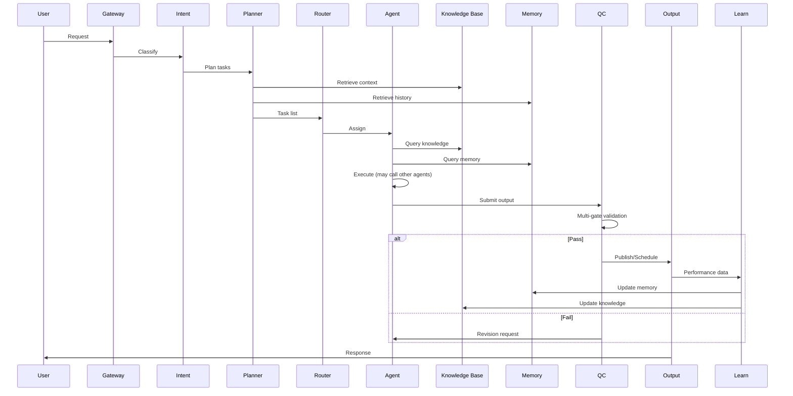

### 5.4. Communication Ingestion Architecture

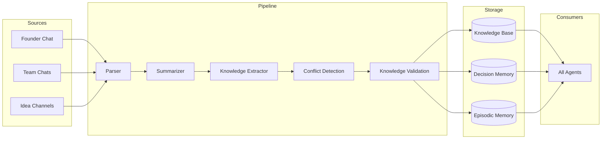

### 5.5. Technology Stack Recommendations

| Layer | Recommended Technologies | Rationale |
|---|---|---|
| Orchestration | Temporal.io / LangGraph / Custom DAG | Durable workflows, retries |
| Vector DB | Pinecone / Weaviate / Qdrant | Hybrid search, metadata filtering |
| Graph DB | Neo4j / Amazon Neptune | Entity relationships |
| Document Store | PostgreSQL + pgvector | Unified relational + vector |
| Object Storage | S3 / GCS | Raw documents, media |
| Message Queue | Redis Streams / Kafka | Agent communication, events |
| LLM Gateway | LiteLLM / Custom router | Multi-model, cost optimization |
| Observability | OpenTelemetry + Grafana | Tracing, metrics, logs |
| Secret Management | HashiCorp Vault / AWS Secrets Manager | Secure credentials |

### 5.6. Deployment Architecture

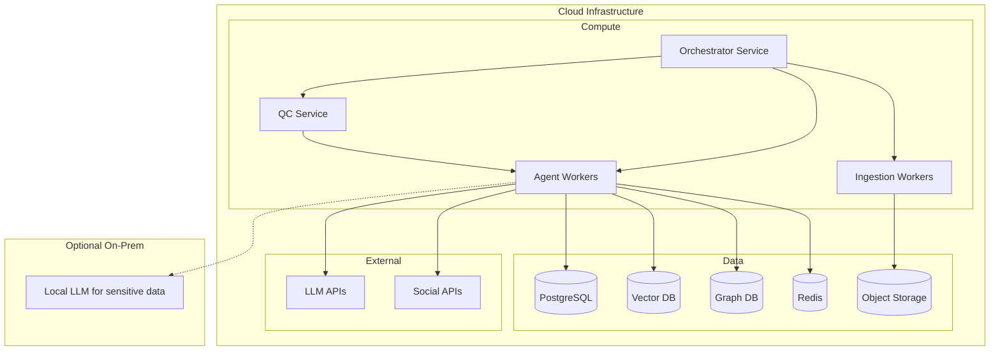

---

## 6. Agents

### 6.1. Agent Design Principles

Каждый агент следует контракту:

```
Agent Contract:
├── Identity: Name, role, persona
├── Responsibility: Bounded scope (what it owns)
├── Inputs: Required context, optional context
├── Outputs: Structured deliverables
├── Tools: Available integrations and capabilities
├── Knowledge: Which KB partitions it accesses
├── Memory: Which memory types it reads/writes
├── Triggers: When it's invoked
├── Callers: Who can invoke it
├── Limitations: What it explicitly cannot do
└── Escalation: When to defer to another agent or human
```

### 6.2. Agent Hierarchy

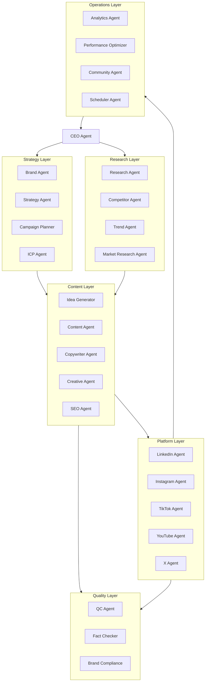

### 6.3. Complete Agent Roster

---

#### AGENT-001: CEO Agent

| Attribute | Value |
|---|---|
| **Responsibility** | Стратегическое направление, приоритизация, финальные решения по спорным вопросам, alignment с company goals |
| **Inputs** | Company goals, roadmap, founder directives, performance reports, agent recommendations |
| **Outputs** | Strategic directives, priority lists, go/no-go decisions, resource allocation |
| **Tools** | Knowledge Base (full access), Decision Memory, Analytics dashboards, Communication channels (read) |
| **Knowledge Used** | Strategy docs, roadmap, OKRs, founder communications, historical decisions |
| **Memory** | Decision Memory (R/W), Long-term Memory (R), Brand Memory (R) |
| **When Called** | Complex strategic decisions, conflicts between agents, quarterly planning, crisis situations |
| **Called By** | Orchestrator (complex requests), any agent (escalation), human (direct request) |
| **Limitations** | Не создаёт контент, не публикует, не выполняет tactical tasks. Delegates всё operational. |

---

#### AGENT-002: Brand Agent

| Attribute | Value |
|---|---|
| **Responsibility** | Guardianship brand identity: tone of voice, visual guidelines, messaging pillars, brand consistency |
| **Inputs** | Brandbook, tone of voice docs, visual guidelines, content drafts, competitor brand analysis |
| **Outputs** | Brand compliance scores, revision recommendations, brand voice guidelines updates, messaging frameworks |
| **Tools** | Brand Memory, Knowledge Base (brand partition), Content analysis tools |
| **Knowledge Used** | Brandbook, tone of voice guide, visual identity, messaging pillars, do's and don'ts |
| **Memory** | Brand Memory (R/W), Semantic Memory (R), Procedural Memory (brand rules) |
| **When Called** | QC stage для all content, brand guideline updates, new platform onboarding |
| **Called By** | QC Agent, Content Agent, Platform Agents, Creative Agent |
| **Limitations** | Не создаёт контент, только evaluates и advises. Не меняет brand strategy без CEO approval. |

---

#### AGENT-003: Strategy Agent

| Attribute | Value |
|---|---|
| **Responsibility** | SMM strategy development, content pillars, channel strategy, audience segmentation |
| **Inputs** | Company strategy, ICP, market research, competitor analysis, performance data |
| **Outputs** | SMM strategy documents, content pillars, channel priorities, quarterly plans |
| **Tools** | Knowledge Base, Analytics Agent output, Research Agent output, Competitor Agent output |
| **Knowledge Used** | Marketing strategy, product roadmap, ICP profiles, competitor database, historical performance |
| **Memory** | Long-term Memory, Decision Memory, Project Memory |
| **When Called** | Quarterly planning, strategy refresh, new product launch, market shift detected |
| **Called By** | CEO Agent, Campaign Planner, human (strategy review) |
| **Limitations** | Не executes tactics. Recommends, не publishes. Major strategy changes require CEO/human approval. |

---

#### AGENT-004: Research Agent

| Attribute | Value |
|---|---|
| **Responsibility** | Deep research on topics, markets, audiences, trends для content creation |
| **Inputs** | Research questions, topic areas, ICP context, competitor mentions |
| **Outputs** | Research briefs, fact sheets, source citations, insight summaries |
| **Tools** | Web Search, Browser, Knowledge Base, Academic sources, Industry reports |
| **Knowledge Used** | Existing research docs, market research, product docs, FAQ, competitor database |
| **Memory** | Semantic Memory (R/W), Episodic Memory, Project Memory |
| **When Called** | Before content creation on new topics, market analysis requests, fact-checking support |
| **Called By** | Content Agent, Idea Generator, SEO Agent, Campaign Planner |
| **Limitations** | Не создаёт финальный контент. Не делает strategic decisions. Cites sources always. |

---

#### AGENT-005: Competitor Agent

| Attribute | Value |
|---|---|
| **Responsibility** | Monitor competitors' SMM activity, analyze their content, identify opportunities/threats |
| **Inputs** | Competitor list, competitor social profiles, industry news |
| **Outputs** | Competitor activity reports, content gap analysis, response recommendations, alert on significant moves |
| **Tools** | Social platform APIs (read), Web Search, Browser, Competitor database |
| **Knowledge Used** | Competitor database, historical competitor content, market positioning docs |
| **Memory** | Episodic Memory (competitor events), Semantic Memory, Long-term Memory |
| **When Called** | Daily monitoring, before campaign planning, when competitor mentioned in comms |
| **Called By** | Strategy Agent, Trend Agent, CEO Agent, scheduled jobs |
| **Limitations** | Не копирует competitor content. Не engages with competitors publicly без approval. |

---

#### AGENT-006: Trend Agent

| Attribute | Value |
|---|---|
| **Responsibility** | Detect emerging trends, viral formats, industry conversations, opportunistic content opportunities |
| **Inputs** | Social feeds, industry news, search trends, platform trending sections |
| **Outputs** | Trend reports, opportunistic content suggestions, format recommendations, urgency scores |
| **Tools** | Web Search, Social APIs (trending), Google Trends, Platform explore pages |
| **Knowledge Used** | Brand guidelines (relevance filter), ICP profiles, content history |
| **Memory** | Episodic Memory (trend events), Procedural Memory (what worked) |
| **When Called** | Daily scans, before content planning, real-time alerts for high-relevance trends |
| **Called By** | Idea Generator, Campaign Planner, Content Agent, scheduled jobs |
| **Limitations** | Не chase все trends — filters by brand relevance. Не creates content без Brand Agent check. |

---

#### AGENT-007: Market Research Agent

| Attribute | Value |
|---|---|
| **Responsibility** | Deep market analysis, audience insights, industry reports synthesis |
| **Inputs** | Market research questions, industry segments, geographic focus |
| **Outputs** | Market analysis reports, audience insight documents, TAM/SAM/SOM updates |
| **Tools** | Web Search, Industry databases, Analytics platforms, Survey data |
| **Knowledge Used** | Existing market research, ICP docs, product docs, analytics data |
| **Memory** | Semantic Memory, Long-term Memory, Project Memory |
| **When Called** | New market entry, ICP refinement, quarterly market review |
| **Called By** | Strategy Agent, ICP Agent, CEO Agent |
| **Limitations** | Не делает product decisions. Provides insights, не recommendations без data. |

---

#### AGENT-008: ICP Agent

| Attribute | Value |
|---|---|
| **Responsibility** | Maintain ICP profiles, ensure content targeting, persona-aware messaging |
| **Inputs** | ICP documents, customer data, analytics, feedback |
| **Outputs** | ICP profiles, targeting recommendations, persona-specific messaging guides |
| **Tools** | Knowledge Base (ICP partition), Analytics, CRM data (if integrated) |
| **Knowledge Used** | ICP docs, customer database, FAQ, support tickets, sales feedback |
| **Memory** | Semantic Memory (ICP facts), Long-term Memory, Customer Memory |
| **When Called** | Content targeting decisions, new ICP hypothesis, campaign audience selection |
| **Called By** | Content Agent, Campaign Planner, Strategy Agent, Platform Agents |
| **Limitations** | Не modifies ICP без human approval. Не accesses PII without authorization. |

---

#### AGENT-009: Idea Generator Agent

| Attribute | Value |
|---|---|
| **Responsibility** | Generate content ideas, brainstorm angles, creative concepts |
| **Inputs** | Content pillars, trends, research insights, performance data, calendar gaps |
| **Outputs** | Content ideas (ranked), creative angles, hook suggestions, format recommendations |
| **Tools** | Trend Agent output, Research Agent, Knowledge Base, Performance data |
| **Knowledge Used** | Content history, successful posts, brand pillars, ICP preferences |
| **Memory** | Episodic Memory (past ideas), Procedural Memory (what worked), Project Memory |
| **When Called** | Content planning sessions, calendar gaps, brainstorming requests |
| **Called By** | Campaign Planner, Content Agent, human (brainstorm request) |
| **Limitations** | Generates ideas, не final content. Не publishes. Ideas require human/agent approval. |

---

#### AGENT-010: Content Agent

| Attribute | Value |
|---|---|
| **Responsibility** | Orchestrate content creation, coordinate copywriters and platform agents |
| **Inputs** | Approved ideas, content briefs, brand guidelines, research, platform requirements |
| **Outputs** | Content drafts (multi-format), content packages for platforms |
| **Tools** | Copywriter Agent, Creative Agent, Platform Agents, Knowledge Base, Brand Memory |
| **Knowledge Used** | All content-relevant knowledge, brand guidelines, ICP, product docs |
| **Memory** | Working Memory, Project Memory, Content history |
| **When Called** | Content creation requests, calendar execution |
| **Called By** | Campaign Planner, Scheduler Agent, human (direct request) |
| **Limitations** | Delegates writing to Copywriter. Не publishes directly — passes to QC. |

---

#### AGENT-011: Copywriter Agent

| Attribute | Value |
|---|---|
| **Responsibility** | Write copy: posts, captions, threads, scripts, headlines, CTAs |
| **Inputs** | Content brief, brand voice guide, platform specs, research facts |
| **Outputs** | Written copy (multiple variants), headline options, CTA variations |
| **Tools** | Brand Memory, Knowledge Base, SEO Agent (for keywords), Platform specs |
| **Knowledge Used** | Tone of voice, messaging pillars, product facts, ICP language preferences |
| **Memory** | Brand Memory, Procedural Memory (writing patterns), Content history |
| **When Called** | Any text content creation |
| **Called By** | Content Agent, Platform Agents, Creative Agent |
| **Limitations** | Writes text only. Не creates visuals. Не publishes. All output goes to QC. |

---

#### AGENT-012: Creative Agent

| Attribute | Value |
|---|---|
| **Responsibility** | Visual content direction, creative briefs, asset specifications |
| **Inputs** | Content concept, brand visual guidelines, platform requirements |
| **Outputs** | Creative briefs, visual direction docs, asset specifications, Figma/Canva templates |
| **Tools** | Figma API, Canva API, Brand Memory, Asset library |
| **Knowledge Used** | Visual brand guidelines, color palette, typography, image style guide |
| **Memory** | Brand Memory, Asset library, Content history (visual performance) |
| **When Called** | Visual content needed, carousel/s video/reel creation |
| **Called By** | Content Agent, Platform Agents |
| **Limitations** | Creates briefs/specs, не final designs (unless auto-generation enabled). Human/designer review for complex visuals. |

---

#### AGENT-013: SEO Agent

| Attribute | Value |
|---|---|
| **Responsibility** | SEO optimization для blog posts, YouTube, website content |
| **Inputs** | Content drafts, target keywords, competitor SEO analysis |
| **Outputs** | SEO-optimized content, keyword recommendations, meta descriptions, title tags |
| **Tools** | Google Search Console, SEO tools (Ahrefs/Semrush API), Keyword databases |
| **Knowledge Used** | SEO strategy, keyword lists, competitor rankings, content performance |
| **Memory** | Procedural Memory (SEO rules), Semantic Memory (keyword facts) |
| **When Called** | Blog content, YouTube videos, long-form content |
| **Called By** | Content Agent, Copywriter Agent, YouTube Agent |
| **Limitations** | SEO for owned content only. Не guarantees rankings. Recommends, не decides strategy. |

---

#### AGENT-014: LinkedIn Agent

| Attribute | Value |
|---|---|
| **Responsibility** | LinkedIn-specific content adaptation, posting strategy, engagement |
| **Inputs** | Content packages, LinkedIn best practices, audience insights |
| **Outputs** | LinkedIn-optimized posts, article drafts, carousel specs, posting schedule |
| **Tools** | LinkedIn API, LinkedIn analytics, Scheduling tools |
| **Knowledge Used** | LinkedIn content history, B2B ICP, professional tone guidelines |
| **Memory** | Platform-specific memory, Engagement history, Procedural Memory (LinkedIn patterns) |
| **When Called** | LinkedIn content creation, engagement responses, analytics review |
| **Called By** | Content Agent, Scheduler Agent, Community Agent |
| **Limitations** | LinkedIn only. Follows LinkedIn ToS. Не automates engagement beyond approved limits. |

---

#### AGENT-015: Instagram Agent

| Attribute | Value |
|---|---|
| **Responsibility** | Instagram content: posts, stories, reels, captions, hashtags |
| **Inputs** | Content packages, visual assets, Instagram trends |
| **Outputs** | Instagram posts, story sequences, reel scripts, hashtag sets |
| **Tools** | Instagram API, Instagram analytics, Hashtag research tools |
| **Knowledge Used** | Instagram content history, visual brand guide, audience demographics |
| **Memory** | Platform memory, Hashtag performance, Visual content history |
| **When Called** | Instagram content creation, story planning, reel production |
| **Called By** | Content Agent, Creative Agent, Scheduler Agent |
| **Limitations** | Instagram only. Visual-heavy — requires Creative Agent collaboration. |

---

#### AGENT-016: TikTok Agent

| Attribute | Value |
|---|---|
| **Responsibility** | TikTok content: scripts, trends adaptation, short-form video direction |
| **Inputs** | Content concepts, TikTok trends, platform specs |
| **Outputs** | TikTok scripts, trend adaptations, video briefs, caption/hashtag sets |
| **Tools** | TikTok API, Trend detection, Video analysis tools |
| **Knowledge Used** | TikTok content history, trend performance, audience behavior |
| **Memory** | Platform memory, Trend history, Viral content patterns |
| **When Called** | TikTok content creation, trend response, video planning |
| **Called By** | Content Agent, Trend Agent, Creative Agent |
| **Limitations** | TikTok only. Fast-moving trends require quick turnaround workflow. |

---

#### AGENT-017: YouTube Agent

| Attribute | Value |
|---|---|
| **Responsibility** | YouTube content: video scripts, titles, descriptions, thumbnails briefs |
| **Inputs** | Video concepts, SEO keywords, YouTube analytics |
| **Outputs** | Video scripts, title/description variants, thumbnail briefs, chapter markers |
| **Tools** | YouTube API, YouTube Analytics, SEO tools |
| **Knowledge Used** | YouTube content history, SEO strategy, audience retention data |
| **Memory** | Platform memory, Video performance history, SEO keyword memory |
| **When Called** | YouTube video planning, script writing, metadata optimization |
| **Called By** | Content Agent, SEO Agent, Campaign Planner |
| **Limitations** | YouTube only. Video production requires external tools/humans. |

---

#### AGENT-018: X (Twitter) Agent

| Attribute | Value |
|---|---|
| **Responsibility** | X content: tweets, threads, engagement, real-time responses |
| **Inputs** | Content packages, trending topics, conversation context |
| **Outputs** | Tweets, threads, reply drafts, engagement recommendations |
| **Tools** | X API, X analytics, Trend monitoring |
| **Knowledge Used** | X content history, brand voice (conversational), news/real-time context |
| **Memory** | Platform memory, Thread history, Engagement patterns |
| **When Called** | X content creation, thread writing, real-time engagement |
| **Called By** | Content Agent, Trend Agent, Community Agent |
| **Limitations** | X only. Real-time engagement requires careful human oversight initially. |

---

#### AGENT-019: Campaign Planner Agent

| Attribute | Value |
|---|---|
| **Responsibility** | Plan and orchestrate marketing campaigns across platforms |
| **Inputs** | Campaign objectives, budget, timeline, target audience, product info |
| **Outputs** | Campaign plans, content calendars, asset lists, KPI targets |
| **Tools** | All content agents, Analytics Agent, Strategy Agent, Scheduler |
| **Knowledge Used** | Campaign history, performance benchmarks, product launch docs |
| **Memory** | Campaign Memory, Project Memory, Decision Memory |
| **When Called** | New campaign requests, product launches, seasonal campaigns |
| **Called By** | CEO Agent, Strategy Agent, human (campaign request) |
| **Limitations** | Plans campaigns, delegates execution. Major campaigns require CEO approval. |

---

#### AGENT-020: Analytics Agent

| Attribute | Value |
|---|---|
| **Responsibility** | Collect, analyze, report on all SMM metrics |
| **Inputs** | Platform analytics, GA data, campaign data, content performance |
| **Outputs** | Performance reports, dashboards, insights, anomaly alerts |
| **Tools** | GA, Search Console, Platform analytics APIs, Data visualization |
| **Knowledge Used** | KPI definitions, historical benchmarks, campaign goals |
| **Memory** | Long-term Memory (metrics history), Campaign Memory, Episodic Memory |
| **When Called** | Daily/weekly/monthly reporting, campaign analysis, anomaly detection |
| **Called By** | CEO Agent, Performance Optimizer, scheduled jobs, human (report request) |
| **Limitations** | Reports and analyzes, не makes strategic changes. Recommends to CEO/Strategy. |

---

#### AGENT-021: Performance Optimizer Agent

| Attribute | Value |
|---|---|
| **Responsibility** | Analyze performance, recommend optimizations, A/B test analysis |
| **Inputs** | Analytics reports, content performance, audience behavior |
| **Outputs** | Optimization recommendations, A/B test results, strategy adjustments |
| **Tools** | Analytics Agent output, A/B testing frameworks, ML models |
| **Knowledge Used** | Performance history, successful patterns, industry benchmarks |
| **Memory** | Procedural Memory (what works), Decision Memory, Learning signals |
| **When Called** | Post-campaign analysis, continuous optimization cycles |
| **Called By** | Analytics Agent, CEO Agent, Learning System |
| **Limitations** | Recommends changes, не implements without approval. Major changes escalate to CEO. |

---

#### AGENT-022: Community Agent

| Attribute | Value |
|---|---|
| **Responsibility** | Monitor and respond to community interactions, manage engagement |
| **Inputs** | Comments, DMs, mentions, community questions |
| **Outputs** | Response drafts, engagement reports, community insights, FAQ updates |
| **Tools** | Platform APIs (comments/DMs), FAQ database, CRM (if integrated) |
| **Knowledge Used** | FAQ, product docs, brand voice, support history |
| **Memory** | Conversation Memory, Customer Memory, Relationship Memory |
| **When Called** | New comments/DMs, community monitoring, FAQ gaps detected |
| **Called By** | Platform Agents, scheduled monitoring, human (escalation) |
| **Limitations** | Drafts responses, human approval for sensitive topics. Не handles complaints without escalation. |

---

#### AGENT-023: Scheduler Agent

| Attribute | Value |
|---|---|
| **Responsibility** | Schedule content for optimal posting times, manage content calendar |
| **Inputs** | Approved content, platform specs, optimal timing data, calendar |
| **Outputs** | Scheduled posts, calendar updates, publishing queue |
| **Tools** | Scheduling platforms, Platform APIs, Calendar systems |
| **Knowledge Used** | Posting time analytics, content calendar, platform best practices |
| **Memory** | Project Memory (calendar), Procedural Memory (timing patterns) |
| **When Called** | Content approved by QC, calendar planning, rescheduling |
| **Called By** | QC Agent (post-approval), Campaign Planner, human (manual schedule) |
| **Limitations** | Schedules only approved content. Не creates content. Respects platform rate limits. |

---

#### AGENT-024: QC Agent (Quality Control Orchestrator)

| Attribute | Value |
|---|---|
| **Responsibility** | Orchestrate all quality checks before content approval |
| **Inputs** | Content drafts, brand guidelines, strategy docs, knowledge base |
| **Outputs** | QC reports, pass/fail decisions, revision requests |
| **Tools** | All QC sub-agents (Fact Checker, Brand Compliance, etc.) |
| **Knowledge Used** | All relevant knowledge for validation |
| **Memory** | Content history (repetition check), Brand Memory, Decision Memory |
| **When Called** | Every content piece before scheduling/publishing |
| **Called By** | Content Agent, Platform Agents (automatic pipeline) |
| **Limitations** | Validates, не creates. Blocks publishing on fail. Escalates edge cases. |

---

#### AGENT-025: Fact Checker Agent

| Attribute | Value |
|---|---|
| **Responsibility** | Verify factual accuracy of content against knowledge base |
| **Inputs** | Content drafts, claims, statistics, product mentions |
| **Outputs** | Fact check reports, accuracy scores, correction suggestions |
| **Tools** | Knowledge Base, Research Agent, Product docs |
| **Knowledge Used** | Product docs, FAQ, official statistics, approved claims list |
| **Memory** | Semantic Memory (verified facts), Decision Memory (approved claims) |
| **When Called** | QC stage for all content |
| **Called By** | QC Agent |
| **Limitations** | Checks against known facts only. Flags unknown claims for human review. |

---

#### AGENT-026: Brand Compliance Agent

| Attribute | Value |
|---|---|
| **Responsibility** | Check brand voice, tone, style, visual consistency |
| **Inputs** | Content drafts, brand guidelines, tone of voice docs |
| **Outputs** | Brand compliance scores, style corrections, tone adjustments |
| **Tools** | Brand Memory, Brand Agent consultation, Style analysis |
| **Knowledge Used** | Brandbook, tone of voice, visual guidelines, do's and don'ts |
| **Memory** | Brand Memory, Content history (brand examples) |
| **When Called** | QC stage for all content |
| **Called By** | QC Agent |
| **Limitations** | Checks compliance, не rewrites (suggests to Copywriter). |

---

#### AGENT-027: Strategy Alignment Agent

| Attribute | Value |
|---|---|
| **Responsibility** | Verify content aligns with SMM strategy, company goals, current priorities |
| **Inputs** | Content drafts, strategy docs, current priorities, campaign context |
| **Outputs** | Alignment scores, misalignment flags, priority recommendations |
| **Tools** | Strategy docs, CEO directives, Campaign plans |
| **Knowledge Used** | SMM strategy, company goals, current priorities, campaign objectives |
| **Memory** | Decision Memory, Project Memory, Long-term Memory |
| **When Called** | QC stage, especially for strategic content |
| **Called By** | QC Agent |
| **Limitations** | Checks alignment, не changes strategy. Escalates conflicts to CEO Agent. |

---

#### AGENT-028: ICP Alignment Agent

| Attribute | Value |
|---|---|
| **Responsibility** | Verify content targets appropriate ICP segments |
| **Inputs** | Content drafts, ICP profiles, targeting intent |
| **Outputs** | ICP alignment scores, audience targeting feedback |
| **Tools** | ICP Agent, ICP profiles, Audience analytics |
| **Knowledge Used** | ICP docs, persona profiles, audience behavior data |
| **Memory** | Customer Memory, ICP-related semantic memory |
| **When Called** | QC stage for targeted content |
| **Called By** | QC Agent |
| **Limitations** | Validates targeting, не defines ICP. |

---

#### AGENT-029: Repetition Detector Agent

| Attribute | Value |
|---|---|
| **Responsibility** | Detect similar/repetitive content to avoid audience fatigue |
| **Inputs** | New content, content history, recent posts |
| **Outputs** | Similarity scores, repetition warnings, differentiation suggestions |
| **Tools** | Content history database, Semantic similarity, Embedding comparison |
| **Knowledge Used** | All published content, content calendar |
| **Memory** | Content history, Episodic Memory (recent posts) |
| **When Called** | QC stage for all content |
| **Called By** | QC Agent |
| **Limitations** | Detects similarity, не judges quality. Thematic repetition may be intentional. |

---

#### AGENT-030: SEO Compliance Agent

| Attribute | Value |
|---|---|
| **Responsibility** | Check SEO requirements for applicable content |
| **Inputs** | Content drafts, SEO requirements, target keywords |
| **Outputs** | SEO compliance scores, keyword usage analysis, optimization suggestions |
| **Tools** | SEO Agent, Keyword databases, SEO guidelines |
| **Knowledge Used** | SEO strategy, keyword lists, content SEO history |
| **Memory** | Procedural Memory (SEO rules), Keyword performance |
| **When Called** | QC stage for SEO-relevant content (blog, YouTube) |
| **Called By** | QC Agent |
| **Limitations** | SEO check only, не content creation. |

---

#### AGENT-031: Publisher Agent

| Attribute | Value |
|---|---|
| **Responsibility** | Execute publishing to platforms, handle API interactions |
| **Inputs** | Approved and scheduled content, platform credentials |
| **Outputs** | Published content confirmations, error reports, post URLs |
| **Tools** | Platform APIs (LinkedIn, Instagram, TikTok, YouTube, X), Scheduling tools |
| **Knowledge Used** | Platform specs, posting history |
| **Memory** | Episodic Memory (publish events), Content history |
| **When Called** | Scheduled publish time reached |
| **Called By** | Scheduler Agent, human (manual publish) |
| **Limitations** | Publishes only QC-approved content. Retries on failure, escalates persistent errors. |

---

#### AGENT-032: Crisis Agent

| Attribute | Value |
|---|---|
| **Responsibility** | Detect and respond to PR crises, negative sentiment spikes |
| **Inputs** | Sentiment monitoring, news alerts, social mentions, internal alerts |
| **Outputs** | Crisis alerts, response recommendations, pause publishing recommendations |
| **Tools** | Sentiment analysis, News monitoring, Social listening tools |
| **Knowledge Used** | Crisis playbooks, brand guidelines, approved statements |
| **Memory** | Episodic Memory (crisis events), Decision Memory (past responses) |
| **When Called** | Negative sentiment spike, controversial topic detection, external crisis |
| **Called By** | Monitoring systems, Community Agent (escalation), human |
| **Limitations** | Alerts and recommends, не responds publicly without human approval. Can pause publishing. |

---

#### AGENT-033: Localization Agent

| Attribute | Value |
|---|---|
| **Responsibility** | Adapt content for different languages/regions |
| **Inputs** | Source content, target locale, cultural guidelines |
| **Outputs** | Localized content, cultural adaptation notes |
| **Tools** | Translation APIs, Locale-specific knowledge, Cultural databases |
| **Knowledge Used** | Localization guidelines, regional brand variations, cultural do's/don'ts |
| **Memory** | Locale-specific memory, Translation history |
| **When Called** | Multi-region content needs, international campaigns |
| **Called By** | Content Agent, Campaign Planner |
| **Limitations** | Adapts content, не creates original. Human review for sensitive cultural content. |

---

#### AGENT-034: Email Agent

| Attribute | Value |
|---|---|
| **Responsibility** | Email marketing content: newsletters, drip campaigns, announcements |
| **Inputs** | Email briefs, subscriber segments, campaign goals |
| **Outputs** | Email drafts, subject lines, segmentation recommendations |
| **Tools** | Email platforms (Mailchimp, etc.), Analytics, CRM |
| **Knowledge Used** | Email templates, past performance, subscriber preferences |
| **Memory** | Campaign Memory, Customer Memory, Email performance history |
| **When Called** | Email campaign creation, newsletter planning |
| **Called By** | Campaign Planner, Content Agent |
| **Limitations** | Email channel only. CAN-SPAM/GDPR compliance required. |

---

#### AGENT-035: Influencer Agent

| Attribute | Value |
|---|---|
| **Responsibility** | Identify influencers, manage outreach, track collaborations |
| **Inputs** | Influencer criteria, campaign needs, budget |
| **Outputs** | Influencer recommendations, outreach templates, collaboration tracking |
| **Tools** | Influencer databases, Social APIs, CRM |
| **Knowledge Used** | Past collaborations, influencer performance, brand fit criteria |
| **Memory** | Relationship Memory, Campaign Memory |
| **When Called** | Influencer campaign planning, partnership opportunities |
| **Called By** | Campaign Planner, Strategy Agent |
| **Limitations** | Recommends and drafts outreach. Human approval for partnerships and contracts. |

---

#### AGENT-036: Reporting Agent

| Attribute | Value |
|---|---|
| **Responsibility** | Generate human-readable reports for stakeholders |
| **Inputs** | Analytics data, campaign results, agent activities |
| **Outputs** | Executive summaries, detailed reports, presentation decks |
| **Tools** | Analytics Agent, Data visualization, Document generation |
| **Knowledge Used** | KPI definitions, stakeholder preferences, report templates |
| **Memory** | Report history, Stakeholder preferences |
| **When Called** | Scheduled reporting, ad-hoc report requests |
| **Called By** | CEO Agent, human (report request), scheduled jobs |
| **Limitations** | Reports data, не interprets strategy. Presents facts and trends. |

---

#### AGENT-037: Knowledge Curator Agent

| Attribute | Value |
|---|---|
| **Responsibility** | Maintain knowledge base quality, identify gaps, suggest updates |
| **Inputs** | Knowledge base state, agent queries, failed retrievals |
| **Outputs** | Knowledge gap reports, curation recommendations, update suggestions |
| **Tools** | Knowledge Base admin, Query logs, Source connectors |
| **Knowledge Used** | All knowledge partitions, source documents |
| **Memory** | Meta-knowledge about knowledge quality |
| **When Called** | Knowledge gaps detected, scheduled curation, post-ingestion |
| **Called By** | Learning System, human (knowledge management) |
| **Limitations** | Identifies gaps, не creates knowledge. Suggests sources for human review. |

---

#### AGENT-038: Reflection Agent

| Attribute | Value |
|---|---|
| **Responsibility** | Post-execution analysis, extract learnings, update memories |
| **Inputs** | Task execution logs, outputs, feedback, performance data |
| **Outputs** | Learning signals, memory updates, process improvements |
| **Tools** | All memory systems, Learning System, Analytics |
| **Knowledge Used** | Execution history, performance patterns |
| **Memory** | All memory types (W), Procedural Memory (primary) |
| **When Called** | After every significant task completion |
| **Called By** | Orchestrator (automatic), Learning System |
| **Limitations** | Learns from outcomes, не changes core strategy without CEO approval. |

---

## 7. Memory

### 7.1. Memory Architecture Overview

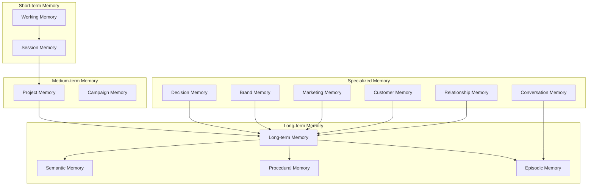

### 7.2. Memory Types — Detailed Specification

#### 7.2.1. Working Memory

| Attribute | Value |
|---|---|
| **Purpose** | Hold immediate context for current task execution |
| **Scope** | Single agent, single task |
| **TTL** | Task duration (minutes) |
| **Storage** | In-memory (Redis) |
| **Contents** | Current inputs, intermediate results, active tool outputs |
| **Access Pattern** | Read/write by executing agent only |
| **Promotion Trigger** | None — ephemeral by design |
| **Example** | Copywriter Agent's current draft, research notes for active query |

#### 7.2.2. Session Memory

| Attribute | Value |
|---|---|
| **Purpose** | Maintain context across multi-turn interactions within a session |
| **Scope** | Single user/session |
| **TTL** | Session duration (hours), configurable max 24h |
| **Storage** | Redis with session key |
| **Contents** | Conversation history, session goals, pending tasks, user preferences expressed |
| **Access Pattern** | All agents in session |
| **Promotion Trigger** | Significant decisions → Decision Memory; useful patterns → Procedural Memory |
| **Example** | Founder's brainstorming session with Idea Generator, iterative content refinement |

#### 7.2.3. Project Memory

| Attribute | Value |
|---|---|
| **Purpose** | Context for ongoing projects (campaigns, launches, initiatives) |
| **Scope** | Single project |
| **TTL** | Project lifecycle + 90 days archive |
| **Storage** | PostgreSQL (structured) + Vector DB (semantic) |
| **Contents** | Project goals, timeline, decisions, assets, status, team assignments |
| **Access Pattern** | Agents working on project |
| **Promotion Trigger** | Project completion → Long-term Memory (learnings) |
| **Example** | Q1 Product Launch campaign: all related content, decisions, performance |

#### 7.2.4. Campaign Memory

| Attribute | Value |
|---|---|
| **Purpose** | Specialized project memory for marketing campaigns |
| **Scope** | Single campaign |
| **TTL** | Campaign duration + 1 year |
| **Storage** | PostgreSQL + Vector DB |
| **Contents** | Campaign brief, KPIs, content calendar, assets, performance snapshots, A/B tests |
| **Access Pattern** | Campaign-related agents |
| **Promotion Trigger** | Campaign end → analytics to Long-term, learnings to Procedural |
| **Example** | Black Friday 2026 campaign: all posts, metrics, what worked/didn't |

#### 7.2.5. Long-term Memory

| Attribute | Value |
|---|---|
| **Purpose** | Persistent organizational knowledge and history |
| **Scope** | Organization-wide, permanent |
| **TTL** | Permanent (with archival tiers) |
| **Storage** | PostgreSQL + Vector DB + Object Storage |
| **Contents** | Historical content, performance baselines, organizational facts, relationship history |
| **Access Pattern** | All agents (read), Reflection Agent (write) |
| **Promotion Trigger** | N/A — top tier |
| **Example** | All published content since inception, historical engagement benchmarks |

#### 7.2.6. Semantic Memory

| Attribute | Value |
|---|---|
| **Purpose** | Structured facts and concepts about the organization, market, products |
| **Scope** | Organization-wide |
| **TTL** | Permanent, with versioning |
| **Storage** | Vector DB + Graph DB |
| **Contents** | Product facts, market data, ICP attributes, competitor info, verified claims |
| **Access Pattern** | All agents (read), Knowledge Curator (write) |
| **Promotion Trigger** | From Knowledge Base ingestion, validated facts |
| **Example** | "Product X launched March 2025", "Primary ICP: B2B SaaS founders" |

#### 7.2.7. Procedural Memory

| Attribute | Value |
|---|---|
| **Purpose** | Learned patterns of what works — processes, formats, timing, styles |
| **Scope** | Organization-wide, domain-specific |
| **TTL** | Permanent, continuously updated |
| **Storage** | PostgreSQL (structured rules) + Vector DB (examples) |
| **Contents** | Successful content patterns, optimal posting times, effective hooks, workflow optimizations |
| **Access Pattern** | All agents (read), Reflection/Learning System (write) |
| **Promotion Trigger** | From performance analysis, A/B test results, human feedback |
| **Example** | "LinkedIn posts with questions get 2x engagement", "Best posting time: Tue 9am EST" |

#### 7.2.8. Episodic Memory

| Attribute | Value |
|---|---|
| **Purpose** | Specific events and experiences with temporal context |
| **Scope** | Organization-wide |
| **TTL** | Permanent, indexed by time |
| **Storage** | Vector DB + Time-series DB |
| **Contents** | Published posts (with performance), meetings, decisions, crises, trend responses |
| **Access Pattern** | All agents (read), system events (write) |
| **Promotion Trigger** | Significant episodes → Semantic (facts) or Procedural (patterns) |
| **Example** | "March 15 viral LinkedIn post about AI trends — 50k impressions" |

#### 7.2.9. Decision Memory

| Attribute | Value |
|---|---|
| **Purpose** | Record of decisions made, rationale, and outcomes |
| **Scope** | Organization-wide |
| **TTL** | Permanent |
| **Storage** | PostgreSQL (structured) |
| **Contents** | Decision text, date, decider, rationale, alternatives considered, outcome (if known) |
| **Access Pattern** | CEO Agent, Strategy Agent, all agents (read for context) |
| **Promotion Trigger** | From Communication Ingestion, CEO Agent, human decisions |
| **Example** | "2026-03-01: Decided to pivot positioning from 'AI tool' to 'AI team' — rationale: market research showed..." |

#### 7.2.10. Brand Memory

| Attribute | Value |
|---|---|
| **Purpose** | Brand identity, voice, visual guidelines, messaging |
| **Scope** | Organization-wide |
| **TTL** | Permanent, versioned |
| **Storage** | Vector DB + Structured store |
| **Contents** | Tone of voice rules, messaging pillars, visual guidelines, approved/rejected examples |
| **Access Pattern** | Brand Agent, QC agents, Content agents |
| **Promotion Trigger** | From brandbook ingestion, Brand Agent updates, human approval |
| **Example** | "Tone: confident but not arrogant", "Never use: 'revolutionary', 'game-changer'" |

#### 7.2.11. Marketing Memory

| Attribute | Value |
|---|---|
| **Purpose** | Marketing strategy, campaigns history, channel performance |
| **Scope** | Organization-wide |
| **TTL** | Permanent |
| **Storage** | PostgreSQL + Vector DB |
| **Contents** | SMM strategy, content pillars, channel priorities, historical campaign performance |
| **Access Pattern** | Strategy Agent, Campaign Planner, Analytics Agent |
| **Promotion Trigger** | From strategy docs, campaign completions |
| **Example** | "Q1 2026 focus: thought leadership on LinkedIn, awareness on TikTok" |

#### 7.2.12. Customer Memory

| Attribute | Value |
|---|---|
| **Purpose** | Customer insights, preferences, segments, feedback |
| **Scope** | Organization-wide (aggregated, not individual PII) |
| **TTL** | Permanent, refreshed regularly |
| **Storage** | PostgreSQL + Vector DB |
| **Contents** | ICP profiles, segment preferences, common questions, feedback themes |
| **Access Pattern** | ICP Agent, Community Agent, Content agents |
| **Promotion Trigger** | From CRM, support tickets, community interactions |
| **Example** | "Enterprise segment prefers case studies over product demos" |

#### 7.2.13. Relationship Memory

| Attribute | Value |
|---|---|
| **Purpose** | Relationships with external entities (influencers, partners, media) |
| **Scope** | Per-entity |
| **TTL** | Permanent |
| **Storage** | PostgreSQL + Graph DB |
| **Contents** | Contact history, collaboration outcomes, preferences, status |
| **Access Pattern** | Influencer Agent, Community Agent, Partnership-related agents |
| **Promotion Trigger** | From interactions, CRM updates |
| **Example** | "Influencer @techleader: collaborated Q4 2025, prefers long-form, responsive" |

#### 7.2.14. Conversation Memory

| Attribute | Value |
|---|---|
| **Purpose** | History of conversations with users, community, stakeholders |
| **Scope** | Per-conversation thread |
| **TTL** | 1 year active, then archive |
| **Storage** | Vector DB + PostgreSQL |
| **Contents** | Message history, context, resolutions, sentiment |
| **Access Pattern** | Community Agent, agents in active conversation |
| **Promotion Trigger** | Significant conversations → Episodic; FAQ-worthy → Semantic |
| **Example** | "Support thread about pricing: resolved with enterprise tier explanation" |

### 7.3. Memory Operations

#### 7.3.1. Memory API

```
Memory Operations:
├── store(type, key, content, metadata) → memory_id
├── retrieve(type, query, filters) → [memories]
├── update(memory_id, content, metadata) → success
├── delete(memory_id) → success
├── promote(source_type, source_id, target_type) → target_id
├── demote(memory_id, archive_tier) → success
├── query_temporal(type, start, end, query) → [memories]
└── get_lineage(memory_id) → [source_memories]
```

#### 7.3.2. Memory Lifecycle

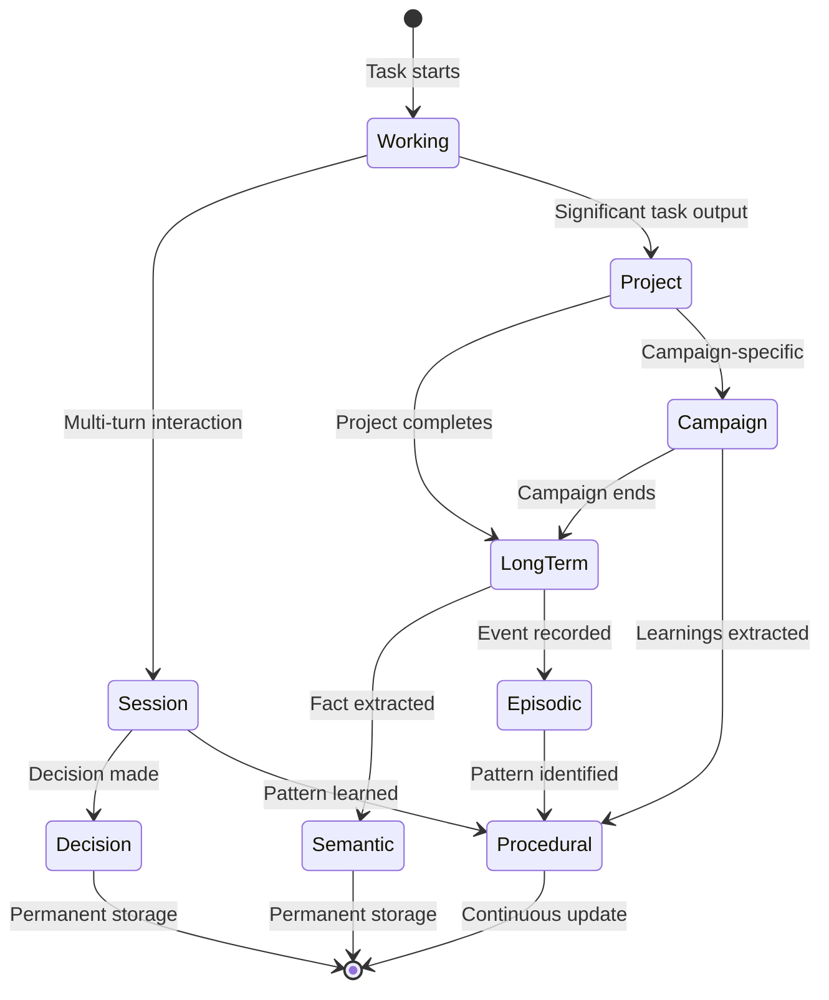

#### 7.3.3. Memory Consistency

- **Write-through**: Critical memories (Decision, Brand) written synchronously.
- **Eventual consistency**: Analytics-derived memories updated async.
- **Conflict resolution**: Newer + higher authority source wins.
- **Versioning**: All memory updates versioned, rollback capable.

---

## 8. Knowledge System

### 8.1. Knowledge Architecture

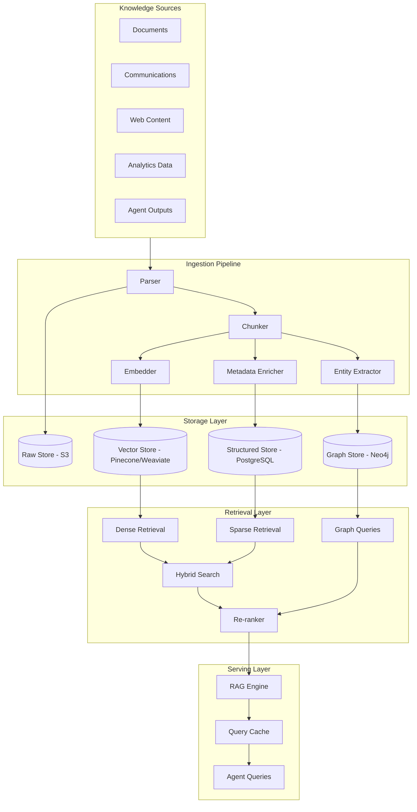

### 8.2. Document Processing Pipeline

#### 8.2.1. Parsing

| Source Type | Parser | Output |
|---|---|---|
| Google Docs | Google Docs API | Structured text + formatting metadata |
| Google Sheets | Sheets API | Tables as structured data + text representation |
| PDF | Unstructured.io / PyMuPDF | Text + tables + images (OCR if needed) |
| Word (.docx) | python-docx | Structured text + styles |
| Markdown | Native parser | Text + frontmatter |
| Notion | Notion API | Blocks → structured text |
| HTML/Web | Trafilatura / BeautifulSoup | Clean text + metadata |
| Presentations | python-pptx / Google Slides API | Slide text + notes |

#### 8.2.2. Chunking Strategy

**Principle**: Chunks must be semantically coherent and appropriately sized for retrieval.

| Document Type | Chunk Strategy | Target Size | Overlap |
|---|---|---|---|
| Long-form docs | Semantic chunking (by section/paragraph) | 500-1000 tokens | 100 tokens |
| Structured docs (FAQs) | Q&A pairs as single chunks | Variable | None |
| Spreadsheets | Row groups or logical sections | 10-50 rows | None |
| Chat logs | Thread-based chunking | Full thread or logical segment | Context window |
| Code/docs | AST-aware chunking | Function/class level | None |
| Presentations | Slide + notes as unit | 1 slide | None |

**Chunking Algorithm (Semantic)**:
1. Split by natural boundaries (headers, paragraphs).
2. Merge small chunks (<200 tokens) with neighbors.
3. Split large chunks (>1000 tokens) at sentence boundaries.
4. Preserve metadata: source, section, page, timestamp.

#### 8.2.3. Embedding Strategy

| Content Type | Embedding Model | Dimensions | Rationale |
|---|---|---|---|
| General text | text-embedding-3-large | 3072 | Best quality for diverse content |
| Code/technical | text-embedding-3-large | 3072 | Good code understanding |
| Multilingual | multilingual-e5-large | 1024 | If non-English content |
| Brand/voice | Fine-tuned model (future) | 768 | Capture brand-specific semantics |

**Embedding Best Practices**:
- Embed chunk + metadata summary for better retrieval.
- Store multiple embeddings per chunk (content, title, summary).
- Re-embed on content update.
- Version embeddings for model upgrades.

#### 8.2.4. Metadata Schema

```yaml
chunk_metadata:
  # Source identification
  source_id: uuid
  source_type: enum [google_doc, notion, pdf, slack, telegram, ...]
  source_url: string
  source_title: string
  
  # Temporal
  created_at: timestamp
  updated_at: timestamp
  ingested_at: timestamp
  valid_from: timestamp  # for temporal queries
  valid_until: timestamp # null if current
  
  # Authority
  author: string
  author_role: enum [founder, employee, agent, external]
  authority_level: int  # 1-10, founder=10
  confidence: float  # 0-1
  
  # Classification
  content_type: enum [strategy, product, brand, research, decision, ...]
  tags: [string]
  entities: [entity_ref]
  
  # Relationships
  parent_doc_id: uuid
  related_chunks: [uuid]
  supersedes: uuid  # if replaces older knowledge
  
  # Processing
  chunk_index: int
  chunk_total: int
  embedding_model: string
  embedding_version: int
```

### 8.3. Retrieval Strategy

#### 8.3.1. Hybrid Search

**Why Hybrid**: Dense (semantic) + Sparse (keyword) captures both meaning and exact matches.

```
Hybrid Search Pipeline:
1. Query Analysis
   ├── Intent classification
   ├── Entity extraction
   └── Query expansion (synonyms, related terms)

2. Parallel Retrieval
   ├── Dense: Vector similarity (top 50)
   ├── Sparse: BM25/keyword (top 50)
   └── Graph: Entity relationships (top 20)

3. Fusion
   ├── Reciprocal Rank Fusion (RRF)
   └── Deduplication

4. Re-ranking
   ├── Cross-encoder re-ranker
   ├── Authority weighting
   ├── Recency weighting
   └── Confidence filtering

5. Context Assembly
   ├── Top-K selection (K=10-20)
   ├── Context window optimization
   └── Source attribution
```

#### 8.3.2. When to Use What

| Query Type | Primary Method | Secondary | Rationale |
|---|---|---|---|
| Factual lookup | Sparse (BM25) | Dense | Exact term matching |
| Conceptual question | Dense | Graph | Semantic similarity |
| Entity relationships | Graph | Dense | Structured connections |
| Temporal query | Structured filter | Dense | Time-bound retrieval |
| Decision history | Structured + Dense | Graph | Decision Memory access |
| Brand/voice check | Dense (Brand partition) | Procedural | Style matching |

#### 8.3.3. Graph Memory

**Purpose**: Capture relationships between entities for complex queries.

**Entity Types**:
- Product, Feature, Benefit
- ICP, Persona, Segment
- Competitor, CompetitorProduct
- Campaign, Content, Channel
- Person, Role, Team
- Decision, Strategy, Goal

**Relationship Types**:
- HAS_FEATURE, TARGETS, COMPETES_WITH
- CREATED_BY, APPROVED_BY, SUPERSEDES
- PART_OF, RELATED_TO, MENTIONS

**Graph Query Examples**:
- "What content targets Enterprise ICP?" → ICP → TARGETS ← Content
- "What decisions affected Product X positioning?" → Product → MENTIONS ← Decision
- "Which competitors mentioned in last campaign?" → Campaign → MENTIONS → Competitor

#### 8.3.4. Episodic Memory Integration

**Purpose**: Retrieve similar past situations for learning.

**Mechanism**:
1. Current task embedded.
2. Search Episodic Memory for similar episodes.
3. Retrieve outcomes and learnings.
4. Inject into agent context.

**Example**: "Creating launch post for Product Y" → retrieves episodes of Product X launch, including what worked.

### 8.4. RAG Implementation

#### 8.4.1. RAG Pipeline

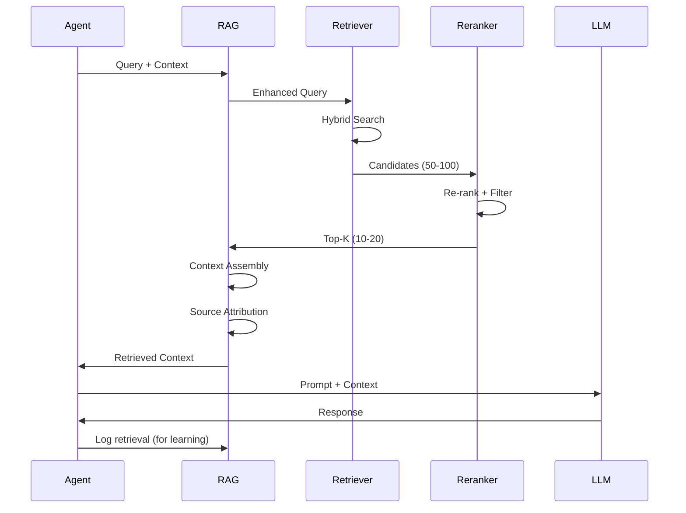

#### 8.4.2. Context Window Management

| Priority | Content | Max Tokens |
|---|---|---|
| 1 (required) | Query + Task context | 500 |
| 2 (required) | Top retrieved chunks | 4000 |
| 3 (important) | Relevant memory | 2000 |
| 4 (optional) | Graph context | 1000 |
| 5 (optional) | Episodic examples | 1000 |

**Truncation Strategy**: If over budget, reduce optional first, then summarize important.

#### 8.4.3. Source Attribution

Every agent output must cite sources:
```yaml
output:
  content: "..."
  sources:
    - chunk_id: uuid
      source_title: "Q1 Strategy Doc"
      source_url: "..."
      relevance_score: 0.92
    - chunk_id: uuid
      source_title: "Founder Slack Message"
      relevance_score: 0.87
```

### 8.5. Knowledge Partitions

| Partition | Contents | Access | Update Frequency |
|---|---|---|---|
| **Core** | Company facts, product info | All agents | Daily |
| **Brand** | Brandbook, tone of voice | Brand, Content, QC agents | Weekly |
| **Strategy** | SMM strategy, goals, roadmap | Strategy, CEO, Campaign agents | Weekly |
| **Research** | Market research, reports | Research, Strategy agents | Daily |
| **Competitor** | Competitor database | Competitor, Strategy agents | Daily |
| **Content** | Published content, drafts | Content, Platform agents | Real-time |
| **Analytics** | Performance data, benchmarks | Analytics, Optimizer agents | Daily |
| **Decisions** | Decision log | CEO, Strategy agents | Real-time |
| **Comms** | Ingested communications | All agents (filtered) | Real-time |

### 8.6. Knowledge Quality

#### 8.6.1. Quality Metrics

| Metric | Target | Measurement |
|---|---|---|
| Coverage | >95% sources ingested | Source sync status |
| Freshness | <24h for critical | Last update timestamp |
| Accuracy | >98% fact verification | QC Agent fact checks |
| Consistency | 0 unresolved conflicts | Conflict detector |
| Retrieval precision | >85% relevant in top-5 | Human evaluation sample |

#### 8.6.2. Knowledge Validation Workflow

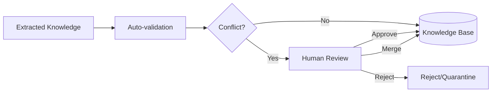

---

## 9. Integrations/Tools

### 9.1. Integration Architecture

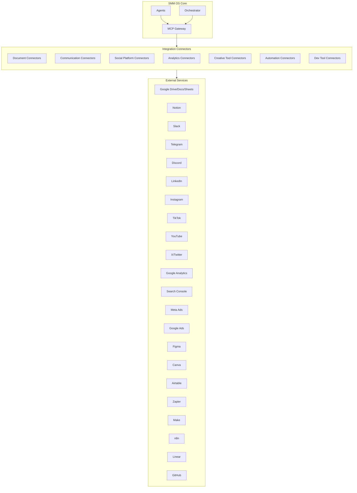

### 9.2. Integration Catalog

#### 9.2.1. Document & Knowledge Sources

| Integration | Purpose | Data Flow | Auth | Priority |
|---|---|---|---|---|
| **Google Drive** | Document storage, sync | Bi-directional | OAuth 2.0 | P0 |
| **Google Docs** | Document ingestion | Read + Watch | OAuth 2.0 | P0 |
| **Google Sheets** | Data tables, analytics | Read + Watch | OAuth 2.0 | P0 |
| **Notion** | Wiki, docs, databases | Bi-directional | OAuth 2.0 | P0 |
| **PDF Upload** | Manual doc ingestion | Read | API Key | P0 |
| **Word Upload** | Manual doc ingestion | Read | API Key | P0 |
| **Markdown/Git** | Technical docs | Read + Watch | SSH/OAuth | P1 |
| **Web Scraper** | Website content, competitors | Read | None/API | P1 |

**Google Drive Integration Details**:
- Watch API for real-time change detection
- Selective sync by folder labels
- Preserve document structure and formatting metadata
- Handle shared drives and permissions

**Notion Integration Details**:
- Sync databases as structured data
- Preserve block hierarchy
- Bi-directional: agents can create/update Notion pages
- Handle relations and rollups

#### 9.2.2. Communication Platforms

| Integration | Purpose | Data Flow | Auth | Priority |
|---|---|---|---|---|
| **Slack** | Team comms, founder chat | Read + Notify | OAuth 2.0 | P0 |
| **Telegram** | Founder chat, alerts | Read + Notify | Bot Token | P0 |
| **Discord** | Community, team chat | Read + Notify | Bot Token | P1 |
| **Email (IMAP)** | External communications | Read | OAuth/IMAP | P2 |

**Slack Integration Details**:
- Ingest configured channels (founder-chat, marketing, product)
- Thread-aware message grouping
- Real-time via Events API
- Bot can post notifications, request approvals
- Respect privacy: configurable channel whitelist

**Telegram Integration Details**:
- Founder direct chat ingestion
- Bot for alerts and approvals
- Group chat support with privacy controls

#### 9.2.3. Social Media Platforms

| Integration | Purpose | Data Flow | Auth | Priority |
|---|---|---|---|---|
| **LinkedIn** | B2B content, analytics | Bi-directional | OAuth 2.0 | P0 |
| **Instagram** | Visual content, stories | Bi-directional | OAuth 2.0 | P0 |
| **TikTok** | Short-form video | Bi-directional | OAuth 2.0 | P1 |
| **YouTube** | Long-form video | Bi-directional | OAuth 2.0 | P1 |
| **X (Twitter)** | Real-time, threads | Bi-directional | OAuth 2.0 | P0 |
| **Facebook** | Cross-posting, ads | Read + Publish | OAuth 2.0 | P2 |

**Platform Integration Pattern**:
```
Platform Connector:
├── Auth Manager (token refresh)
├── Rate Limiter (respect API limits)
├── Content Adapter (format conversion)
├── Publisher (post creation)
├── Analytics Fetcher (metrics retrieval)
├── Engagement Handler (comments, DMs)
└── Error Handler (retries, escalation)
```

**LinkedIn Specifics**:
- Personal profile vs Company page support
- Article publishing for long-form
- Document/carousel posts
- Analytics: impressions, engagement, demographics

**Instagram Specifics**:
- Feed posts, Stories, Reels
- Hashtag research integration
- Visual content requirements (aspect ratios)
- Insights API for analytics

#### 9.2.4. Analytics Platforms

| Integration | Purpose | Data Flow | Auth | Priority |
|---|---|---|---|---|
| **Google Analytics 4** | Website traffic, conversions | Read | OAuth 2.0 | P0 |
| **Google Search Console** | SEO performance | Read | OAuth 2.0 | P1 |
| **Platform Native Analytics** | Social metrics | Read | Via Platform APIs | P0 |
| **Meta Ads Manager** | Ad performance | Read | OAuth 2.0 | P2 |
| **Google Ads** | Ad performance | Read | OAuth 2.0 | P2 |

**Analytics Aggregation**:
- Unified metrics schema across platforms
- Daily sync jobs
- Anomaly detection on metric changes
- Attribution modeling (content → conversion)

#### 9.2.5. Creative Tools

| Integration | Purpose | Data Flow | Auth | Priority |
|---|---|---|---|---|
| **Figma** | Design assets, templates | Read + Create | OAuth 2.0 | P1 |
| **Canva** | Quick graphics, templates | Read + Create | OAuth 2.0 | P1 |
| **Asset Library** | Internal media storage | Bi-directional | Internal | P0 |

**Figma Integration**:
- Read design system components
- Export assets for social
- Create frames from Creative Agent briefs
- Brand template access

**Canva Integration**:
- Template-based asset generation
- Brand kit application
- Bulk resize for platforms
- Direct publish to social (where supported)

#### 9.2.6. Automation Platforms

| Integration | Purpose | Data Flow | Auth | Priority |
|---|---|---|---|---|
| **Zapier** | Legacy automations | Trigger/Action | API Key | P2 |
| **Make (Integromat)** | Complex workflows | Trigger/Action | API Key | P2 |
| **n8n** | Self-hosted automation | Trigger/Action | API Key | P1 |
| **Internal Webhooks** | Custom integrations | Bi-directional | API Key | P0 |

**Automation Strategy**:
- SMM OS as central orchestrator
- External automation for legacy/non-SMM tasks
- Webhook endpoints for external triggers
- Event publishing for external subscribers

#### 9.2.7. Development & Project Tools

| Integration | Purpose | Data Flow | Auth | Priority |
|---|---|---|---|---|
| **Linear** | Task tracking, roadmap | Bi-directional | OAuth 2.0 | P1 |
| **GitHub** | Code docs, releases | Read | OAuth 2.0 | P2 |
| **Airtable** | Databases, CRM | Bi-directional | OAuth 2.0 | P1 |

**Linear Integration**:
- Sync product roadmap for content planning
- Create tasks from agent recommendations
- Track content production workflow

#### 9.2.8. AI & Search Tools

| Integration | Purpose | Data Flow | Auth | Priority |
|---|---|---|---|---|
| **Web Search API** | Research, trend detection | Read | API Key | P0 |
| **Browser Automation** | Dynamic content, verification | Read | Internal | P1 |
| **LLM APIs** | OpenAI, Anthropic, etc. | Read | API Key | P0 |
| **MCP Servers** | Extensible tool protocol | Bi-directional | Configurable | P0 |

**MCP (Model Context Protocol) Gateway**:
- Standardized tool interface for agents
- Plugin architecture for new integrations
- Custom MCP servers for proprietary systems
- Tool discovery and capability negotiation

### 9.3. Tool Assignment by Agent

| Agent | Primary Tools | Secondary Tools |
|---|---|---|
| CEO Agent | Knowledge Base, Analytics Dashboard | Communication (read) |
| Research Agent | Web Search, Browser, Knowledge Base | Academic sources |
| Content Agent | Copywriter, Creative, Platform Agents | Knowledge Base, Brand Memory |
| LinkedIn Agent | LinkedIn API, Scheduler | Analytics |
| Analytics Agent | GA, Platform Analytics, GSC | Data visualization |
| Creative Agent | Figma, Canva, Asset Library | Brand Memory |
| Community Agent | Platform APIs (comments/DMs) | FAQ, CRM |
| Competitor Agent | Social APIs (read), Web Search | Browser |
| Publisher Agent | Platform APIs (publish) | Scheduler |

### 9.4. Integration Security

| Concern | Mitigation |
|---|---|
| Token storage | Encrypted in Vault, never in code/prompts |
| Scope minimization | Request only required OAuth scopes |
| Rate limiting | Respect platform limits, queue requests |
| Audit logging | Log all external API calls |
| Token rotation | Automatic refresh, alert on failure |
| Sandbox mode | Test integrations without real publishing |

---

## 10. Workflows

### 10.1. Каталог Workflow

| ID | Workflow | Триггер | Длительность | Агенты | Human Gate |
|---|---|---|---|---|---|
| WF-01 | Daily Content Production | Scheduler / Human request | 2–4 ч | Idea → Content → Copy → Platform → QC → Schedule | Optional |
| WF-02 | Campaign Launch | Human / CEO Agent | 1–2 недели | Strategy → Campaign Planner → Content → QC → Publish | Required |
| WF-03 | Communication Ingestion | Real-time message | <1 ч | Parser → Summarizer → Extractor → Validator | Critical only |
| WF-04 | Trend Response | Trend Agent alert | 1–2 ч | Trend → Idea → Content → QC → Publish | Required (v1) |
| WF-05 | Weekly Planning | Cron (Monday) | 2–3 ч | Analytics → Strategy → Campaign Planner → Calendar | Review |
| WF-06 | Performance Review | Cron (weekly/monthly) | 1–2 ч | Analytics → Optimizer → CEO → Strategy update | Review |
| WF-07 | Competitor Response | Competitor Agent alert | 4–24 ч | Competitor → Research → Strategy → Content | Required |
| WF-08 | Community Response | New comment/DM | 15–60 мин | Community → QC (light) → Publish/escalate | Sensitive topics |
| WF-09 | Knowledge Update | Source change / Comms | 15–60 мин | Extractor → Conflict → Validator → KB | Critical |
| WF-10 | Crisis Response | Sentiment spike | Immediate | Crisis → CEO → Pause → Response draft | Required |
| WF-11 | Product Launch Content | Product event | 2–4 недели | Research → Campaign → Multi-platform → QC | Required |
| WF-12 | SEO Content Pipeline | Content calendar | 1–3 дня | Research → SEO → Copy → QC → Publish | Optional |
| WF-13 | Influencer Outreach | Campaign need | 3–7 дней | Influencer → CEO approval → Outreach | Required |
| WF-14 | Brand Guideline Update | Brand change | 1–3 дня | Brand → CEO → KB update → All agents notify | Required |
| WF-15 | Learning Cycle | Post-publish + cron | Continuous | Analytics → Reflection → Memory → Strategy | Auto |

### 10.2. WF-01: Daily Content Production

**Цель:** Производство и публикация стандартного контента по календарю или ad hoc запросу.

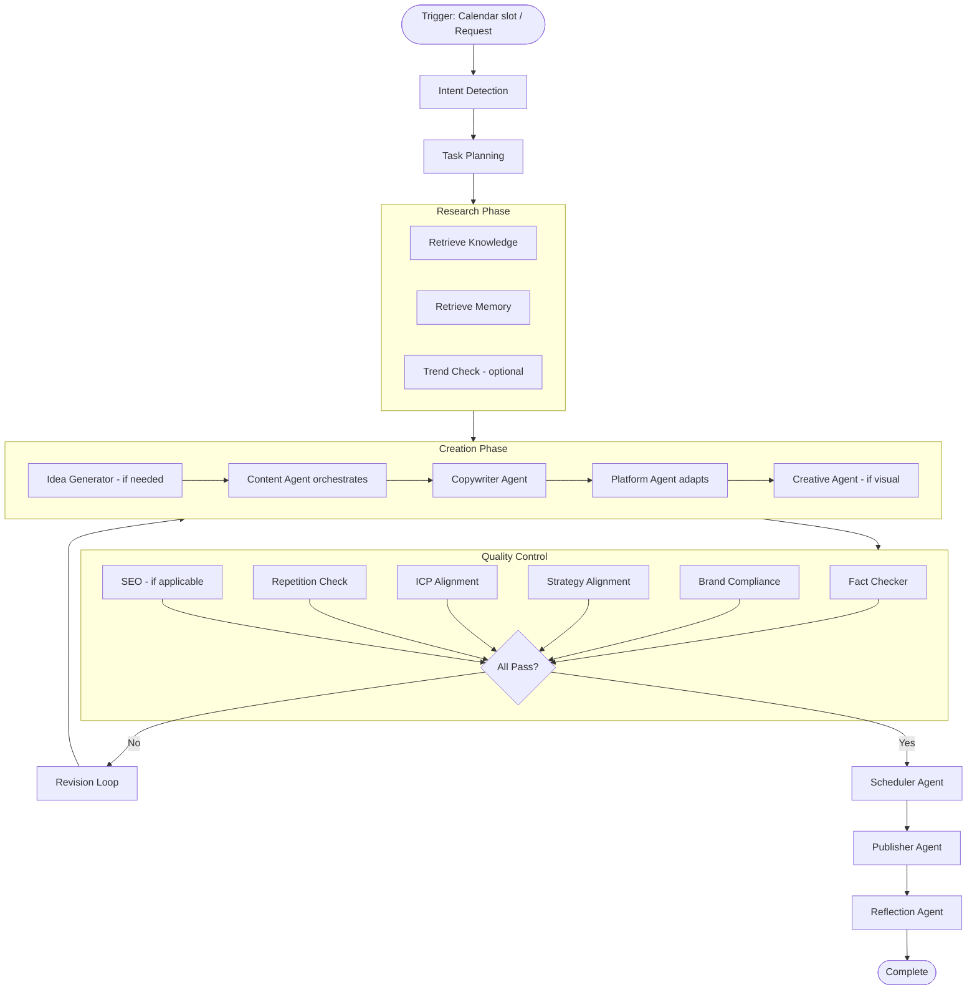

**Шаги:**

1. **Trigger** — Scheduler Agent обнаруживает слот в календаре или human/agent отправляет запрос («напиши пост про X для LinkedIn»).
2. **Intent Detection** — классификация: тип контента, платформа, срочность, сложность.
3. **Planning** — декомпозиция: нужен ли research, visual, SEO; какие агенты задействовать.
4. **Knowledge/Memory Retrieval** — RAG по теме, episodic memory (что публиковали ранее), procedural memory (что работало).
5. **Creation** — Content Agent координирует Copywriter + Platform Agent (+ Creative при необходимости).
6. **QC** — полный QC pipeline (см. Quality Control System).
7. **Revision Loop** — max 3 итерации; после 3 — escalation to human.
8. **Schedule/Publish** — Scheduler определяет время; Publisher выполняет.
9. **Reflection** — post-publish learning signals.

**SLA:** Standard post <4 hours. Urgent <1 hour (with reduced QC scope + human approval).

### 10.3. WF-02: Campaign Launch

**Цель:** End-to-end кампания от brief до post-campaign analysis.

```mermaid
flowchart LR
    BRIEF[Campaign Brief]
    STRAT[Strategy Alignment]
    PLAN[Campaign Planner]
    CAL[Content Calendar]
    
    subgraph Production["Parallel Production"]
        P1[Content Batch 1]
        P2[Content Batch 2]
        P3[Content Batch N]
    end

    QC_BATCH[Batch QC]
    APPROVE[Human Approval]
    SCHEDULE[Schedule All]
    LAUNCH[Launch]
    MONITOR[Monitor]
    OPTIMIZE[Optimize]
    REPORT[Report]

    BRIEF --> STRAT --> PLAN --> CAL
    CAL --> Production
    Production --> QC_BATCH --> APPROVE --> SCHEDULE --> LAUNCH
    LAUNCH --> MONITOR --> OPTIMIZE --> REPORT
```

**Фазы:**

| Phase | Duration | Key Activities | Gate |
|---|---|---|---|
| Brief & Strategy | 1–2 days | Objectives, KPIs, audience, messaging | CEO approval |
| Planning | 2–3 days | Content calendar, asset list, platform mix | Human review |
| Production | 1–2 weeks | Parallel content creation | QC per piece |
| Pre-launch Review | 1 day | Full campaign review | Human approval |
| Launch | Launch day | Scheduled publishing, monitoring | Auto |
| Optimization | Campaign duration | Real-time adjustments | Auto + alerts |
| Post-campaign | 3–5 days | Analysis, learnings, report | Human review |

### 10.4. WF-03: Communication Ingestion

**Цель:** Превращение коммуникаций команды в actionable knowledge.

*(Детальный pipeline — см. раздел Communication Ingestion Pipeline)*

**Trigger:** Real-time webhook от Slack/Telegram/Discord.

**Priority Routing:**
- Founder message → immediate processing, highest authority
- Decision keywords detected → Decision Memory path
- Idea keywords → Idea backlog path
- General discussion → Summarize + low-priority KB update

### 10.5. WF-04: Trend Response

**Цель:** Быстрая реакция на релевантные тренды.

**Constraints:**
- Brand relevance score >0.7 required
- Time window: trend relevance decays (TikTok: hours, LinkedIn: days)
- Human approval required in Phase 0–2

**Fast Path:**
```
Trend Alert → Brand Relevance Check → Idea (15 min) → Copy (15 min) → 
Light QC (brand + facts only) → Human Approval → Publish
```

### 10.6. WF-05: Weekly Planning

**Цель:** Планирование контента на неделю.

**Schedule:** Every Monday 6:00 AM (configurable).

**Steps:**
1. Analytics Agent: прошлая неделя performance summary
2. Performance Optimizer: recommendations
3. Trend Agent: upcoming trends/opportunities
4. Competitor Agent: competitor activity summary
5. Campaign Planner: calendar gaps, campaign needs
6. Idea Generator: fill gaps with ideas
7. CEO Agent: prioritize and approve direction
8. Output: weekly content calendar draft → human review

### 10.7. WF-08: Community Response

**Цель:** Ответы на комментарии, DM, mentions.

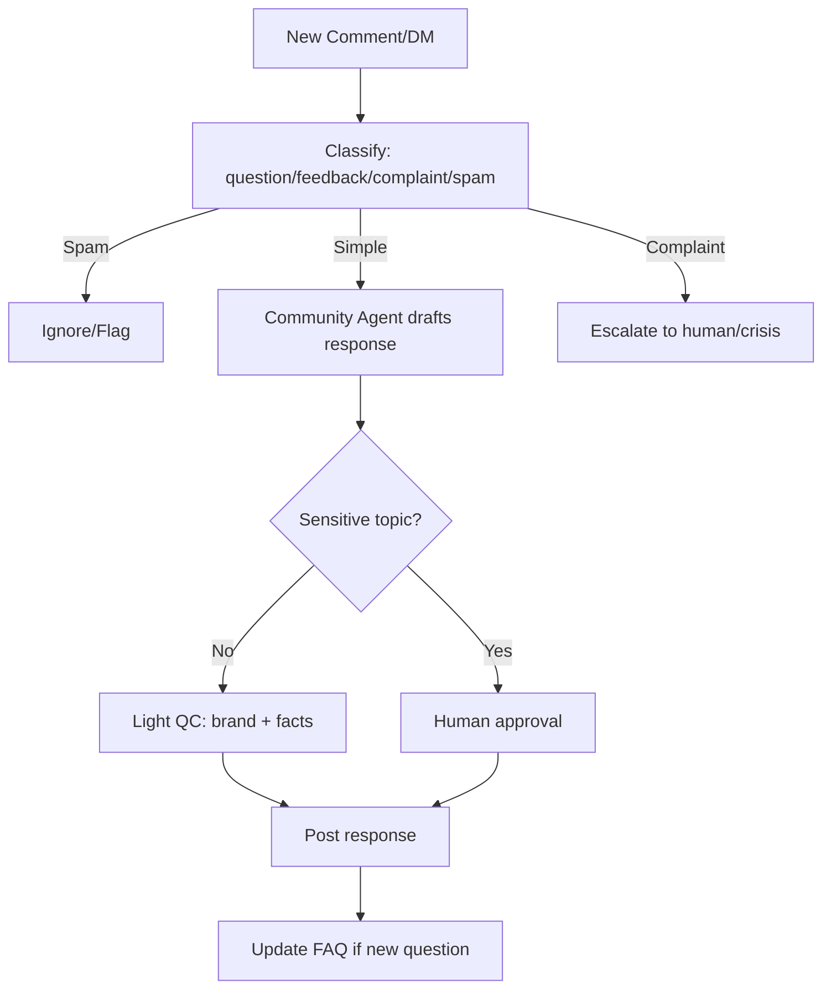

**Response Time SLA:**
- Simple questions: <1 hour
- Complex questions: <4 hours
- Complaints: immediate escalation, human response

### 10.8. WF-10: Crisis Response

**Цель:** Обнаружение и управление PR-кризисами.

**Trigger Conditions:**
- Sentiment score drops >30% in 1 hour
- Negative mention volume spike (>3x baseline)
- Controversial topic detected in our content
- External crisis affecting industry/brand

**Immediate Actions (automated):**
1. Crisis Agent alert to human + CEO Agent
2. Pause all scheduled publishing
3. Gather context (what happened, sources, sentiment)
4. Draft holding statement (if applicable)
5. Await human decision

**Human Decision Required:** Resume publishing, respond publicly, or remain silent.

### 10.9. Workflow Orchestration Patterns

#### 10.9.1. Sequential
Agents execute one after another. Use when output of A is required input for B.
```
Research Agent → Content Agent → Copywriter → QC Agent
```

#### 10.9.2. Parallel
Independent tasks run simultaneously. Use when no dependencies.
```
[LinkedIn Agent] + [Instagram Agent] + [X Agent] → Merge → QC
```

#### 10.9.3. Conditional
Branch based on conditions.
```
IF visual_required THEN Creative Agent ELSE skip
IF seo_relevant THEN SEO Agent ELSE skip
```

#### 10.9.4. Iterative (Revision Loop)
Repeat until condition met or max iterations.
```
WHILE qc_failed AND iterations < 3:
    Content Agent revises based on QC feedback
```

#### 10.9.5. Human-in-the-Loop
Pause for human input at defined gates.
```
QC Pass → AWAIT human_approval(timeout=24h) → Publish
```

### 10.10. Workflow State Management

```yaml
workflow_state:
  id: uuid
  type: enum [daily_content, campaign, crisis, ...]
  status: enum [pending, running, paused, waiting_human, completed, failed]
  current_step: string
  context:
    request: object
    knowledge_retrieved: [chunk_refs]
    memory_retrieved: [memory_refs]
    agent_outputs: {agent_id: output}
    qc_results: [qc_report]
  history:
    - step: string
      agent: string
      timestamp: datetime
      duration_ms: int
      outcome: string
  human_gates:
    - gate_id: string
      status: enum [pending, approved, rejected]
      timeout: datetime
  created_at: timestamp
  updated_at: timestamp
```

---

## 11. Pipelines

### 11.1. Pipeline Architecture Overview

Pipelines — это **некомпилируемые, event-driven data flows**, которые питают систему данными и обрабатывают их асинхронно. В отличие от Workflows (которые orchestrate agents для выполнения задач), Pipelines обрабатывают **потоки данных**.

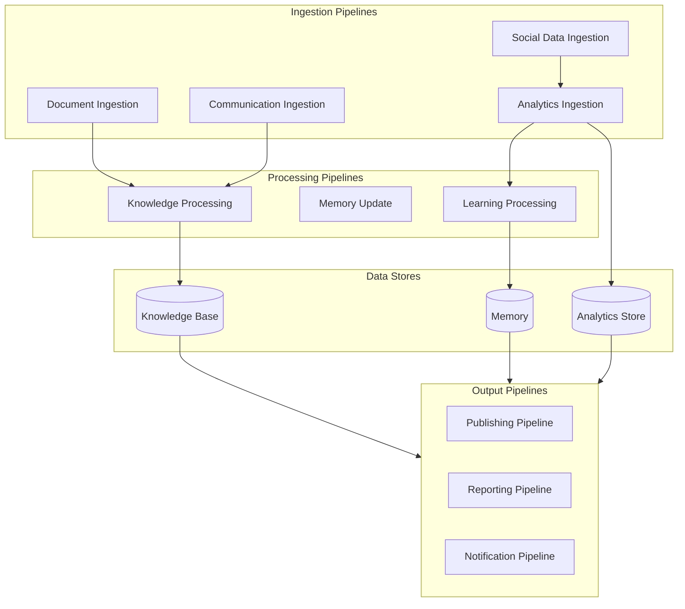

### 11.2. Document Ingestion Pipeline

**Purpose:** Sync all document sources into Knowledge Base.

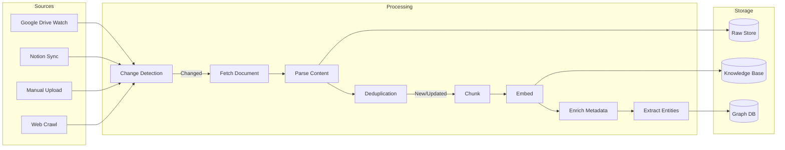

**Schedule:**
- Google Drive/Notion: Real-time via webhooks + daily full sync
- Manual upload: Immediate
- Web crawl: Weekly for configured URLs

**Change Detection:**
- Hash comparison for content
- Metadata comparison (modified_at)
- Incremental sync for large documents

**Deduplication:**
- Same content, different source → merge with source tracking
- Updated version → supersede old chunks, preserve history

### 11.3. Communication Ingestion Pipeline

*(Полная спецификация — см. dedicated section ниже)*

**Summary Flow:**
```
Message → Parser → Thread Grouping → Summarizer → Knowledge Extractor → 
Conflict Detection → Priority Routing → Validation → KB + Memory
```

### 11.4. Social Data Ingestion Pipeline

**Purpose:** Collect data from social platforms for analytics and learning.

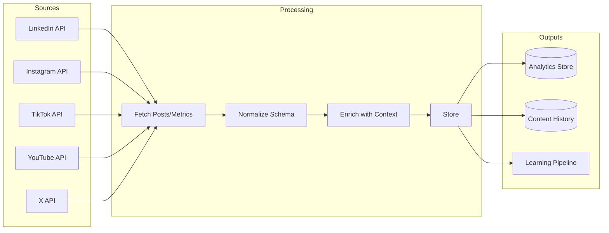

**Data Collected:**
- Own posts: content, metrics, engagement
- Comments/replies: text, sentiment, response status
- Competitor posts (if configured): content, metrics
- Trending topics (where available)

**Schedule:**
- Own content metrics: Every 6 hours
- Comments/DMs: Real-time via webhooks
- Competitor monitoring: Daily
- Trend data: Every 2 hours

### 11.5. Analytics Ingestion Pipeline

**Purpose:** Aggregate analytics from all sources.

**Sources:**
- Google Analytics 4
- Google Search Console
- Platform native analytics
- UTM tracking data
- Conversion data (if CRM integrated)

**Unified Metrics Schema:**
```yaml
metric:
  id: uuid
  timestamp: datetime
  source: enum [ga4, gsc, linkedin, instagram, ...]
  metric_type: enum [impression, engagement, click, conversion, ...]
  value: number
  dimensions:
    content_id: uuid
    platform: string
    campaign_id: uuid
    audience_segment: string
  metadata: object
```

### 11.6. Knowledge Processing Pipeline

**Purpose:** Transform raw ingested content into queryable knowledge.

**Stages:**

| Stage | Input | Output | Processing |
|---|---|---|---|
| 1. Parse | Raw document | Structured text | Format-specific parsers |
| 2. Clean | Structured text | Clean text | Remove boilerplate, normalize |
| 3. Chunk | Clean text | Chunks | Semantic chunking |
| 4. Embed | Chunks | Vectors | Embedding model |
| 5. Enrich | Chunks + metadata | Enriched chunks | NER, classification, tagging |
| 6. Extract | Enriched chunks | Entities + relations | Entity/relation extraction |
| 7. Index | All above | Searchable index | Vector + sparse + graph indexing |
| 8. Validate | Indexed knowledge | Validated knowledge | Conflict check, quality gates |

### 11.7. Publishing Pipeline

**Purpose:** Execute scheduled publishing to platforms.

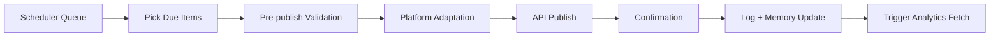

**Pre-publish Validation:**
- Content still approved (not revoked)
- Platform credentials valid
- Rate limits not exceeded
- No crisis pause active

**Error Handling:**
- Transient errors: Retry 3x with exponential backoff
- Permanent errors: Alert human, mark as failed
- Partial success (multi-platform): Continue with successful, retry failed

### 11.8. Learning Pipeline

**Purpose:** Continuous improvement from performance data.

*(Полная спецификация — см. dedicated section Learning System)*

**Trigger:** 
- Post-publish: 24h, 7d, 30d after publish
- Scheduled: Daily learning cycle
- Event: Human feedback received

### 11.9. Notification Pipeline

**Purpose:** Alert humans and agents about important events.

**Notification Types:**

| Type | Urgency | Channel | Recipient |
|---|---|---|---|
| Approval Required | High | Slack/Telegram/Email | Configured approvers |
| Crisis Alert | Critical | All channels | Founders + on-call |
| QC Failure | Medium | Slack | Content team |
| Knowledge Conflict | Medium | Slack | Knowledge admin |
| Performance Anomaly | Medium | Slack | Analytics team |
| Daily Summary | Low | Email/Slack | Stakeholders |
| Weekly Report | Low | Email | Stakeholders |

**Notification Rules:**
- Deduplication: Same alert within 1h → suppress
- Escalation: Unacknowledged critical → escalate after 15min
- Quiet hours: Non-critical suppressed during configured hours

### 11.10. Pipeline Monitoring

**Metrics per Pipeline:**
- Throughput (items/hour)
- Latency (p50, p95, p99)
- Error rate
- Backlog size
- Processing lag (time since source update)

**Alerts:**
- Backlog >1000 items
- Error rate >5%
- Latency p95 >SLA threshold
- Pipeline stalled (no processing for >1h)

---

## Communication Ingestion Pipeline

### CIP-001: Overview

**Mission:** Автоматически превращать все коммуникации команды (особенно founder chat) в структурированные, actionable знания, доступные всем агентам в течение <1 часа.

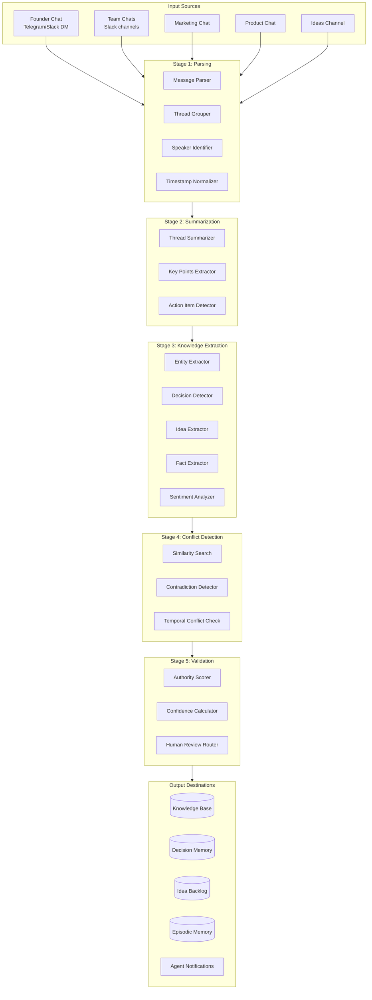

### CIP-002: Stage 1 — Parsing

**Input:** Raw messages from communication platforms.

**Processing:**

| Step | Function | Output |
|---|---|---|
| Message Parser | Extract text, attachments, reactions, links | Structured message objects |
| Thread Grouper | Group replies into threads | Thread objects with parent-child |
| Speaker Identifier | Map speaker ID to role (founder, team, agent) | Speaker metadata with authority level |
| Timestamp Normalizer | UTC normalization | Consistent timestamps |

**Message Object Schema:**
```yaml
message:
  id: uuid
  source: enum [slack, telegram, discord]
  channel_id: string
  channel_type: enum [founder_dm, team_channel, ideas, ...]
  thread_id: uuid
  parent_message_id: uuid
  speaker:
    id: string
    name: string
    role: enum [founder, executive, team, external]
    authority_level: int  # 1-10
  content:
    text: string
    attachments: [attachment_ref]
    links: [url]
    mentions: [entity_ref]
  reactions: [reaction]
  timestamp: datetime
  raw: object  # original platform payload
```

**Authority Levels:**
- Founder: 10
- C-level: 9
- Department head: 7
- Team member: 5
- External: 3
- Bot/Agent: 1

### CIP-003: Stage 2 — Summarization

**Purpose:** Condense threads into digestible summaries, especially for long discussions.

**Thread Summarizer:**
- Input: Thread object (may be 100+ messages)
- Output: Summary (200–500 tokens) + key points list
- Model: Fast LLM (Haiku/GPT-4o-mini) for cost efficiency
- Preserve: decisions, action items, dissenting opinions

**Key Points Extractor:**
- Extract bullet points from summary
- Tag each point: decision, idea, fact, question, action_item
- Confidence score per point

**Action Item Detector:**
- Pattern matching + LLM detection
- Extract: action, assignee (if mentioned), deadline (if mentioned)
- Route to appropriate workflow (task creation, idea backlog)

**Output Schema:**
```yaml
thread_summary:
  thread_id: uuid
  summary: string
  key_points:
    - text: string
      type: enum [decision, idea, fact, question, action_item]
      confidence: float
      speaker: string
  action_items:
    - action: string
      assignee: string
      deadline: datetime
  participants: [speaker_ref]
  duration: interval
  message_count: int
```

### CIP-004: Stage 3 — Knowledge Extraction

**Purpose:** Extract structured knowledge from summarized communications.

**Entity Extractor:**
- Named entities: people, products, features, companies, metrics, dates
- Link to existing graph entities or create new
- Confidence scoring

**Decision Detector:**
- Patterns: "we decided", "let's go with", "approved", "confirmed"
- Founder/executive statements weighted higher
- Extract: decision text, rationale, alternatives rejected, decider

**Decision Object:**
```yaml
decision:
  id: uuid
  text: string
  rationale: string
  alternatives_considered: [string]
  decider:
    name: string
    role: string
    authority_level: int
  timestamp: datetime
  source_thread: uuid
  confidence: float
  supersedes: uuid  # if reverses previous decision
  affects: [entity_ref]  # products, strategies, etc.
```

**Idea Extractor:**
- Patterns: "what if", "idea:", "we should try", "opportunity"
- Extract: idea text, context, proposer
- Route to Idea Backlog for Idea Generator Agent

**Fact Extractor:**
- Factual statements about products, market, customers
- Cross-reference with existing knowledge
- Flag new facts vs. confirmations vs. contradictions

**Sentiment Analyzer:**
- Overall thread sentiment
- Per-topic sentiment
- Flag negative sentiment for review

### CIP-005: Stage 4 — Conflict Detection

**Purpose:** Identify when new knowledge contradicts existing knowledge.

**Similarity Search:**
- Embed extracted knowledge
- Search KB for semantically similar existing knowledge
- Threshold: cosine similarity >0.85

**Contradiction Detector:**
- LLM-based NLI (Natural Language Inference)
- Compare new statement with similar existing statements
- Classify: entailment, contradiction, neutral

**Temporal Conflict Check:**
- Same topic, different time → check if intentional update
- Decision supersedes previous decision → mark old as superseded
- Fact changed over time → version, don't delete

**Conflict Object:**
```yaml
conflict:
  id: uuid
  new_knowledge: knowledge_ref
  existing_knowledge: knowledge_ref
  conflict_type: enum [contradiction, supersession, update]
  severity: enum [critical, major, minor]
  resolution_status: enum [pending, resolved, acknowledged]
  recommended_action: string
```

**Conflict Routing:**
- Critical (strategy, positioning, product facts): Immediate human review
- Major (tactical decisions): Human review within 24h
- Minor (details, preferences): Auto-resolve if new source has higher authority

### CIP-006: Stage 5 — Validation

**Purpose:** Ensure knowledge quality before entering KB/Memory.

**Authority Scorer:**
- Weight knowledge by speaker authority
- Founder statement about strategy = auto-approve (with notification)
- Team member statement about facts = require corroboration or human review

**Confidence Calculator:**
- Factors: speaker authority, corroboration, recency, explicit vs. implicit
- Output: confidence score 0–1
- Threshold for auto-accept: >0.8 with authority >7

**Human Review Router:**
- Critical conflicts → immediate Slack/Telegram alert
- Medium confidence (0.5–0.8) → queue for batch review
- Low confidence (<0.5) → quarantine, don't enter KB

**Validation Outcomes:**
```yaml
validation_result:
  knowledge_id: uuid
  status: enum [accepted, rejected, pending_review, quarantined]
  confidence: float
  reviewer: enum [auto, human]
  review_notes: string
  destinations:
    - type: enum [kb, decision_memory, idea_backlog, episodic]
      partition: string
```

### CIP-007: Output Routing

| Extracted Type | Destination | Priority | Notification |
|---|---|---|---|
| Decision (founder) | Decision Memory + KB | Immediate | All agents |
| Decision (team) | Decision Memory | High | Strategy agents |
| Idea | Idea Backlog | Medium | Idea Generator |
| Fact (new) | KB (Semantic) | Medium | Knowledge Curator |
| Fact (confirms) | KB (confidence boost) | Low | None |
| Action Item | Task system | High | Assignee |
| Strategy change | KB + Brand Memory | Critical | CEO Agent + all |
| Product update | KB (Product partition) | High | Content agents |

### CIP-008: Agent Notification

When critical knowledge is ingested, notify relevant agents:

```yaml
agent_notification:
  type: enum [knowledge_update, decision, strategy_change, crisis]
  affected_agents: [agent_id]
  summary: string
  knowledge_refs: [uuid]
  required_action: enum [none, review, update_strategy, pause]
  urgency: enum [immediate, next_task, next_cycle]
```

**Example:** Founder says "we're pivoting from B2B to B2C" →
1. Decision extracted with authority=10
2. Conflict detected with existing B2B strategy docs
3. Auto-accepted (founder authority)
4. Decision Memory updated
5. KB strategy partition flagged for update
6. All agents notified: `strategy_change, urgency=immediate`
7. CEO Agent triggers strategy review workflow

### CIP-009: Pipeline Metrics

| Metric | Target | Alert Threshold |
|---|---|---|
| Ingestion latency (message → KB) | <1 hour | >2 hours |
| Extraction accuracy | >90% | <85% |
| Conflict detection rate | 100% of contradictions | Any missed critical |
| False positive conflicts | <10% | >20% |
| Human review queue size | <50 items | >100 items |
| Founder message processing | <15 min | >30 min |

---

## Request Processing Lifecycle

### RPL-001: Overview

**Mission:** Обработать любой входящий запрос (от human, agent, или system) через полный lifecycle от intent detection до learning.

```mermaid
flowchart TB
    subgraph Input
        REQ[User Request]
    end

    subgraph Stage1["1. Intent Detection"]
        I1[Parse Request]
        I2[Classify Intent]
        I3[Assess Complexity]
        I4[Determine Urgency]
    end

    subgraph Stage2["2. Planning"]
        P1[Retrieve Context Requirements]
        P2[Decompose Tasks]
        P3[Assign Agents]
        P4[Define Success Criteria]
    end

    subgraph Stage3["3. Knowledge Retrieval"]
        K1[Query Analysis]
        K2[Hybrid Search]
        K3[Graph Traversal]
        K4[Memory Retrieval]
        K5[Context Assembly]
    end

    subgraph Stage4["4. Execution"]
        E1[Agent Orchestration]
        E2[Parallel/Sequential Execution]
        E3[Inter-agent Communication]
        E4[Tool Invocation]
    end

    subgraph Stage5["5. Quality Control"]
        Q1[Multi-gate QC]
        Q2[Revision Loop]
        Q3[Human Approval]
    end

    subgraph Stage6["6. Output"]
        O1[Format Output]
        O2[Deliver Response]
        O3[Schedule/Publish if applicable]
    end

    subgraph Stage7["7. Reflection & Learning"]
        R1[Execution Analysis]
        R2[Memory Update]
        R3[Learning Signals]
    end

    REQ --> Stage1 --> Stage2 --> Stage3 --> Stage4 --> Stage5 --> Stage6 --> Stage7
```

### RPL-002: Stage 1 — Intent Detection

**Input:** Raw request (text, may include attachments, context).

**Parse Request:**
- Extract text, attachments, metadata
- Identify @mentions, references to previous context
- Detect language

**Classify Intent:**

| Intent Category | Sub-intents | Example |
|---|---|---|
| Content Creation | post, article, thread, script, caption | "Write a LinkedIn post about our new feature" |
| Content Planning | calendar, campaign, ideas | "Plan content for next week" |
| Research | topic, competitor, market | "Research what competitors are doing with AI" |
| Analysis | performance, report, comparison | "How did last week's posts perform?" |
| Strategy | review, update, recommendation | "Should we focus more on TikTok?" |
| Operations | schedule, publish, pause | "Pause all scheduled posts" |
| Community | respond, monitor, report | "Reply to the comment on our latest post" |
| Knowledge | query, update, explain | "What's our current positioning?" |
| Admin | config, approval, status | "Show pending approvals" |

**Assess Complexity:**
- Simple: Single agent, single output, <30 min
- Medium: 2–3 agents, may need research, <2 hours
- Complex: Multiple agents, campaign-level, may span days
- Strategic: CEO-level, requires human decision

**Determine Urgency:**
- Immediate: Crisis, time-sensitive trend
- High: Same-day deadline
- Normal: Standard workflow
- Low: Background/batch processing

**Intent Object:**
```yaml
intent:
  request_id: uuid
  raw_request: string
  parsed_request: string
  category: enum [content, planning, research, analysis, strategy, ops, community, knowledge, admin]
  sub_intent: string
  complexity: enum [simple, medium, complex, strategic]
  urgency: enum [immediate, high, normal, low]
  platforms: [string]  # if content-related
  entities_mentioned: [entity_ref]
  confidence: float
```

### RPL-003: Stage 2 — Planning

**Retrieve Context Requirements:**
- Based on intent, determine what knowledge/memory is needed
- Content creation → brand, product, ICP, past content
- Strategy → current strategy, goals, recent decisions
- Research → existing research, competitor data

**Decompose Tasks:**
```yaml
task_decomposition:
  request_id: uuid
  tasks:
    - id: uuid
      type: string
      agent: string
      dependencies: [task_id]
      inputs: object
      expected_output: string
      timeout: duration
  execution_plan: enum [sequential, parallel, mixed]
  estimated_duration: duration
```

**Example Decomposition** — "Write a LinkedIn post about our new AI feature":
```yaml
tasks:
  - id: t1
    type: research
    agent: Research Agent
    dependencies: []
    inputs: {topic: "AI feature", depth: "brief"}
    expected_output: "Research brief with key facts"
    
  - id: t2
    type: copywriting
    agent: Copywriter Agent
    dependencies: [t1]
    inputs: {brief: "$t1.output", platform: "linkedin"}
    expected_output: "LinkedIn post draft"
    
  - id: t3
    type: platform_adaptation
    agent: LinkedIn Agent
    dependencies: [t2]
    inputs: {draft: "$t2.output"}
    expected_output: "LinkedIn-optimized post"
    
  - id: t4
    type: quality_control
    agent: QC Agent
    dependencies: [t3]
    inputs: {content: "$t3.output"}
    expected_output: "QC report + approved content"
```

**Assign Agents:**
- Match task types to agent capabilities
- Check agent availability (not overloaded)
- Consider agent specialization (e.g., specific platform)

**Define Success Criteria:**
- What constitutes successful completion
- QC thresholds
- Human approval requirements

### RPL-004: Stage 3 — Knowledge Retrieval

**Query Analysis:**
- Extract key concepts from request
- Identify entities to look up
- Expand query with synonyms, related terms

**Hybrid Search:**
- Dense retrieval: semantic similarity
- Sparse retrieval: keyword matching
- Combine with RRF (Reciprocal Rank Fusion)

**Graph Traversal:**
- For entity-related queries, traverse graph relationships
- Example: "content for enterprise customers" → ICP(enterprise) → TARGETS → Content examples

**Memory Retrieval:**
- Working memory: current session context
- Episodic: similar past tasks
- Procedural: what worked before
- Decision: relevant past decisions

**Context Assembly:**
```yaml
retrieved_context:
  request_id: uuid
  knowledge_chunks:
    - chunk_id: uuid
      content: string
      source: string
      relevance: float
  graph_context:
    entities: [entity]
    relationships: [relationship]
  memory:
    episodic: [episode]
    procedural: [pattern]
    decisions: [decision]
  total_tokens: int
  assembly_strategy: string
```

**Context Budget Management:**
- Total budget: ~8000 tokens for context
- Priority: query understanding > relevant knowledge > memory > graph
- Truncate/summarize if over budget

### RPL-005: Stage 4 — Execution

**Agent Orchestration:**
- Execute tasks according to plan (sequential/parallel)
- Pass outputs between dependent tasks
- Handle timeouts and failures

**Parallel/Sequential Execution:**
```
Parallel: [Research Agent, Trend Agent] → wait all → Content Agent
Sequential: Research → Copy → Platform → QC
```

**Inter-agent Communication:**
- Agents can request help from other agents
- Message bus for async communication
- Shared context object passed through pipeline

**Tool Invocation:**
- Agents invoke tools via MCP gateway
- Tool results logged and passed back to agent
- Rate limiting and error handling

**Execution State:**
```yaml
execution_state:
  request_id: uuid
  status: enum [running, paused, completed, failed]
  current_task: uuid
  completed_tasks:
    - task_id: uuid
      agent: string
      output: object
      duration_ms: int
      tool_calls: [tool_call]
  errors: [error]
  started_at: timestamp
  updated_at: timestamp
```

### RPL-006: Stage 5 — Quality Control

*(Полная спецификация — см. Quality Control System)*

**Summary:**
- All content outputs pass through QC Agent
- Multi-gate validation (facts, brand, strategy, ICP, repetition, SEO)
- Revision loop if failed (max 3 iterations)
- Human approval for high-risk or after failed revisions

### RPL-007: Stage 6 — Output

**Format Output:**
- Structure response according to request type
- Include source attributions
- Add metadata (agents involved, processing time, confidence)

**Deliver Response:**
- Return to requester (human, agent, system)
- Store in appropriate memory
- Trigger downstream actions (schedule, publish, notify)

**Output Object:**
```yaml
response:
  request_id: uuid
  status: enum [success, partial, failed]
  output:
    type: string
    content: object
    sources: [source_ref]
  metadata:
    agents_used: [agent_id]
    processing_time_ms: int
    qc_score: float
    confidence: float
  actions_taken:
    - type: enum [scheduled, published, saved, notified]
      details: object
```

### RPL-008: Stage 7 — Reflection & Learning

**Execution Analysis:**
- What worked well
- What could improve
- Unexpected issues
- Resource usage (time, cost, tokens)

**Memory Update:**
- Successful patterns → Procedural Memory
- Task episode → Episodic Memory
- New facts discovered → Semantic Memory
- Decisions made → Decision Memory

**Learning Signals:**
```yaml
learning_signal:
  request_id: uuid
  signal_type: enum [success_pattern, failure_pattern, optimization, new_knowledge]
  content: object
  confidence: float
  action: enum [update_procedural, update_semantic, flag_for_review]
```

### RPL-009: Lifecycle Metrics

| Metric | Target | Measurement |
|---|---|---|
| End-to-end latency (simple) | <5 min | Request to response |
| End-to-end latency (complex) | <30 min | Request to response |
| Intent classification accuracy | >95% | Human evaluation sample |
| Task decomposition quality | >90% | Missing steps detected |
| Knowledge retrieval relevance | >85% in top-5 | Human evaluation |
| QC pass rate (first attempt) | >80% | QC logs |
| Human escalation rate | <20% | Escalation logs |

---

## Quality Control System

### QCS-001: Overview

**Mission:** Гарантировать, что весь публикуемый контент соответствует factual accuracy, brand standards, strategy alignment, и quality bar компании.

```mermaid
flowchart TB
    INPUT[Content Draft]
    
    subgraph Gate1["Gate 1: Factual Accuracy"]
        F1[Fact Checker Agent]
        F2[Claim Verification]
        F3[Source Cross-reference]
    end

    subgraph Gate2["Gate 2: Brand Compliance"]
        B1[Brand Compliance Agent]
        B2[Tone of Voice Check]
        B3[Style Guidelines]
        B4[Visual Consistency]
    end

    subgraph Gate3["Gate 3: Strategic Alignment"]
        S1[Strategy Alignment Agent]
        S2[Company Goals Check]
        S3[Current Priorities]
        S4[Campaign Context]
    end

    subgraph Gate4["Gate 4: Audience Alignment"]
        A1[ICP Alignment Agent]
        A2[Targeting Verification]
        A3[Message Appropriateness]
    end

    subgraph Gate5["Gate 5: Content Quality"]
        C1[Repetition Detector]
        C2[SEO Compliance]
        C3[Platform Best Practices]
        C4[Engagement Potential]
    end

    AGG[Score Aggregation]
    DECISION{Pass Threshold?}
    REVISE[Revision Request]
    HUMAN[Human Review]
    APPROVE[Approved]

    INPUT --> Gate1 --> Gate2 --> Gate3 --> Gate4 --> Gate5
    Gate5 --> AGG --> DECISION
    DECISION -->|Score >= 0.85| APPROVE
    DECISION -->|Score 0.70-0.85| HUMAN
    DECISION -->|Score < 0.70| REVISE
    REVISE --> INPUT
```

### QCS-002: Gate 1 — Factual Accuracy

**Agent:** Fact Checker Agent

**Checks:**

| Check | Method | Fail Condition |
|---|---|---|
| Product claims | Cross-reference product docs | Claim not in approved list |
| Statistics | Verify against source docs | Number doesn't match source |
| Feature descriptions | Compare with product specs | Feature misrepresented |
| Company facts | Check against core knowledge | Factually incorrect |
| Quotes/attributions | Verify source | Unverified attribution |
| Dates/deadlines | Check against roadmap/calendar | Incorrect date |
| Competitor mentions | Verify against competitor DB | Inaccurate competitor info |

**Scoring:**
- Each claim checked: pass/fail/uncertain
- Uncertain claims flagged for human review
- Score = passed claims / total claims
- Threshold: 100% for verified claims, uncertain allowed with flag

**Output:**
```yaml
fact_check_report:
  content_id: uuid
  claims_checked: int
  claims_verified: int
  claims_failed: int
  claims_uncertain: int
  failures:
    - claim: string
      issue: string
      correction: string
      source: string
  score: float
  pass: boolean
```

### QCS-003: Gate 2 — Brand Compliance

**Agent:** Brand Compliance Agent (+ Brand Agent consultation)

**Checks:**

| Check | Method | Fail Condition |
|---|---|---|
| Tone of voice | LLM classification + examples | Off-brand tone detected |
| Messaging pillars | Keyword/concept presence | Missing required messaging |
| Forbidden words | Blocklist matching | Prohibited term used |
| Brand personality | Personality trait scoring | Personality mismatch |
| Visual guidelines | Creative brief review | Off-brand visual direction |
| Logo/brand usage | Asset compliance check | Incorrect brand asset usage |
| Consistency with past | Similar content comparison | Inconsistent with brand evolution |

**Tone of Voice Dimensions:**
```yaml
tone_check:
  dimensions:
    - name: "Confidence"
      target: "Confident but not arrogant"
      score: 0.85
    - name: "Formality"
      target: "Professional but approachable"
      score: 0.90
    - name: "Humor"
      target: "Subtle, not forced"
      score: 0.75
    - name: "Technicality"
      target: "Accessible to target audience"
      score: 0.88
  overall_score: 0.85
  issues:
    - dimension: "Humor"
      issue: "Forced joke in paragraph 3"
      suggestion: "Remove or rephrase naturally"
```

**Brand Memory Reference:**
- Pull approved examples for similar content type
- Pull rejected examples to avoid patterns
- Apply brand-specific rules from Brand Memory

### QCS-004: Gate 3 — Strategic Alignment

**Agent:** Strategy Alignment Agent

**Checks:**

| Check | Method | Fail Condition |
|---|---|---|
| SMM strategy alignment | Compare with strategy docs | Off-strategy topic/approach |
| Company goals | Check against current OKRs | Doesn't support goals |
| Current priorities | Check Decision Memory | Conflicts with priorities |
| Campaign fit | Check campaign context | Wrong campaign or off-message |
| Competitive positioning | Verify positioning statement | Misrepresents positioning |
| Content pillar | Verify pillar assignment | Wrong pillar or missing |

**Priority Context:**
- Retrieve current priorities from Decision Memory
- Weight checks by priority importance
- Flag if content addresses deprioritized topic

**Example:**
```yaml
strategy_alignment:
  current_priorities:
    - "AI team positioning (P0)"
    - "Enterprise customer acquisition (P1)"
    - "Product launch Q2 (P1)"
  content_alignment:
    - priority: "AI team positioning"
      aligned: true
      evidence: "Mentions AI team concept"
    - priority: "Enterprise customer acquisition"
      aligned: false
      issue: "Content targets SMB, not enterprise"
  overall_score: 0.70
  recommendation: "Revise to target enterprise ICP or confirm SMB targeting is intentional"
```

### QCS-005: Gate 4 — Audience Alignment (ICP)

**Agent:** ICP Alignment Agent

**Checks:**

| Check | Method | Fail Condition |
|---|---|---|
| Target ICP | Verify intended audience | Wrong ICP segment |
| Language/jargon | ICP-appropriate language check | Too technical/simple for ICP |
| Pain points | Address relevant pain points | Missing or wrong pain points |
| Value proposition | ICP-relevant value prop | Value prop doesn't resonate with ICP |
| Channel-ICP fit | Platform appropriate for ICP | Wrong platform for target ICP |
| Buyer stage | Content matches buyer journey stage | Stage mismatch |

**ICP Profiles Reference:**
```yaml
icp_check:
  target_icp: "B2B SaaS Founders"
  icp_profile:
    pain_points: ["scaling team", "automation", "cost reduction"]
    language_style: "direct, results-oriented"
    preferred_channels: ["linkedin", "twitter"]
  content_analysis:
    pain_points_addressed: ["automation"]
    pain_points_missing: ["scaling team", "cost reduction"]
    language_appropriate: true
    channel_appropriate: true
  score: 0.80
  suggestions:
    - "Consider adding cost reduction angle"
```

### QCS-006: Gate 5 — Content Quality

**Agents:** Repetition Detector, SEO Compliance, Platform Agents

**Checks:**

| Check | Agent | Fail Condition |
|---|---|---|
| Content repetition | Repetition Detector | >80% similar to recent post |
| SEO requirements | SEO Compliance Agent | Missing keywords, poor structure |
| Platform best practices | Platform Agent | Wrong format, length, hashtags |
| Engagement potential | Content Agent | Low predicted engagement |
| CTA presence | Copywriter review | Missing or weak CTA |
| Hook quality | Copywriter review | Weak opening hook |

**Repetition Detection:**
- Embed content
- Search last 30 days of published content
- Similarity threshold: 0.80 = fail, 0.60–0.80 = warning
- Thematic repetition (same topic) may be intentional — flag, don't auto-fail

**SEO Compliance (for applicable content):**
```yaml
seo_check:
  target_keywords: ["AI team", "SMM automation"]
  keyword_presence:
    - keyword: "AI team"
      in_title: true
      in_body: true
      density: 0.02
    - keyword: "SMM automation"
      in_title: false
      in_body: true
      density: 0.01
  meta_description: present
  heading_structure: appropriate
  score: 0.85
```

### QCS-007: Score Aggregation

**Weighted Scoring:**
```yaml
qc_weights:
  factual_accuracy: 0.25  # Must be high
  brand_compliance: 0.25  # Must be high
  strategy_alignment: 0.20
  icp_alignment: 0.15
  content_quality: 0.15
```

**Overall Score Calculation:**
```
overall_score = Σ (gate_score × weight)
```

**Decision Thresholds:**

| Score | Decision | Action |
|---|---|---|
| ≥0.90 | Auto-approve | Proceed to schedule/publish |
| 0.85–0.89 | Auto-approve (low risk) | Proceed with logging |
| 0.70–0.84 | Human review | Queue for approval |
| 0.50–0.69 | Revision required | Return to Content Agent with feedback |
| <0.50 | Reject | Major revision or abandon |

**Risk Modifiers:**
- High-risk content (crisis response, competitor mention, pricing): +0.10 to threshold
- Founder-requested content: -0.05 to threshold
- Trend response (time-sensitive): -0.05 to threshold but brand check mandatory

### QCS-008: Revision Loop

**Max Iterations:** 3

**Revision Request Format:**
```yaml
revision_request:
  content_id: uuid
  iteration: int
  qc_report: qc_report
  priority_fixes:
    - gate: string
      issue: string
      specific_fix: string
  optional_improvements:
    - suggestion: string
  preserve:
    - "Keep the hook"
    - "Maintain CTA"
```

**Escalation:**
- After 3 failed iterations → human review mandatory
- Persistent brand failures → Brand Agent consultation
- Persistent fact failures → Research Agent re-verification

### QCS-009: Human Review Interface

**Review Queue:**
- Prioritized by urgency and score
- Shows QC report with specific issues highlighted
- Side-by-side: original draft vs. suggested fixes
- Source attributions visible

**Reviewer Actions:**
- Approve as-is
- Approve with minor edits
- Request revision (specific feedback)
- Reject
- Escalate to CEO/founder

**Review SLAs:**
- Urgent (trend response): 30 min
- High priority: 4 hours
- Normal: 24 hours

### QCS-010: QC Metrics

| Metric | Target | Purpose |
|---|---|---|
| First-pass rate | >80% | Content quality at creation |
| Auto-approve rate | >60% | Efficiency |
| Human review rate | <30% | Reduce bottleneck |
| Revision success rate | >90% within 3 iterations | Revision effectiveness |
| Post-publish issues | <2% | QC effectiveness |
| Brand compliance score (avg) | >0.90 | Brand consistency |
| Factual error rate | <0.5% | Accuracy |

---

## Learning System

### LS-001: Overview

**Mission:** Непрерывно улучшать систему на основе performance data, feedback, и external signals.

```mermaid
flowchart TB
    subgraph Inputs["Learning Inputs"]
        PERF[Content Performance]
        FEEDBACK[Human Feedback]
        TRENDS[External Trends]
        COMP[Competitor Analysis]
        DECisions[Decision Outcomes]
    end

    subgraph Processing["Learning Processing"]
        ANALYZE[Performance Analyzer]
        PATTERN[Pattern Detector]
        CORRELATE[Correlation Engine]
        HYPOTHESIS[Hypothesis Generator]
    end

    subgraph Outputs["Learning Outputs"]
        PROC[Procedural Memory Update]
        SEM[Semantic Memory Update]
        STRAT[Strategy Recommendations]
        AGENT[Agent Behavior Updates]
    end

    subgraph Validation["Validation"]
        TEST[A/B Testing]
        HUMAN[Human Validation]
        ROLLOUT[Gradual Rollout]
    end

    Inputs --> Processing --> Outputs --> Validation
    Validation -->|Confirmed| Outputs
```

### LS-002: Learning Input Sources

#### LS-002.1. Content Performance

**Data Collected:**
- Engagement metrics (likes, comments, shares, saves)
- Reach metrics (impressions, views)
- Conversion metrics (clicks, signups, if tracked)
- Sentiment of comments
- Time-based performance (hour 1, day 1, week 1)

**Collection Schedule:**
- 24h post-publish: Initial performance snapshot
- 7d post-publish: Week performance
- 30d post-publish: Final performance assessment

**Performance Object:**
```yaml
content_performance:
  content_id: uuid
  platform: string
  published_at: datetime
  metrics:
    24h: {impressions, engagement_rate, ...}
    7d: {impressions, engagement_rate, ...}
    30d: {impressions, engagement_rate, ...}
  benchmark_comparison:
    vs_average: float  # e.g., 1.5 = 50% above average
    vs_similar: float
  sentiment:
    positive: float
    negative: float
    neutral: float
  tags: [content_type, topic, format, hook_type, ...]
```

#### LS-002.2. Human Feedback

**Sources:**
- Explicit feedback on agent outputs
- Edits made before approval
- Rejections with reasons
- Post-publish corrections
- Strategy meeting decisions

**Feedback Object:**
```yaml
feedback:
  id: uuid
  source: enum [human_edit, rejection, correction, explicit]
  content_id: uuid
  agent_id: string
  feedback_type: enum [positive, negative, correction, preference]
  original: string
  corrected: string
  reason: string
  timestamp: datetime
```

#### LS-002.3. External Trends

**Sources:**
- Trend Agent daily reports
- Industry news
- Platform algorithm changes
- Seasonal patterns

#### LS-002.4. Competitor Analysis

**Sources:**
- Competitor Agent monitoring
- Competitor content performance (where visible)
- Market positioning changes

#### LS-002.5. Decision Outcomes

**Sources:**
- Decision Memory with outcome tracking
- Campaign results vs. predictions
- Strategy changes and their effects

### LS-003: Learning Processing

#### LS-003.1. Performance Analyzer

**Functions:**
- Aggregate performance across content types, topics, formats
- Identify top performers and underperformers
- Calculate benchmarks and trends
- Segment analysis (by platform, ICP, content pillar)

**Analysis Outputs:**
```yaml
performance_analysis:
  period: string
  top_performers:
    - content_id: uuid
      metric: string
      value: float
      factors: [hook_type, topic, format, timing, ...]
  underperformers:
    - content_id: uuid
      metric: string
      value: float
      potential_issues: [string]
  benchmarks:
    by_platform: {linkedin: {avg_engagement: 0.05}, ...}
    by_content_type: {carousel: {avg_engagement: 0.08}, ...}
  trends:
    - metric: string
      direction: enum [up, down, stable]
      change: float
```

#### LS-003.2. Pattern Detector

**Functions:**
- Identify patterns in high-performing content
- Detect anti-patterns in low-performing content
- Cross-reference with procedural memory
- Generate hypotheses for testing

**Pattern Types:**
```yaml
pattern:
  id: uuid
  type: enum [success, failure, neutral]
  description: string
  evidence:
    - content_id: uuid
      metric: float
  confidence: float
  factors:
    - factor: string  # e.g., "question in hook"
      correlation: float
  sample_size: int
  first_detected: datetime
  last_confirmed: datetime
```

**Example Patterns:**
- "LinkedIn posts with questions in the first line get 2.1x engagement"
- "Carousel posts about product features underperform vs. thought leadership"
- "Posts published Tuesday 9am EST outperform other times by 1.4x"
- "Content mentioning competitor X gets higher engagement but also negative comments"

#### LS-003.3. Correlation Engine

**Functions:**
- Statistical correlation between content attributes and performance
- Control for confounding factors (platform, timing, topic)
- Identify causal vs. correlational relationships

**Correlation Analysis:**
```yaml
correlation:
  attribute: string  # e.g., "hook_type=question"
  metric: string  # e.g., "engagement_rate"
  correlation: float  # -1 to 1
  p_value: float
  sample_size: int
  controlled_for: [platform, timing, topic]
  confidence: enum [high, medium, low]
```

#### LS-003.4. Hypothesis Generator

**Functions:**
- Generate testable hypotheses from patterns
- Prioritize by potential impact and testability
- Design A/B tests where applicable

**Hypothesis Object:**
```yaml
hypothesis:
  id: uuid
  statement: string  # "Using questions in hooks increases engagement"
  basis: [pattern_id]
  test_design:
    type: enum [ab_test, before_after, cohort]
    variants: [string]
    sample_size_needed: int
    duration: duration
  expected_impact: float
  priority: enum [high, medium, low]
  status: enum [proposed, testing, confirmed, rejected]
```

### LS-004: Learning Outputs

#### LS-004.1. Procedural Memory Updates

**What Gets Updated:**
- Optimal posting times per platform
- Effective content formats
- Successful hook patterns
- Engagement tactics that work
- Workflow optimizations

**Update Process:**
```yaml
procedural_update:
  pattern_id: uuid
  rule: string  # "For LinkedIn, use question hooks"
  confidence: float
  evidence_count: int
  effective_from: datetime
  superseded_by: uuid  # if replaced
```

**Example Procedural Rules:**
- "LinkedIn: Question hook → +110% engagement (confidence: 0.92, n=47)"
- "Instagram Reels: 15-30 sec optimal length (confidence: 0.85, n=23)"
- "Avoid posting about [topic X] on Fridays (confidence: 0.78, n=12)"

#### LS-004.2. Semantic Memory Updates

**What Gets Updated:**
- Verified facts from performance (what resonates with audience)
- ICP preference insights
- Market perception data
- Competitor intelligence

**Example Updates:**
- "Enterprise ICP responds better to ROI-focused messaging than feature-focused"
- "Audience frequently asks about [topic Y] — consider FAQ update"

#### LS-004.3. Strategy Recommendations

**Generated By:** Performance Optimizer Agent + CEO Agent review

**Recommendation Types:**
```yaml
strategy_recommendation:
  id: uuid
  type: enum [channel, content_pillar, format, timing, topic, budget]
  recommendation: string
  rationale: string
  evidence: [pattern_id, correlation_id]
  expected_impact: string
  confidence: float
  requires_approval: boolean
  status: enum [proposed, approved, implemented, rejected]
```

**Example Recommendations:**
- "Increase LinkedIn posting frequency from 3x to 5x/week based on consistent above-benchmark performance"
- "Reduce TikTok investment — 3 months below benchmark, audience mismatch with ICP"
- "Double down on 'AI team' messaging pillar — 2.3x average engagement"

#### LS-004.4. Agent Behavior Updates

**What Gets Updated:**
- Agent prompts (via prompt versioning system)
- Default parameters (creativity, length, format preferences)
- Tool usage patterns
- Inter-agent collaboration patterns

**Update Process:**
1. Learning signal identified
2. Hypothesis generated
3. A/B test in sandbox or limited rollout
4. Results validated
5. Prompt/parameter update deployed
6. Monitor for regression

### LS-005: Learning Validation

#### LS-005.1. A/B Testing

**Test Types:**
- Content variants (hook, format, CTA)
- Posting times
- Platform mix
- Messaging approaches

**Test Framework:**
```yaml
ab_test:
  id: uuid
  hypothesis_id: uuid
  variants:
    - name: "control"
      description: string
      allocation: 0.5
    - name: "treatment"
      description: string
      allocation: 0.5
  primary_metric: string
  secondary_metrics: [string]
  sample_size: int
  status: enum [running, completed, inconclusive]
  results:
    control: {metric: value}
    treatment: {metric: value}
    lift: float
    p_value: float
    winner: string
```

#### LS-005.2. Human Validation

**Required For:**
- Strategy recommendations
- Major procedural memory changes
- Brand-related learnings
- Contradictory patterns

**Validation Process:**
- Present evidence and recommendation
- Human approves/rejects/modifies
- Document decision in Decision Memory

#### LS-005.3. Gradual Rollout

**For Agent Behavior Updates:**
1. Sandbox testing (synthetic tasks)
2. 10% traffic (low-risk content)
3. 50% traffic (monitor metrics)
4. 100% rollout (if no regression)
5. Rollback capability at each stage

### LS-006: Learning from Best/Worst Content

#### LS-006.1. Best Content Analysis

**Process:**
1. Identify top 10% performers (by engagement, reach, or conversion)
2. Extract common attributes (topic, format, hook, timing, platform)
3. Analyze comment sentiment and themes
4. Generate "success template" patterns
5. Update Procedural Memory with confirmed patterns

**Best Content Report:**
```yaml
best_content_analysis:
  period: string
  top_content:
    - content_id: uuid
      metric: float
      attributes:
        topic: string
        format: string
        hook_type: string
        platform: string
        timing: datetime
        content_pillar: string
  common_patterns:
    - pattern: string
      frequency: float
  recommendations:
    - "Create more [format] about [topic]"
    - "Use [hook_type] hooks more frequently"
```

#### LS-006.2. Worst Content Analysis

**Process:**
1. Identify bottom 10% performers
2. Analyze failure modes (wrong topic, bad timing, off-brand, etc.)
3. Check if QC missed issues
4. Generate anti-patterns
5. Update Procedural Memory with warnings

**Failure Mode Categories:**
- Topic-audience mismatch
- Format-platform mismatch
- Timing issues
- Off-brand (QC miss)
- Factual issues (QC miss)
- Saturation (too much similar content)
- External factors (news cycle, platform algorithm)

### LS-007: Trend Learning

**Process:**
1. Trend Agent identifies emerging trends
2. Track which trends we acted on vs. ignored
3. Measure performance of trend-based content
4. Learn which trend types work for our brand
5. Update trend response criteria

**Trend Learning Object:**
```yaml
trend_learning:
  trend_id: uuid
  trend_description: string
  action_taken: boolean
  content_created: [content_id]
  performance: float  # vs benchmark
  brand_relevance_score: float
  lesson: string  # "Trends about [X] work for us, [Y] don't"
```

### LS-008: Decision Outcome Tracking

**Process:**
1. When decision is made, log expected outcome
2. After relevant period, measure actual outcome
3. Compare expected vs. actual
4. Update decision-making patterns

**Decision Outcome Object:**
```yaml
decision_outcome:
  decision_id: uuid
  decision: string
  expected_outcome: string
  actual_outcome: string
  outcome_match: enum [exceeded, met, missed]
  metrics:
    - metric: string
      expected: float
      actual: float
  lessons: [string]
```

### LS-009: Learning Cycle Schedule

| Cycle | Frequency | Focus | Output |
|---|---|---|---|
| Real-time | Continuous | Feedback, corrections | Immediate agent updates |
| Daily | 6 AM | Previous day performance | Daily insights report |
| Weekly | Monday | Week performance, patterns | Weekly optimization report |
| Monthly | 1st | Trend analysis, strategy review | Monthly strategy recommendations |
| Quarterly | Q start | Deep analysis, strategy refresh | Quarterly strategy update |

### LS-010: Learning Metrics

| Metric | Target | Purpose |
|---|---|---|
| Pattern detection accuracy | >85% | Quality of learnings |
| Hypothesis confirmation rate | >60% | Usefulness of hypotheses |
| Strategy recommendation adoption | >50% | Impact of learnings |
| Performance improvement trend | +5%/quarter | System effectiveness |
| QC improvement over time | +2%/quarter | Learning from failures |
| Agent behavior update success | >90% no regression | Safe updates |

---

## 12. Roadmap

### 12.1. Roadmap Overview

```mermaid
gantt
    title SMM OS Implementation Roadmap
    dateFormat YYYY-MM
    section Phase 0
    Foundation & Setup           :p0, 2026-01, 2M
    section Phase 1
    Knowledge Base MVP           :p1, 2026-03, 2M
    section Phase 2
    Core Agents & Workflows      :p2, 2026-05, 3M
    section Phase 3
    Communication Ingestion      :p3, 2026-08, 2M
    section Phase 4
    Multi-Platform Publishing    :p4, 2026-10, 2M
    section Phase 5
    Learning & Optimization      :p5, 2026-12, 2M
    section Production
    Full Autonomy & Scale        :prod, 2027-02, 3M
```

### 12.2. Phase 0: Foundation & Setup

**Duration:** 2 months

**Goal:** Инфраструктурный фундамент, базовая архитектура, первичная ingestion документов.

**Why Now:** Без фундамента невозможно строить агентов. Knowledge Base — prerequisite для всего.

**Expected Result:**
- Infrastructure deployed (cloud, databases, message queue)
- Document ingestion pipeline working for Google Drive + Notion
- Basic vector search operational
- 1–2 agents running in sandbox (Research, Copywriter)
- Manual workflow: human triggers agents, approves all outputs

**Dependencies:**
- Cloud account setup
- API credentials for Google, Notion
- Initial document corpus identified and accessible

**Completion Criteria:**
- [ ] 100% of identified core documents ingested
- [ ] Vector search returns relevant results (>70% precision in manual test)
- [ ] Research Agent can answer questions about company/product
- [ ] Copywriter Agent can generate on-brand draft (with human edit)
- [ ] All infrastructure monitored and alerting configured

**Common Mistakes:**
- Over-engineering infrastructure before validating agent needs
- Ingesting everything without prioritization (start with core docs)
- Skipping metadata enrichment (painful to add later)
- Not establishing evaluation framework early

**Risks:**
| Risk | Probability | Impact | Mitigation |
|---|---|---|---|
| Document access issues | Medium | High | Early audit of all sources |
| Embedding quality poor | Low | High | Test multiple models early |
| Scope creep | High | Medium | Strict Phase 0 scope |

**Best Practices:**
- Start with 10–20 core documents, validate pipeline, then scale
- Build evaluation dataset for retrieval quality from day 1
- Document all architectural decisions
- Set up cost tracking immediately

### 12.3. Phase 1: Knowledge Base MVP

**Duration:** 2 months

**Goal:** Production-ready Knowledge Base с hybrid search, metadata, basic graph.

**Why Now:** Agents need reliable knowledge retrieval. MVP KB enables meaningful agent work.

**Expected Result:**
- Full document ingestion (all sources)
- Hybrid search (dense + sparse) operational
- Metadata schema implemented
- Basic entity extraction and graph
- Knowledge partitions (Core, Brand, Strategy)
- Conflict detection (manual resolution)
- 5 agents operational: Research, Copywriter, Brand, Content, QC (basic)

**Dependencies:**
- Phase 0 complete
- All document sources connected
- Brand guidelines documented

**Completion Criteria:**
- [ ] All document sources syncing (<24h freshness)
- [ ] Hybrid search precision >80% (eval dataset)
- [ ] Entity graph with >100 entities
- [ ] Brand Agent can evaluate content compliance
- [ ] QC Agent catches obvious factual/brand errors
- [ ] End-to-end: request → research → draft → QC → human approval

**Common Mistakes:**
- Perfectionism in chunking strategy (iterate later)
- Ignoring graph relationships (hard to add retroactively)
- Not versioning knowledge (temporal queries impossible later)
- Under-investing in conflict detection

**Risks:**
| Risk | Probability | Impact | Mitigation |
|---|---|---|---|
| Knowledge staleness | Medium | High | Automated sync + alerts |
| Graph complexity explosion | Medium | Medium | Start simple, expand gradually |
| QC false positives | High | Medium | Tune thresholds with human feedback |

**Best Practices:**
- Implement source authority levels from start
- Build knowledge admin UI early
- Create "knowledge gap" reporting
- Regular human audit of retrieved knowledge quality

### 12.4. Phase 2: Core Agents & Workflows

**Duration:** 3 months

**Goal:** Полный agent roster для content creation, orchestration, workflows.

**Why Now:** KB ready, time to build the team. Core workflows enable daily operations.

**Expected Result:**
- 20+ agents deployed with contracts
- Orchestration layer operational (intent, planning, routing)
- Core workflows: Daily Content, Weekly Planning, Campaign Launch
- Memory system (Working, Session, Project, Long-term, Procedural)
- Multi-agent collaboration working
- Human approval gates configured

**Dependencies:**
- Phase 1 complete
- Platform API credentials (at least LinkedIn)
- Content calendar process defined

**Completion Criteria:**
- [ ] All core agents deployed and tested
- [ ] Daily Content workflow end-to-end <4 hours
- [ ] Weekly Planning workflow generates usable calendar
- [ ] Memory system storing and retrieving correctly
- [ ] Agent-to-agent communication working
- [ ] 50% of content tasks without human intervention (except approval)

**Common Mistakes:**
- Too many agents too fast (start with core 10, expand)
- Ignoring agent failure modes (need graceful degradation)
- Not logging agent decisions (impossible to debug/improve)
- Workflow rigidity (need flexibility for edge cases)

**Risks:**
| Risk | Probability | Impact | Mitigation |
|---|---|---|---|
| Agent coordination failures | Medium | High | Robust error handling, fallbacks |
| Cost explosion | High | Medium | Cost limits, model routing |
| Quality inconsistency | Medium | High | Strong QC gates, human review |

**Best Practices:**
- Agent contracts as code (version controlled)
- Comprehensive logging and tracing
- Start with one platform (LinkedIn), expand after stable
- Weekly agent performance review

### 12.5. Phase 3: Communication Ingestion

**Duration:** 2 months

**Goal:** Real-time ingestion коммуникаций команды в Knowledge Base и Memory.

**Why Now:** "Founder said X today, agents know tomorrow" — critical differentiator.

**Expected Result:**
- Slack/Telegram ingestion pipeline operational
- Communication → Knowledge extraction working
- Decision Memory populated from comms
- Conflict detection for comms vs. docs
- Agent notifications on critical updates
- <1 hour latency for founder messages

**Dependencies:**
- Phase 2 complete
- Communication platform access configured
- Privacy/consent policies defined

**Completion Criteria:**
- [ ] Founder chat ingesting in real-time
- [ ] Team channels ingesting (configured list)
- [ ] Decision extraction accuracy >85%
- [ ] Conflict detection catching contradictions
- [ ] Agents receive notifications on strategy changes
- [ ] Human review queue manageable (<50 items)

**Common Mistakes:**
- Ingesting too many channels (noise overwhelms signal)
- Not prioritizing founder/executive messages
- Ignoring privacy boundaries
- Auto-accepting all extracted knowledge (need validation)

**Risks:**
| Risk | Probability | Impact | Mitigation |
|---|---|---|---|
| Privacy violation | Medium | Critical | Clear policies, channel whitelist |
| Information overload | High | Medium | Priority filtering, summarization |
| Extraction errors | Medium | High | Human validation for critical |

**Best Practices:**
- Start with founder chat only, expand gradually
- Authority levels from day 1
- Clear escalation for conflicts
- Regular audit of ingested comms quality

### 12.6. Phase 4: Multi-Platform Publishing

**Duration:** 2 months

**Goal:** Automated publishing на все целевые платформы.

**Why Now:** Content creation ready, time to execute distribution.

**Expected Result:**
- Platform agents for LinkedIn, Instagram, X (minimum)
- Publishing pipeline operational
- Scheduler with optimal timing
- Analytics ingestion from platforms
- Community Agent for responses (draft mode)
- End-to-end autonomous content cycle (with approval)

**Dependencies:**
- Phase 2–3 complete
- Platform API credentials and approvals
- Content calendar populated

**Completion Criteria:**
- [ ] Publishing to 3+ platforms working
- [ ] Scheduler using performance-based timing
- [ ] Analytics flowing into system daily
- [ ] Community Agent drafting responses
- [ ] 70% of scheduled content publishes without issues
- [ ] Zero off-brand content published

**Common Mistakes:**
- Platform API rate limit issues (need queuing)
- Not handling publish failures gracefully
- Ignoring platform-specific content requirements
- Auto-publishing before QC confidence high enough

**Risks:**
| Risk | Probability | Impact | Mitigation |
|---|---|---|---|
| Platform API changes | Medium | High | Abstraction layer, monitoring |
| Off-brand publish | Low | Critical | Mandatory QC, human gate initially |
| Account restrictions | Low | Critical | Conservative rate limits |

**Best Practices:**
- Sandbox/test accounts for development
- Publish queue with retry logic
- Post-publish monitoring for issues
- Gradual autonomy increase (human approve → auto low-risk → auto all)

### 12.7. Phase 5: Learning & Optimization

**Duration:** 2 months

**Goal:** Continuous learning loop operational, system self-improves.

**Why Now:** Enough data accumulated, time to close the loop.

**Expected Result:**
- Performance analysis automated
- Pattern detection identifying success/failure patterns
- Procedural Memory updating from learnings
- Strategy recommendations generated
- A/B testing framework operational
- Measurable performance improvement

**Dependencies:**
- Phase 4 complete (3+ months of publish data)
- Analytics pipeline stable
- Baseline metrics established

**Completion Criteria:**
- [ ] Daily/weekly performance reports automated
- [ ] 10+ confirmed patterns in Procedural Memory
- [ ] Strategy recommendations generated monthly
- [ ] A/B test framework running
- [ ] Measurable engagement improvement vs. baseline
- [ ] Learning metrics meeting targets

**Common Mistakes:**
- Learning from insufficient data (need statistical significance)
- Over-fitting to recent trends
- Not validating learnings before applying
- Ignoring negative learnings (what doesn't work)

**Risks:**
| Risk | Probability | Impact | Mitigation |
|---|---|---|---|
| Wrong pattern adoption | Medium | Medium | Validation before rollout |
| Over-optimization | Medium | Low | Diversity requirements |
| Learning loop too slow | Medium | Medium | Real-time feedback for critical |

**Best Practices:**
- Statistical rigor in pattern detection
- Human validation for strategy changes
- Gradual rollout of learned behaviors
- Regular "unlearning" audit (outdated patterns)

### 12.8. Production: Full Autonomy & Scale

**Duration:** 3 months

**Goal:** Production-grade system with high autonomy, scale, reliability.

**Why Now:** All components proven, time to productionize.

**Expected Result:**
- 90%+ tasks without human intervention
- All platforms operational
- Crisis response automated (with human escalation)
- Full learning loop closed
- Scale to 100+ content pieces/week
- 99.9% uptime
- Cost optimized

**Dependencies:**
- All previous phases complete
- 6+ months of operational data
- Team confidence in system

**Completion Criteria:**
- [ ] 90% autonomous operation (human for exceptions only)
- [ ] All 30+ agents operational
- [ ] All workflows automated
- [ ] Learning system demonstrating improvement
- [ ] SLAs met consistently
- [ ] Cost per post <$0.50
- [ ] Zero critical incidents (off-brand publish, factual error in production)

**Common Mistakes:**
- Removing human oversight too fast
- Ignoring edge cases at scale
- Not planning for platform changes
- Complacency after initial success

**Risks:**
| Risk | Probability | Impact | Mitigation |
|---|---|---|---|
| Autonomy failure | Medium | Critical | Gradual rollout, kill switches |
| Scale bottlenecks | Medium | High | Load testing, horizontal scaling |
| Model deprecation | Medium | Medium | Multi-model support |

**Best Practices:**
- Maintain human oversight capability always
- Comprehensive monitoring and alerting
- Regular disaster recovery drills
- Continuous cost optimization
- Quarterly architecture review

---

## 13. Risks

### 13.1. Risk Matrix

| ID | Risk | Category | Probability | Impact | Score | Mitigation |
|---|---|---|---|---|---|---|
| R-01 | Off-brand content published | Quality | Medium | Critical | 9 | Multi-gate QC, human approval gates |
| R-02 | Factual error in published content | Quality | Medium | Critical | 9 | Fact Checker, source attribution |
| R-03 | Knowledge staleness | Data | High | High | 8 | Real-time sync, staleness alerts |
| R-04 | Founder decision not captured | Data | Medium | High | 6 | Priority comms ingestion |
| R-05 | Agent coordination failure | Technical | Medium | High | 6 | Graceful degradation, fallbacks |
| R-06 | Cost explosion | Financial | High | Medium | 6 | Cost limits, model routing |
| R-07 | Platform API changes | Technical | Medium | High | 6 | Abstraction layer, monitoring |
| R-08 | Privacy violation (comms ingestion) | Legal | Low | Critical | 6 | Clear policies, channel whitelist |
| R-09 | Competitor content copying | Legal | Low | High | 4 | Originality checks, brand focus |
| R-10 | LLM model deprecation | Technical | Medium | Medium | 4 | Multi-model support |
| R-11 | Key person dependency | Operational | Medium | Medium | 4 | Documentation, knowledge in system |
| R-12 | Over-automation backlash | Reputational | Low | High | 4 | Human touchpoints, transparency |
| R-13 | Trend-chasing off-brand | Quality | Medium | Medium | 4 | Brand relevance filter |
| R-14 | Data breach | Security | Low | Critical | 6 | Encryption, access controls |
| R-15 | Single point of failure | Technical | Medium | High | 6 | Redundancy, disaster recovery |

### 13.2. Risk Mitigation Strategies

#### R-01/R-02: Content Quality Risks

**Controls:**
- Mandatory QC for all content
- Fact Checker with source requirements
- Brand Compliance with examples
- Human approval for high-risk content
- Post-publish monitoring with rapid takedown capability
- Kill switch to pause all publishing

**Monitoring:**
- QC pass rates
- Post-publish issue reports
- Brand consistency scores
- Human override frequency

#### R-03/R-04: Knowledge Risks

**Controls:**
- Real-time sync for critical sources
- Communication ingestion with priority routing
- Staleness alerts and dashboards
- Knowledge validation workflow
- Regular knowledge audits

**Monitoring:**
- Knowledge freshness metrics
- Sync failure alerts
- Conflict queue size
- Agent retrieval quality

#### R-05/R-07/R-15: Technical Risks

**Controls:**
- Graceful degradation (partial functionality vs. full failure)
- Circuit breakers for external APIs
- Retry logic with exponential backoff
- Multi-region deployment (Production)
- Regular disaster recovery testing

**Monitoring:**
- System uptime
- API error rates
- Agent failure rates
- Recovery time metrics

#### R-06: Cost Risks

**Controls:**
- Per-agent cost budgets
- Model routing (cheap models for simple tasks)
- Caching for repeated queries
- Cost alerts and dashboards
- Regular cost optimization reviews

**Monitoring:**
- Daily cost tracking
- Cost per task/content piece
- Budget utilization

#### R-08/R-14: Security Risks

**Controls:**
- Encryption at rest and in transit
- RBAC for all access
- Secret management (Vault)
- Audit logging
- Regular security reviews
- GDPR compliance for PII

**Monitoring:**
- Access logs
- Failed authentication attempts
- Data access patterns

### 13.3. Contingency Plans

| Scenario | Trigger | Response |
|---|---|---|
| Off-brand publish | QC miss detected post-publish | Immediate takedown, root cause analysis, QC threshold adjustment |
| Factual error | User report or monitoring | Correction publish, Fact Checker review, source verification |
| System outage | Uptime <99% | Failover to backup, manual operations mode, stakeholder notification |
| Cost spike | Daily cost >2x average | Pause non-critical operations, model downgrade, investigation |
| Platform ban | API access revoked | Pause platform publishing, appeal process, alternative channels |
| Data breach | Security alert | Incident response plan, notification, forensic analysis |

---

## 14. Scaling Strategy

### 14.1. Scaling Dimensions

```mermaid
flowchart TB
    subgraph Horizontal["Horizontal Scaling"]
        AGENTS[More Agents]
        WORKERS[More Workers]
        PLATFORMS[More Platforms]
    end

    subgraph Vertical["Vertical Scaling"]
        MODELS[Better Models]
        CONTEXT[Larger Context]
        QUALITY[Higher Quality]
    end

    subgraph Data["Data Scaling"]
        KB[Knowledge Base Growth]
        MEMORY[Memory Accumulation]
        ANALYTICS[Analytics Volume]
    end

    subgraph Operational["Operational Scaling"]
        AUTONOMY[More Autonomy]
        WORKFLOWS[More Workflows]
        CUSTOMERS[Multi-tenant]
    end
```

### 14.2. Agent Scaling

**Current:** 30+ specialized agents

**Scaling Approach:**
- Agent pools for high-demand agents (Copywriter, Platform Agents)
- Load balancing across agent instances
- Auto-scaling based on queue depth

**Agent Instance Model:**
```yaml
agent_pool:
  agent_type: "Copywriter Agent"
  min_instances: 2
  max_instances: 10
  scale_up_threshold: queue_depth > 20
  scale_down_threshold: queue_depth < 5
  cooldown: 5min
```

**Future Agent Additions:**
- Vertical-specific agents (Healthcare SMM, FinTech SMM)
- Language-specific agents (Localization Agent expansion)
- Format-specific agents (Podcast Agent, Newsletter Agent)
- Integration-specific agents (Shopify Agent, HubSpot Agent)

### 14.3. Knowledge Base Scaling

**Current Capacity:** 10M chunks

**Scaling Strategy:**

| Scale | Chunks | Strategy |
|---|---|---|
| Phase 1 | 100K | Single vector DB instance |
| Phase 2 | 1M | Sharded vector DB, read replicas |
| Phase 3 | 10M | Partition by knowledge type, caching layer |
| Production | 100M+ | Multi-region, tiered storage (hot/warm/cold) |

**Optimization Techniques:**
- Embedding caching (don't re-embed unchanged content)
- Query caching (common queries)
- Tiered storage (recent/hot vs. archival/cold)
- Approximate nearest neighbor (ANN) for speed
- Pre-computed indexes for common queries

### 14.4. Content Volume Scaling

**Target Progression:**

| Phase | Content/Week | Platforms | Autonomy |
|---|---|---|---|
| Phase 2 | 10–20 | 1 | 30% |
| Phase 4 | 30–50 | 3 | 60% |
| Phase 5 | 50–100 | 5 | 80% |
| Production | 100–500 | 5+ | 90% |

**Scaling Content Production:**
- Parallel content creation (multiple Content Agent instances)
- Batch processing for campaigns
- Template-based generation for recurring content
- Content repurposing pipeline (1 piece → multiple formats)

### 14.5. Multi-Tenant Scaling (Future)

**Architecture for Multiple Companies:**

```mermaid
flowchart TB
    subgraph Shared["Shared Infrastructure"]
        ORCH[Orchestrator]
        LLM[LLM Gateway]
        CORE[Core Agents]
    end

    subgraph Tenant1["Tenant A"]
        KB1[(Knowledge Base A)]
        MEM1[(Memory A)]
        BRAND1[Brand Config A]
        AGENTS1[Custom Agents A]
    end

    subgraph Tenant2["Tenant B"]
        KB2[(Knowledge Base B)]
        MEM2[(Memory B)]
        BRAND2[Brand Config B]
        AGENTS2[Custom Agents B]
    end

    ORCH --> Tenant1
    ORCH --> Tenant2
    CORE --> Tenant1
    CORE --> Tenant2
```

**Tenant Isolation:**
- Separate knowledge bases per tenant
- Separate memory stores
- Shared agent logic, tenant-specific configuration
- Resource quotas per tenant
- Billing per tenant

### 14.6. Cost Scaling

**Cost Optimization Strategies:**

| Strategy | Savings | Implementation |
|---|---|---|
| Model routing | 50–70% | Simple tasks → cheap models |
| Caching | 30–50% | Cache embeddings, common queries |
| Batch processing | 20–30% | Batch similar tasks |
| Prompt optimization | 10–20% | Shorter prompts, better context |
| Self-hosted models | 40–60% | For high-volume, non-critical tasks |

**Cost Targets by Scale:**

| Content/Week | Target Cost/Post | Monthly Infrastructure |
|---|---|---|
| 20 | $1.00 | $500 |
| 50 | $0.75 | $1,000 |
| 100 | $0.50 | $2,000 |
| 500 | $0.30 | $5,000 |

### 14.7. Geographic Scaling

**For Multi-Region Operations:**
- Regional knowledge partitions (locale-specific)
- Regional agent instances (latency optimization)
- Timezone-aware scheduling
- Local platform preferences
- Compliance with regional regulations (GDPR, etc.)

---

## 15. Security

### 15.1. Security Architecture

```mermaid
flowchart TB
    subgraph External["External Layer"]
        WAF[WAF]
        CDN[CDN]
        LB[Load Balancer]
    end

    subgraph Access["Access Control"]
        AUTH[Authentication]
        RBAC[RBAC]
        API_GW[API Gateway]
    end

    subgraph Application["Application Layer"]
        AGENTS[Agents]
        ORCH[Orchestrator]
        MCP[MCP Gateway]
    end

    subgraph Data["Data Layer"]
        ENCRYPT[Encryption at Rest]
        VAULT[Secret Vault]
        AUDIT[Audit Logs]
    end

    subgraph Network["Network Security"]
        VPC[VPC Isolation]
        FW[Firewall]
        TLS[TLS 1.3]
    end

    External --> Access --> Application --> Data
    Network --> Application
    Network --> Data
```

### 15.2. Authentication & Authorization

**Human Users:**
- SSO integration (Google Workspace, Okta)
- MFA required for admin access
- Role-based access control (RBAC)

**Roles:**

| Role | Permissions |
|---|---|
| Admin | Full system access, configuration |
| Approver | Approve content, review knowledge conflicts |
| Viewer | View dashboards, reports |
| Agent Operator | Trigger workflows, view agent status |
| API User | Programmatic access (limited scopes) |

**Agent Authentication:**
- Service accounts with limited scopes
- Token rotation
- No human credentials accessible to agents

**API Authentication:**
- API keys for external integrations
- OAuth 2.0 for platform APIs
- Webhook signature verification

### 15.3. Data Security

**Encryption:**
- At rest: AES-256 for all databases and object storage
- In transit: TLS 1.3 for all connections
- Secrets: Encrypted in Vault, never in code/logs/prompts

**Data Classification:**

| Class | Examples | Handling |
|---|---|---|
| Public | Published content, marketing materials | Standard storage |
| Internal | Strategy docs, analytics | Encrypted, access controlled |
| Confidential | Founder comms, financial data | Encrypted, strict access, audit |
| Restricted | Credentials, PII | Vault, minimal access, masked in logs |

**PII Handling:**
- Minimize PII in knowledge base
- Aggregate customer data (no individual PII)
- GDPR compliance: right to deletion, data portability
- PII detection and masking in logs

### 15.4. Secret Management

**Vault Architecture:**
```yaml
secrets:
  platform_credentials:
    linkedin: {client_id, client_secret, access_token, refresh_token}
    instagram: {...}
    slack: {...}
  api_keys:
    openai: sk-...
    anthropic: sk-...
  internal:
    db_password: ...
    encryption_key: ...
```

**Secret Access:**
- Agents access secrets via MCP Gateway (never in prompts)
- Secrets rotated automatically where supported
- Access logged and audited
- Emergency rotation capability

### 15.5. Agent Security

**Prompt Injection Prevention:**
- Input sanitization
- System prompts isolated from user input
- Output validation before tool execution
- Sandboxed tool execution

**Tool Access Control:**
- Agents have minimum required tool access
- Tool calls logged and auditable
- Dangerous operations require human approval
- Rate limiting on tool calls

**Agent Boundaries:**
- Agents cannot modify their own prompts
- Agents cannot access other tenants' data
- Agents cannot exfiltrate data (output filtering)

### 15.6. Communication Ingestion Security

**Privacy Controls:**
- Channel whitelist (only approved channels ingested)
- Message filtering (exclude private/sensitive topics)
- Retention policies (auto-delete after N days)

**Access Controls:**
- Только агенты с явным разрешением читают Conversation Memory
- Founder/executive сообщения — отдельная partition с ограниченным доступом
- Community Agent видит только публичные interactions, не internal chats
- Audit log всех обращений к comms-derived knowledge

**Consent & Policy:**
- Явное согласие участников чатов на ingestion (документируется)
- Политика retention: internal comms — 1 год active, затем archive; founder decisions — permanent
- Opt-out mechanism для specific channels/topics
- Regular privacy audit (quarterly)

### 15.7. Platform Integration Security

**OAuth Token Management:**
- Tokens stored encrypted in Vault
- Automatic refresh before expiry
- Scope minimization (request only required permissions)
- Token revocation capability
- Separate tokens per platform per account

**API Rate Limiting:**
- Respect platform rate limits (prevent account restrictions)
- Internal rate limiting (prevent abuse)
- Queue-based publishing (smooth traffic)

**Publishing Safeguards:**
- Pre-publish validation (content still approved)
- Crisis pause capability (immediate stop all publishing)
- Rollback capability (delete recent posts where platform allows)
- Publish audit trail (who/what/when/why)

### 15.8. Audit & Compliance

**Audit Logging:**
```yaml
audit_log:
  timestamp: datetime
  actor: enum [human, agent, system]
  actor_id: string
  action: string
  resource_type: string
  resource_id: string
  details: object
  ip_address: string  # for human actions
  outcome: enum [success, failure]
```

**Logged Events:**
- All agent actions and decisions
- All tool/API calls
- All knowledge access (especially sensitive partitions)
- All content approvals/rejections
- All configuration changes
- All authentication events

**Compliance Requirements:**

| Regulation | Requirement | Implementation |
|---|---|---|
| GDPR | Data subject rights | Deletion, export capabilities |
| GDPR | Lawful basis | Consent for comms ingestion |
| GDPR | Data minimization | PII exclusion policies |
| SOC 2 | Access controls | RBAC, MFA, audit logs |
| SOC 2 | Encryption | At rest and in transit |
| Platform ToS | API usage | Rate limits, content policies |

### 15.9. Incident Response

**Security Incident Classification:**

| Severity | Examples | Response Time |
|---|---|---|
| Critical | Data breach, unauthorized publish | Immediate (<15 min) |
| High | Credential compromise, API abuse | <1 hour |
| Medium | Failed auth spike, suspicious access | <4 hours |
| Low | Policy violation, minor misconfiguration | <24 hours |

**Incident Response Plan:**
1. **Detect** — Monitoring alerts, anomaly detection
2. **Contain** — Kill switches, access revocation, pause operations
3. **Investigate** — Audit log analysis, root cause identification
4. **Remediate** — Fix vulnerability, rotate credentials
5. **Recover** — Restore operations, verify integrity
6. **Learn** — Post-incident review, update controls

**Kill Switches:**
- Pause all publishing (immediate)
- Disable specific agents
- Revoke platform credentials
- Block external API access
- Enable manual-only mode

### 15.10. Security Monitoring

**Continuous Monitoring:**
- Failed authentication attempts
- Unusual API access patterns
- Agent behavior anomalies
- Data access outside normal patterns
- Cost spikes (potential abuse)
- External vulnerability scanning

**Alerting Thresholds:**
- 5+ failed auth in 5 min → alert
- Agent accessing unauthorized partition → immediate alert
- Publish during crisis pause → immediate alert
- Daily cost >3x average → alert
- New external IP accessing admin → alert

---

## 16. Future Features

### 16.1. Near-Term (6–12 months post-Production)

#### 16.1.1. Advanced Visual Generation

**Description:** End-to-end visual content creation без human designer.

**Capabilities:**
- AI image generation (brand-consistent)
- Auto-carousel generation from text
- Video thumbnail generation
- Short-form video auto-editing (TikTok/Reels)
- Brand template application

**Dependencies:** Creative Agent maturity, brand asset library, video processing infrastructure.

**Impact:** 10x visual content output, reduced dependency on design resources.

#### 16.1.2. Paid Advertising Integration

**Description:** Autonomous management of Meta Ads, Google Ads, LinkedIn Ads.

**Capabilities:**
- Campaign creation from SMM strategy
- Budget allocation and optimization
- A/B testing at ad level
- Performance reporting integrated with organic
- Attribution modeling (organic + paid)

**Dependencies:** Ads platform APIs, budget approval workflows, legal compliance for ad claims.

**Impact:** Unified organic + paid strategy, full-funnel optimization.

#### 16.1.3. Influencer Management Platform

**Description:** Full influencer lifecycle management.

**Capabilities:**
- Influencer discovery and scoring
- Automated outreach sequences
- Contract tracking
- Content collaboration workflow
- Performance tracking per influencer
- Payment integration

**Dependencies:** Influencer Agent, CRM integration, legal templates.

**Impact:** Scalable influencer marketing without dedicated team.

#### 16.1.4. Podcast & Audio Content

**Description:** Podcast production pipeline.

**Capabilities:**
- Episode planning from content calendar
- Script generation
- Show notes and timestamps
- Audiogram generation for social
- Distribution to podcast platforms

**Dependencies:** Audio processing, podcast platform APIs.

**Impact:** New content format, repurposing long-form content.

#### 16.1.5. Email Marketing Deep Integration

**Description:** Full email marketing automation integrated with SMM.

**Capabilities:**
- Newsletter generation from weekly content
- Drip campaign creation
- Subscriber segmentation based on social engagement
- Cross-channel attribution
- A/B testing email + social coordination

**Dependencies:** Email Agent expansion, ESP integration (Mailchimp, ConvertKit).

**Impact:** Unified content across owned channels.

### 16.2. Mid-Term (12–24 months)

#### 16.2.1. Multi-Tenant SaaS Platform

**Description:** SMM OS as product for other companies.

**Capabilities:**
- Tenant isolation (knowledge, memory, brand)
- Self-service onboarding
- Custom agent configuration per tenant
- White-label option
- Usage-based billing
- Tenant admin dashboard

**Architecture:**
- Shared orchestration, isolated data
- Tenant-specific agent configurations
- Resource quotas and billing meters
- Multi-region deployment

**Impact:** New revenue stream, scale beyond single company.

#### 16.2.2. Predictive Analytics & Forecasting

**Description:** ML-powered performance prediction.

**Capabilities:**
- Predict content performance before publish
- Forecast campaign results
- Optimal timing prediction
- Trend prediction (what will be trending)
- Budget optimization recommendations

**Dependencies:** 12+ months performance data, ML infrastructure.

**Impact:** Data-driven decisions before execution, reduced failed content.

#### 16.2.3. Competitive Intelligence Automation

**Description:** Deep automated competitor monitoring and response.

**Capabilities:**
- Real-time competitor content tracking
- Sentiment analysis of competitor reception
- Automatic gap analysis
- Response strategy recommendations
- Competitive positioning alerts

**Dependencies:** Competitor Agent maturity, social listening tools.

**Impact:** Proactive competitive strategy, faster response to market moves.

#### 16.2.4. Customer Journey Integration

**Description:** SMM integrated with full customer journey.

**Capabilities:**
- Social touchpoint tracking in CRM
- Content personalization by journey stage
- Lead scoring from social engagement
- Sales enablement content generation
- Customer success story automation

**Dependencies:** CRM integration (HubSpot, Salesforce), customer data platform.

**Impact:** SMM as revenue driver, not just awareness.

#### 16.2.5. Legal & Compliance Agent

**Description:** Automated legal review for content.

**Capabilities:**
- Regulatory compliance check (industry-specific)
- Claim substantiation verification
- Competitor mention legal review
- Disclosure requirement check (sponsored content)
- Jurisdiction-specific rules

**Dependencies:** Legal rule database, industry-specific training.

**Impact:** Reduced legal risk, faster approval for regulated industries.

### 16.3. Long-Term (24+ months)

#### 16.3.1. Autonomous Brand Evolution

**Description:** System proposes and tests brand evolution.

**Capabilities:**
- Brand performance analysis over time
- A/B testing brand messaging variants
- Gradual brand voice evolution based on audience response
- New brand pillar proposals
- Visual identity refresh recommendations

**Guardrails:** Human approval required for any brand change; gradual rollout with monitoring.

**Impact:** Brand stays relevant while maintaining consistency.

#### 16.3.2. Market Expansion Automation

**Description:** Automated expansion to new markets/languages.

**Capabilities:**
- Market opportunity identification
- Localization Agent expansion (multi-language)
- Regional platform strategy (WeChat, LINE, etc.)
- Cultural adaptation automation
- Regional performance tracking

**Dependencies:** Localization Agent, regional platform APIs, cultural knowledge bases.

**Impact:** Global reach without proportional team growth.

#### 16.3.3. AI Agent Marketplace

**Description:** Ecosystem of third-party specialized agents.

**Capabilities:**
- Agent plugin architecture (MCP-based)
- Third-party agent development SDK
- Agent marketplace (discover, install, configure)
- Revenue sharing for agent developers
- Quality certification program

**Examples:** Industry-specific agents (Healthcare SMM, FinTech SMM), platform-specific agents (Pinterest, Reddit), format-specific agents (Newsletter, Webinar).

**Impact:** Unlimited specialization without internal development.

#### 16.3.4. Real-Time Event Response

**Description:** Instant response to breaking news and events.

**Capabilities:**
- Real-time news monitoring
- Event relevance scoring (<5 min)
- Rapid content generation (<15 min)
- Pre-approved response templates
- Automatic pause/resume based on event severity

**Dependencies:** News APIs, Crisis Agent maturity, pre-approved templates.

**Impact:** Capitalize on timely moments, protect brand during crises.

#### 16.3.5. Synthetic Audience Testing

**Description:** Test content against AI-simulated audience segments before publish.

**Capabilities:**
- ICP persona simulation
- Predicted engagement by segment
- Sentiment prediction
- Controversy detection
- Optimization suggestions before publish

**Dependencies:** ICP Agent maturity, audience behavior models.

**Impact:** Higher hit rate, reduced post-publish failures.

#### 16.3.6. Self-Improving Agent Architecture

**Description:** Agents that improve their own prompts and behavior.

**Capabilities:**
- Automatic prompt optimization based on outcomes
- Agent specialization evolution
- New agent spawning for emerging needs
- Agent retirement for underperformers
- Meta-learning across agent population

**Guardrails:** Human oversight, gradual rollout, rollback capability.

**Impact:** Continuous improvement without manual intervention.

### 16.4. Research Directions

| Direction | Description | Potential Impact |
|---|---|---|
| Multi-modal understanding | Video/audio content analysis for learning | Better video content strategy |
| Causal inference | True causation vs. correlation in performance | Better strategy decisions |
| Federated learning | Learn from industry without sharing data | Industry benchmarks |
| Constitutional AI | Self-correcting agents with value alignment | Safer autonomy |
| Agent negotiation | Agents negotiate task allocation and priorities | Better team dynamics |
| Emergent specialization | Agents develop niches organically | Adaptive organization |

### 16.5. Feature Prioritization Framework

**Prioritization Criteria:**

| Criterion | Weight | Description |
|---|---|---|
| Business impact | 30% | Revenue, cost savings, efficiency |
| User demand | 25% | Founder/team requests, pain points |
| Technical feasibility | 20% | Complexity, dependencies, risk |
| Strategic alignment | 15% | Fits long-term vision |
| Competitive advantage | 10% | Differentiation vs. alternatives |

**Decision Process:**
1. Feature proposal with impact assessment
2. Technical feasibility review
3. Scoring against criteria
4. Roadmap placement
5. Quarterly roadmap review and adjustment

---

## Приложения

### A. Glossary

| Term | Definition |
|---|---|
| Agent | Specialized AI entity with bounded responsibility and explicit contracts |
| Chunk | Semantic unit of knowledge for retrieval (500–1000 tokens) |
| Decision Memory | Persistent store of decisions with rationale and outcomes |
| Episodic Memory | Memory of specific events with temporal context |
| Hybrid Search | Combination of dense (semantic) and sparse (keyword) retrieval |
| ICP | Ideal Customer Profile — target audience definition |
| Ingestion | Process of importing external data into the system |
| MCP | Model Context Protocol — standardized tool interface for agents |
| Orchestration | Coordination of multiple agents to complete complex tasks |
| Procedural Memory | Learned patterns of what works (processes, formats, timing) |
| QC | Quality Control — multi-gate validation before publishing |
| RAG | Retrieval-Augmented Generation — LLM with retrieved context |
| Workflow | Orchestrated sequence of agent tasks for a business process |

### B. Agent Quick Reference

| Agent | Primary Function | Key Tools |
|---|---|---|
| CEO Agent | Strategic direction | KB, Analytics, Decision Memory |
| Brand Agent | Brand guardianship | Brand Memory, Brandbook |
| Strategy Agent | SMM strategy | KB, Analytics, Research |
| Research Agent | Deep research | Web Search, KB, Browser |
| Content Agent | Content orchestration | Copywriter, Platform Agents |
| Copywriter Agent | Text creation | Brand Memory, KB |
| LinkedIn Agent | LinkedIn content | LinkedIn API, Scheduler |
| Instagram Agent | Instagram content | Instagram API, Creative |
| TikTok Agent | TikTok content | TikTok API, Trend Agent |
| YouTube Agent | YouTube content | YouTube API, SEO Agent |
| X Agent | X/Twitter content | X API, Trend Agent |
| QC Agent | Quality orchestration | All QC sub-agents |
| Analytics Agent | Performance analysis | GA, Platform Analytics |
| Community Agent | Engagement responses | Platform APIs, FAQ |
| Campaign Planner | Campaign planning | All content agents |
| Trend Agent | Trend detection | Web Search, Social APIs |
| Competitor Agent | Competitor monitoring | Social APIs, Competitor DB |
| Crisis Agent | Crisis management | Sentiment, News monitoring |
| Scheduler Agent | Content scheduling | Scheduler, Platform APIs |
| Publisher Agent | Content publishing | Platform APIs |

### C. Memory Quick Reference

| Memory Type | TTL | Primary Use |
|---|---|---|
| Working | Task duration | Current task context |
| Session | Session (hours) | Multi-turn conversation |
| Project | Project + 90d | Ongoing initiative context |
| Campaign | Campaign + 1y | Campaign-specific data |
| Long-term | Permanent | Organizational history |
| Semantic | Permanent | Facts and concepts |
| Procedural | Permanent | What works patterns |
| Episodic | Permanent | Specific events |
| Decision | Permanent | Decisions and rationale |
| Brand | Permanent | Brand identity |
| Customer | Permanent | Audience insights |
| Conversation | 1 year | Interaction history |

### D. Integration Priority Matrix

| Integration | Phase | Priority | Complexity |
|---|---|---|---|
| Google Drive/Docs | 0 | P0 | Medium |
| Notion | 0 | P0 | Medium |
| Slack | 3 | P0 | Medium |
| Telegram | 3 | P0 | Low |
| LinkedIn | 2 | P0 | High |
| Instagram | 4 | P0 | High |
| X/Twitter | 4 | P0 | Medium |
| Google Analytics | 4 | P0 | Medium |
| Figma | 2 | P1 | Medium |
| Canva | 4 | P1 | Low |
| TikTok | 4 | P1 | High |
| YouTube | 4 | P1 | High |
| Discord | 3 | P1 | Low |
| Linear | 2 | P1 | Low |
| Airtable | 2 | P1 | Low |
| Meta Ads | 5+ | P2 | High |
| Google Ads | 5+ | P2 | High |
| n8n | 2 | P1 | Low |
| MCP Servers | 1 | P0 | Medium |

### E. Success Metrics Dashboard

**Operational Metrics:**
- Content published / week
- Average time-to-publish
- Autonomy rate (% without human intervention)
- QC first-pass rate
- Agent utilization

**Quality Metrics:**
- Brand consistency score
- Factual accuracy rate
- Human override rate
- Post-publish issue rate

**Business Metrics:**
- Engagement rate (vs. baseline)
- Follower growth
- Content-attributed conversions
- Cost per published post
- ROI vs. human SMM team

**System Metrics:**
- Uptime
- RAG retrieval latency
- Knowledge freshness
- Communication ingestion latency
- Cost per task

---

## Заключение

SMM OS — это амбициозная, но достижимая архитектура для замены SMM-отдела AI-командой. Ключевые принципы успеха:

1. **Knowledge-first** — система настолько умна, насколько полна и актуальна её база знаний.
2. **Team, not chatbot** — 30+ специализированных агентов с явными контрактами превосходят одного универсального.
3. **Always current** — Communication Ingestion Pipeline обеспечивает, что решения founder'а сегодня известны всем агентам завтра.
4. **Quality gates** — multi-layer QC предотвращает off-brand и factual errors.
5. **Continuous learning** — система улучшается с каждым опубликованным контентом.
6. **Incremental autonomy** — от human-approve-all к 90% autonomous за 12–18 месяцев.

Roadmap от Phase 0 до Production рассчитан на 12–18 месяцев при dedicated engineering team. Критический путь: Knowledge Base → Core Agents → Communication Ingestion → Publishing → Learning.

Этот документ — living architecture. По мере implementation и learning, sections должны обновляться. Рекомендуется quarterly architecture review для incorporation новых insights и technology advances.

---

**Document Version:** 1.0  
**Last Updated:** July 2026  
**Next Review:** October 2026  
**Owner:** Platform Architecture Team
