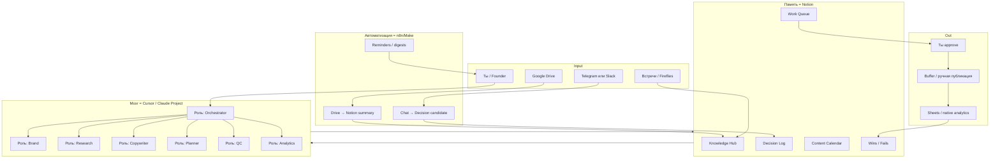

# SMM OS — No-Code Architecture

> **Не канон продукта.** Личный/скоростной прототип. Коммерческая архитектура: [SMM-OS-PRODUCT-ARCHITECTURE.md](./SMM-OS-PRODUCT-ARCHITECTURE.md).

**Версия:** 1.0 (No-Code Edition)  
**Для кого:** личный эксперимент без кода  
**Связь:** полная инженерная архитектура — `SMM-OS-ARCHITECTURE.md`; **продукт** — `SMM-OS-PRODUCT-ARCHITECTURE.md`.

---

## 1. Vision (упрощённая)

SMM OS No-Code — это не сервер и не 38 агентов в коде.

Это **операционная система из готовых инструментов**, где:

| Роль человека | Роль AI | Роль автоматизации |
|---|---|---|
| Решения, бренд, approve, publish | Пишет, исследует, проверяет | Достаёт знания, напоминает, логирует |

**Цель:** заменить рутину SMM-отдела (research, drafts, планы, чеклисты), не строить платформу.

---

## 2. Принцип: 1 мозг + 1 база + 1 конвейер

```
Ты (Owner)
    ↓
Cursor / Claude Project  =  «команда агентов» (промпты + роли)
    ↓
Notion                   =  Knowledge + Memory + Calendar + Queue
    ↓
n8n / Make               =  Ingestion + Reminders + Alerts
    ↓
Google Drive             =  Сырые файлы (брендбук, PDF, презентации)
    ↓
Buffer / Later / native  =  Публикация (человек или полуавтомат)
```

Никакого Postgres, Docker, LangGraph, vector DB «с нуля».

---

## 3. Стек (только no-code / low-config)

### Must-have (стартуй с этого)

| Инструмент | Зачем | Аналог |
|---|---|---|
| **Notion** | База знаний, брифы, контент-план, решения, QC | — |
| **Cursor** или **Claude Projects** | «Агенты» через роли + @файлы / Project Knowledge | ChatGPT Projects |
| **Google Drive** | Хранилище исходников | — |
| **n8n** (cloud) или **Make** | Автозабор сообщений, синки, напоминания | Zapier (дороже) |
| **Telegram** или **Slack** | Вход команд + алерты | — |

### Nice-to-have (фаза 2 no-code)

| Инструмент | Зачем |
|---|---|
| **Airtable** | Контент-календарь + статусы (если Notion тесен) |
| **Canva** | Креативы по шаблонам |
| **Buffer / Later / Publer** | Очередь постов |
| **Google Sheets** | Простая аналитика / трекинг метрик |
| **Fireflies / Grain** | Саммари встреч → Notion |
| **Typefully** | Черновики X / LinkedIn |

### Не использовать на старте

- Свой код, API-серверы, pgvector, Neo4j, Temporal  
- 30 отдельных «агентов» как сервисы  
- Автопубликация без approve  
- Полный ingest всех чатов компании в день 1  

---

## 4. Архитектура (No-Code)



### Слои простыми словами

1. **Gateway** — Telegram/Slack сообщение или ты открываешь Cursor.  
2. **Orchestrator** — один главный промпт: «разбей задачу, вызови нужные роли».  
3. **Specialists** — не код, а **сохранённые роли** (см. §6).  
4. **Memory/Knowledge** — Notion databases.  
5. **Tools** — Drive, Canva, Buffer, Sheets через копипаст / n8n / MCP в Cursor.  
6. **Output** — черновик в Notion → твой approve → публикация.

---

## 5. Notion = операционная система

Одна Notion workspace: **SMM OS**.

### 5.1. Databases (минимум 7)

| DB | Назначение | Ключевые свойства |
|---|---|---|
| **Knowledge Hub** | Все знания компании | Type (Brand/Product/ICP/Strategy/FAQ/Research), Authority (1–5), Source link, Last verified, Status |
| **Decision Log** | Решения из чатов/встреч | Decision, Date, Who, Impact (High/Med/Low), Affects (Brand/Product/Content), Synced to agents? |
| **Content Calendar** | План постов | Date, Platform, Status (Idea→Draft→QC→Approved→Published), Brief, Draft, Link |
| **Work Queue** | Задачи для AI/тебя | Priority, Type, Input brief, Assigned role, Output link |
| **Brand Kit** | ToV, запреты, примеры | Do / Don't, Examples good/bad |
| **Competitor Watch** | Конкуренты | Name, Notes, Last checked |
| **Learning Log** | Что сработало | Post link, Metric, Lesson, Reuse? |

### 5.2. Pages (wiki)

- `/Brand` — позиционирование, ToV, визуал  
- `/Product` — фичи, FAQ, roadmap (публичное)  
- `/ICP` — персоны, боли, язык  
- `/Playbooks` — «как сделать LinkedIn-пост», «как ответить в comments»  
- `/Agent Prompts` — тексты всех ролей (source of truth)

### 5.3. Правило актуальности

Если founder сказал «меняем позиционирование»:

1. Пишешь/вставляешь в **Decision Log** (1 минута).  
2. Обновляешь страницу `/Brand`.  
3. Ставишь `Last verified = today` в Knowledge Hub.  
4. В Cursor/Claude: «перечитай Brand + Decision Log».

**«Завтра агент знает»** = Notion обновлён + Project Knowledge / @страницы подключены. Без магии.

---

## 6. Агенты = роли (не микросервисы)

Не 38 ботов. **8 ролей** в одном Cursor/Claude Project.  
Каждая роль — страница в Notion + команда в чате.

### Как вызывать

В Cursor / Claude:

```
@Brand Kit @ICP @Product
Роль: Copywriter
Платформа: LinkedIn
Бриф: ...
Сначала сверься с Brand Kit. Потом черновик + список источников из Notion.
```

Или короткие слэш-команды (сохрани в Notion Playbooks):

| Команда | Роль |
|---|---|
| `/research` | Research |
| `/copy` | Copywriter |
| `/plan` | Planner |
| `/qc` | QC |
| `/brand` | Brand check |
| `/ideas` | Ideation |
| `/week` | Weekly plan |
| `/learn` | Разбор поста |

### 6.1. Orchestrator (ты + один системный промпт)

**Ответственность:** понять задачу, сказать какие роли и какие страницы Notion открыть.  
**Не делает:** сам длинные посты (делегирует).

### 6.2. Brand

**In:** draft или идея  
**Out:** pass/fail + правки ToV, запрещённые формулировки  
**Знания:** Brand Kit, Decision Log (High)

### 6.3. Research

**In:** вопрос / тема  
**Out:** summary + bullets + «откуда взято» (ссылки на Notion/Drive)  
**Знания:** Knowledge Hub, Product, ICP  
**Ограничение:** если нет в базе — пишет «не знаю, нужно уточнить у founder»

### 6.4. Copywriter

**In:** brief + research pack  
**Out:** draft под платформу + варианты хуков  
**Знания:** Brand Kit, ICP, примеры лучших постов (Learning Log)

### 6.5. Planner

**In:** цели недели / месяца  
**Out:** строки для Content Calendar (темы, платформы, цели)  
**Знания:** Strategy page, Calendar, Learning Log

### 6.6. QC

**In:** draft  
**Out:** чеклист: факты, бренд, повторы, ICP, CTA  
**Знания:** Brand Kit, Product facts, Decision Log

### 6.7. Ideation / Trends

**In:** ниша + свежие заметки  
**Out:** 10 идей с приоритетом  
**Знания:** ICP, Competitor Watch, Learning Log  
**Ручной input:** ты вставляешь тренды из TikTok/LinkedIn (или Make присылает дайджест ссылок)

### 6.8. Analytics Coach

**In:** цифры из Sheets / screenshots Insights  
**Out:** 3 вывода + 3 гипотезы на следующую неделю  
**Знания:** Learning Log, Calendar (published)

### Роли «позже» (не сейчас)

Community replies, SEO, Ads, Crisis, Influencer, CEO-agent — добавляй **только когда** 8 ролей уже в привычке.

---

## 7. Memory (упрощённая модель)

| Тип памяти | Где живёт | Как обновлять |
|---|---|---|
| Working | Текущий чат Cursor/Claude | Само |
| Session | Тред / Composer | Само |
| Brand | Notion Brand Kit | Вручную при изменениях |
| Decision | Decision Log | Ты или n8n из чата |
| Project / Campaign | Notion page кампании | Вручную |
| Episodic («что постили») | Content Calendar = Published | После публикации |
| Learning | Learning Log | Раз в неделю |
| Customer / ICP | ICP page | Редко, осознанно |

**Нет** отдельной vector memory. «Память» = актуальный Notion + то, что ты @тегаешь в чате.

---

## 8. Knowledge System (без RAG-инженерии)

### Как хранить знания

1. Важные документы → Google Drive (оригинал).  
2. Рабочая правда → **сжатая страница в Notion** (1–3 экрана), не 80-стр PDF целиком.  
3. В Claude Project / Cursor: загрузить ключевые Notion exports или держать `@` на файлы.  
4. Длинные PDF: один раз попроси AI сделать **Notion summary**, положи summary в Knowledge Hub (Authority 4–5).

### «RAG» в no-code = дисциплина

```
Нужен ответ
  → открой нужные страницы Notion / @файлы
  → роль Research
  → требуй цитаты заголовков страниц
  → если пусто → Decision Log / спроси founder
```

### Conflict detection (ручной)

Если новый Decision противоречит Brand:

1. n8n/ты создаёт карточку в Work Queue: «Conflict: positioning».  
2. Ты решает.  
3. Обновляешь Brand Kit.  
4. Ставишь Decision = Applied.

---

## 9. Communication Ingestion (no-code)

Полный автопилот «весь стартап в мозг» — **нет**.  
Есть **узкий и безопасный** пайплайн.

### Рекомендуемый поток

```
Founder Telegram (или #marketing Slack)
    ↓
Ты ставишь реакцию 📌 / тег #decision
    ↓
n8n / Make ловит сообщение
    ↓
Создаёт строку в Notion Decision Log
    (Decision = текст, Who = founder, Impact = High)
    ↓
Алерт тебе: «подтверди и обнови Brand если нужно»
    ↓
Ты confirm → опционально AI помогает переписать Brand page
```

### Почему не «все сообщения подряд»

Шум, privacy, противоречия, стоимость.  
Ingest только: **запиненные**, **#decision**, **#product**, **#brand**.

### Встречи

Fireflies/Grain → summary → Notion Knowledge Hub (type=Meeting).  
Раз в неделю 15 мин: перенести важное в Decision Log / Brand.

---

## 10. Request Lifecycle (как ты работаешь)

```
1. Задача появляется (идея / слот календаря / сообщение)
2. Создаёшь карточку в Work Queue (или пишешь /copy в Cursor)
3. Orchestrator-промпт: какие роли + какие @страницы
4. Research (если нужны факты)
5. Copywriter
6. QC + Brand
7. Черновик → Content Calendar (status Draft)
8. Ты правишь и Approved
9. Публикуешь (Buffer или руками)
10. Через 3–7 дней: цифры → Analytics Coach → Learning Log
```

Это и есть «Operating System» без кода.

---

## 11. Quality Control (чеклист, не сервис)

QC-роль заполняет в Notion checkbox:

- [ ] Факты совпадают с Product / FAQ  
- [ ] Нет противоречия Decision Log ( Holidays 30 дней)  
- [ ] ToV: Brand Kit Do/Don't  
- [ ] Нет запрещённых claims  
- [ ] Понятно ICP  
- [ ] Есть CTA (если нужен)  
- [ ] Не дублирует пост за 14 дней (глянь Calendar)  
- [ ] Длина/формат платформы  

**Правило:** Status ≠ Approved без галочек QC.

---

## 12. Learning (раз в неделю, 30–45 мин)

Ритуал **Weekly OS Review**:

1. Sheets / Insights: top 3 и bottom 3 поста.  
2. Analytics Coach: выводы.  
3. 3 записи в Learning Log.  
4. Planner: скорректировать следующую неделю.  
5. Обновить 1 playbook, если нашли паттерн.

Без этого система не «умнеет» — даже с кодом.

---

## 13. Integrations Map (no-code)

| Нужно | Инструмент | Как связать |
|---|---|---|
| Файлы бренда | Google Drive | Ссылки в Knowledge Hub |
| Правда компании | Notion | Руками + AI summaries |
| Агенты | Cursor / Claude Project | Промпты в `/Agent Prompts` |
| Решения из чата | Telegram/Slack → n8n → Notion | Только #decision |
| Напоминания | n8n | «Завтра 3 слота без драфта» |
| Дизайн | Canva Brand Kit | Шаблон + ссылка в Calendar |
| Публикация | Buffer / Later / native | После Approved |
| Аналитика | Sheets + screenshots | Еженедельно |
| Встречи | Fireflies → Notion | Auto summary |

MCP в Cursor — бонус (Notion MCP, Drive), если настроится без кода. Не блокер.

---

## 14. Workflows (каталог v1)

| ID | Workflow | Кто жмёт кнопку | Результат |
|---|---|---|---|
| W1 | Weekly Plan | Ты + Planner | 5–7 строк Calendar |
| W2 | Daily Draft | Ты + Research→Copy→QC | Draft в Calendar |
| W3 | Decision Capture | Реакция в чате + n8n | Decision Log |
| W4 | Brand Update | Ты после Decision | Brand Kit обновлён |
| W5 | Post-publish Learn | Ты раз в неделю | Learning Log |
| W6 | Competitor skim | Ты / Ideation | Заметки + идеи |
| W7 | Comment reply assist | Ты вставляешь comment | Draft reply + QC light |

Всё. Остальные из big-architecture — после привычки.

---

## 15. Roadmap No-Code (вместо Phase 0–Production eng)

### Phase N0 — 1 неделя: Skeleton

**Цель:** Notion OS + 3 роли работают руками.

- [ ] Workspace + 7 databases  
- [ ] Brand / Product / ICP pages заполнены  
- [ ] Промпты: Orchestrator, Research, Copywriter, QC  
- [ ] 5 eval-вопросов: Research отвечает верно  
- [ ] 2 драфта доведены до «можно публиковать»

**DoD:** ты сделал 1 пост end-to-end по системе.

### Phase N1 — 2–3 недели: Habit

- [ ] Content Calendar на 2 недели вперёд  
- [ ] Decision Log введён в культуру (хотя бы founder)  
- [ ] Weekly OS Review 1 раз прошёл  
- [ ] Learning Log ≥5 записей  

### Phase N2 — месяц: Light Automation

- [ ] n8n: #decision → Notion  
- [ ] n8n: daily digest «пустые слоты календаря»  
- [ ] Buffer подключен  
- [ ] Fireflies → Notion (если есть встречи)

### Phase N3 — когда болит

Только если упираешься в лимиты Notion/ручного @контекста:

- отдельный Claude Project только под Brand  
- Airtable для календаря  
- найм/партнёр на **узкий** код (search по большой базе)

**Инженерный Phase 0 из `PHASE-0-IMPLEMENTATION.md` — не начинать**, пока N0–N2 не стабильны 4+ недели.

---

## 16. Что сознательно выкинули из большой архитектуры

| Было (eng) | Стало (no-code) |
|---|---|
| 38 агентов | 8 ролей |
| Orchestrator service | Промпт + твоя дисциплина |
| Vector DB / hybrid search | Notion + @страницы + summaries |
| Graph memory | Decision Log + links |
| Comms auto-ingest all | Только #decision / 📌 |
| QC agents pipeline | Чеклист + роль QC |
| Learning system | Weekly ritual |
| Multi-platform publishers | Buffer + руки |
| Temporal / LangGraph | Чеклист workflow W1–W7 |

Большой документ = карта «куда можно вырасти».  
Этот документ = **карта «что делать руками сегодня»**.

---

## 17. Security & Hygiene (коротко)

- Не скармливай AI зарплаты, пароли, личные переписки.  
- Decision Log без чувствительного — формулируй нейтрально.  
- Публикация только после Approved.  
- Brand Kit = единственный source of truth для тона.  
- Раз в месяц: `Last verified` на ключевых Knowledge pages.

---

## 18. Risks

| Риск | Как обойти |
|---|---|
| «Снова просто ChatGPT» | Без Notion Calendar + QC + Decision Log — это не OS. Держи ритуал. |
| Устаревший бренд в чате | Decision Log + Last verified |
| Overwhelm | Только 8 ролей и W1–W7 |
| Нет времени на Weekly Review | Тогда система не учится — сократи контент, не автоматизацию |
| Хочется сразу код | Сначала 4 недели N0–N2 |

---

## 19. Success Metrics (простые)

- Постов по процессу / неделя  
- % драфтов с пройденным QC  
- Время от brief → Approved  
- Decision Log: решения не теряются  
- Learning Log: ≥3 урока / неделя  
- Субъективно: меньше хаоса, меньше «забыли позиционирование»

---

## 20. Immediate Next Actions (сегодня–завтра)

1. Создай Notion workspace **SMM OS** и 7 DB из §5.1.  
2. Заполни Brand Kit + ICP + Product (даже черновиком).  
3. Вставь 4 промпта ролей на страницу Agent Prompts.  
4. Сделай один цикл: brief → Research → Copy → QC → Calendar.  
5. Только потом думай про n8n.

---

## 21. Связь с другими документами

| Документ | Роль |
|---|---|
| `SMM-OS-ARCHITECTURE.md` | Long-term / eng vision (не строить сейчас) |
| `PHASE-0-IMPLEMENTATION.md` | Инженерный Phase 0 — **отложен** |
| **Этот файл** | Актуальный план реализации |

Когда no-code упрётся в потолок (тысячи доков, команда, SLA) — вернуться к eng-архитектуре точечно, а не целиком.

---

**Итог:** Operating System = **Notion (память) + Cursor/Claude (команда) + n8n (нервы) + ты (CEO).**  
Код не обязателен, пока не обязателен объём.
