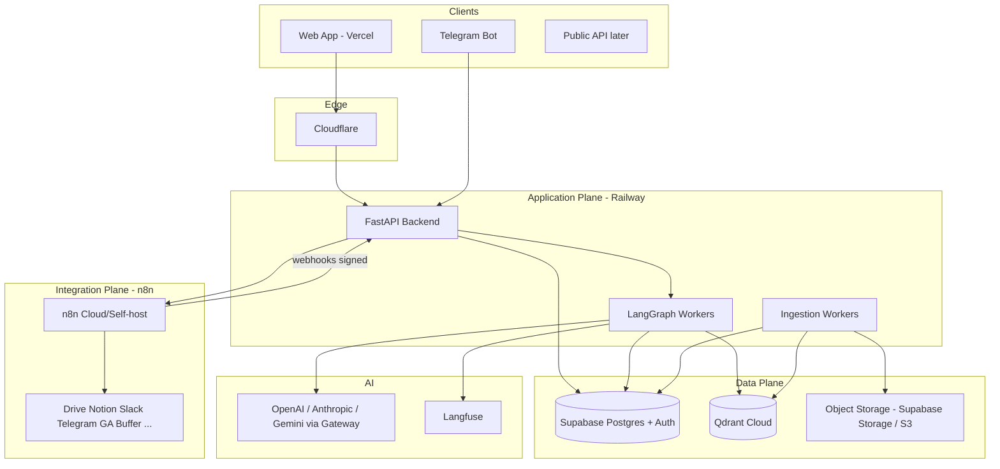
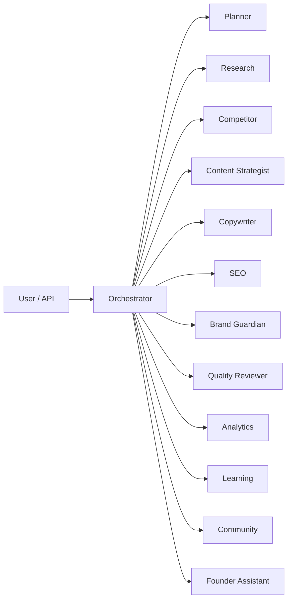
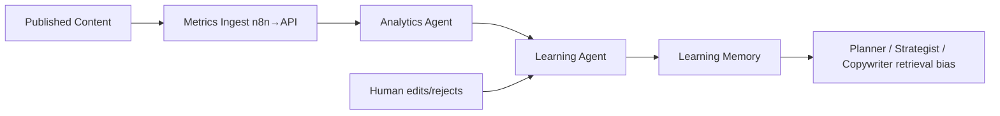

# SMM OS — Product Architecture v1

**Версия:** 1.0 (Commercial Product Foundation)  
**Статус:** Architecture for a sellable AI SMM Operating System  
**Горизонт:** 3–5 лет развития → multi-tenant SaaS  
**Аудитория:** Founder-architect, future engineering hires, investors/technical due diligence  

**Связь с другими документами:**
| Документ | Роль |
|---|---|
| `SMM-OS-ARCHITECTURE.md` | Исследовательский max-scope blueprint (38 агентов) — reference, не implementation target |
| `SMM-OS-NOCODE.md` | Личный прототип — **не** продукт |
| `PHASE-0-IMPLEMENTATION.md` | Legacy eng draft — ignore |
| `PHASE-0-PRODUCT.md` | **Active P0 implementation** (schema, API, LangGraph) |
| **Этот файл** | **Каноническая архитектура продукта** |

---

## 1. Product Vision

SMM OS — **multi-tenant AI Operating System**, которая закрывает функции SMM-департамента для стартапа или SMB:

исследование → стратегия → контент → QC → публикация (HITL) → аналитика → обучение.

Это **не** чат-бот и **не** «обёртка над ChatGPT».  
Дифференциатор продукта:

1. **Company-grounded knowledge layer** (отдельный от чата)  
2. **Specialized agent team** с оркестрацией и контрактами  
3. **Decision-aware memory** (решения founder’а становятся системной правдой)  
4. **Closed-loop learning** от performance метрик обратно в рекомендации  
5. **Human-in-the-loop** как продукт-фича (trust), не как костыль  

### Commercial framing

| Покупатель | Боль | Ценность SMM OS |
|---|---|---|
| Early startup (1–2 marketing) | Нет SMM-команды | «Виртуальный отдел» с контролем founder’а |
| SMB / agency | Дорого держать full SMM | Ускорение + стандартизация качества |
| Scale-up | Знания размазаны, off-brand | Единый knowledge + brand guardrails |

**Модель продажи (целевая):** SaaS per workspace (tenant) + usage (LLM tokens) + seats.  
Архитектура с дня 1 должна допускать tenant isolation, даже если v1 обслуживает 1–3 клиентов вручную.

---

## 2. Design Principles (обязательные)

1. **Buy undifferentiated, build differentiated**  
   Auth, DB hosting, vector infra, observability — managed.  
   Agent logic, knowledge quality, learning loop, SMM workflows — своё.

2. **One brain (backend), many nerves (n8n)**  
   n8n = connectors/webhooks only. Вся бизнес-логика в FastAPI + LangGraph.

3. **Knowledge ≠ Sources**  
   Drive/Notion/PDF — ingestion sources. **System of record для знаний — Knowledge Layer (Qdrant + Postgres metadata).**

4. **10–15 agents, not 38**  
   Достаточно специализации для качества; достаточно мало для поддержки одним человеком → маленькой командой.

5. **HITL by default for irreversible / brand-critical actions**  
   Publish, brand/ICP/strategy mutations — proposal → approval.

6. **Multi-model from day 1**  
   Router по задаче/стоимости/качеству; vendor lock-in = риск продукта.

7. **Observable agents**  
   Каждый run трассируется (Langfuse). Без этого нельзя продавать enterprise trust.

8. **Progressive multi-tenancy**  
   Schema и auth tenant-aware сразу; биллинг и self-serve — позже.

---

## 3. Architecture Overview



### Planes

| Plane | Responsibility | Why split |
|---|---|---|
| **Application** | Authz business rules, agents, approvals, learning | Competitive core |
| **Data** | Tenants, relational state, vectors, files | Durable product state |
| **Integration** | OAuth quirks, webhooks, polling social APIs | High churn, low differentiation |
| **Edge/Obs** | CDN, WAF, tracing, product analytics | Sellability + ops |

---

## 4. Technology Stack — Decisions & Alternatives

### 4.1 Development

| Tech | Role | Why |
|---|---|---|
| **Cursor** | Primary IDE + agent-assisted coding | Speed for solo founder |
| **GitHub** | Source, PRs, Actions CI | Industry default; hiring-ready |

### 4.2 Backend — FastAPI (Python)

**Choice:** FastAPI on Railway.

| Alternative | Why not (now) |
|---|---|
| NestJS/Node | Слабее экосистема AI (LangGraph/LlamaIndex) |
| Django | Тяжелее для agent-first API |
| Serverless-only (Lambdas) | Плохо для long LangGraph runs |

**Sellability:** Python AI stack = легче нанимать AI engineers.  
**Cost:** Railway dyno дешевле команды на K8s.  
**Complexity:** Один сервис + workers; не 100 microservices.

### 4.3 Agent Orchestration — LangGraph

**Choice:** LangGraph as workflow engine for agent DAGs.

| Alternative | Pros | Cons | Verdict |
|---|---|---|---|
| Raw LLM chains | Simple | No durable state, hard HITL | Reject for product |
| Temporal + custom | Excellent durability | Ops/cost heavy for solo | Phase: later if needed |
| CrewAI/AutoGen | Fast demo | Weaker control/contracts for SaaS | Reject as core |
| **LangGraph** | Checkpointing, HITL interrupts, Python-native | Learning curve | **Select** |

**Best practice:** Explicit graph nodes = agents; shared state schema; interrupt before publish/brand write.

### 4.4 LLM Gateway — Multi-provider

**Choice:** LiteLLM (or thin custom router) in front of OpenAI, Anthropic, Gemini.

| Route | Typical model tier | Rationale |
|---|---|---|
| Orchestrator / Planner | Strong (Claude Sonnet / GPT-4.1-class) | Planning quality |
| Copywriter / Brand | Strong | Brand-sensitive |
| Research synthesis | Strong + tools | Grounding |
| Classification / routing / extract | Cheap (Haiku / Flash / mini) | Cost control |
| Embeddings | Dedicated embedding model | Stable retrieval |

**Why multi-model:** margin control, outage resilience, task-fit, procurement flexibility for B2B.

### 4.5 Database — Supabase (PostgreSQL)

**Use for:** users, orgs/tenants, workspaces, projects, content items, approvals, runs, settings, billing stubs, integration credentials metadata (secrets in vault).

| Alternative | Why not |
|---|---|
| Plain Railway Postgres | Lose Auth/Realtime/Storage convenience |
| Firebase | Weaker relational + SQL analytics |
| Mongo-only | Bad fit for approvals/joins |

**Multi-tenancy:** `org_id` / `workspace_id` on every business table + RLS policies in Supabase.

**Sellability:** Postgres + RLS is a credible B2B story («your data is isolated»).

### 4.6 Knowledge Layer — Qdrant Cloud (mandatory)

**System of record for semantic knowledge:** Qdrant collections per tenant (or single collection + `tenant_id` payload filter — see §8).

| Alternative | Why rejected for product |
|---|---|
| Notion as KB | Not productizable; not your Moat; poor retrieval control |
| pgvector only | OK for MVP toy; weaker filtering/scale/hybrid story; couples OLTP + vector load |
| Pinecone | Fine commercially; Qdrant chosen for cost/control/hybrid + EU options |
| Weaviate | Heavier ops/features than needed v1 |

**Supabase stores:** document registry, versions, source pointers, permissions, sync cursors.  
**Qdrant stores:** embeddings + payload (chunk text, metadata).  
**Object storage:** raw files (PDF/DOCX).

This split is a **product differentiator**: «We index your company brain; Notion is just a source.»

### 4.7 Integration Layer — n8n

**n8n does:** OAuth apps, file fetch, webhook receive, schedule polls, push «raw events» to backend.

**n8n does NOT:** agent reasoning, QC decisions, memory updates, learning logic, tenant authz.

```
Source → n8n → POST /webhooks/integrations/{source} (HMAC) → FastAPI → queue → workers
```

| Alternative | Verdict |
|---|---|
| Zapier | Expensive at scale; less self-host control |
| Make | OK; n8n preferred for self-host + cost |
| Custom connectors only | Too slow for solo; build top 3 later in-house if needed |

### 4.8 Deployment & Observability

| Service | Role | Why managed |
|---|---|---|
| **GitHub Actions** | CI (lint, test, migrate) | Standard |
| **Railway** | FastAPI + workers | Low ops, good DX solo→small team |
| **Vercel** | Frontend (dashboard) | Fast UI iteration |
| **Supabase** | Postgres + Auth + Storage | Auth/RLS/Storage bundle |
| **Qdrant Cloud** | Vectors | Avoid self-host vector ops |
| **Cloudflare** | DNS, TLS, WAF, rate limit edge | Security baseline for SaaS |
| **Sentry** | App errors | MTTR |
| **Langfuse** | LLM/agent traces, cost, eval hooks | AI engineering standard; enterprise trust |
| **PostHog** | Product analytics (funnels, feature flags) | Understand buyers, not just models |

**Later (not v1):** Kubernetes, separate microservice per agent, data warehouse — when revenue justifies.

---

## 5. Multi-Tenancy Model (SaaS-ready)

```
Organization (customer company)
  └── Workspace (brand / product line)
        └── Sources, Agents config, Content, Memory partitions, Members
```

**Isolation strategy (v1 choice):**

| Approach | Pros | Cons | Decision |
|---|---|---|---|
| DB-per-tenant | Strong isolation | Ops nightmare solo | Later enterprise SKU |
| **Shared DB + `workspace_id` + RLS** | Simple, cheap | Must be disciplined | **v1** |
| Qdrant collection-per-tenant | Clean deletes | Collection sprawl | Optional at 50+ tenants |
| **Qdrant shared collection + payload filter `workspace_id`** | Simple | Filter bugs = data leak risk | **v1 with hard tests** |

**Security gate for sale:** automated tests that tenant A cannot retrieve tenant B vectors/rows.

---

## 6. Logical Components

### 6.1 API Gateway (FastAPI)

- Auth (Supabase JWT)
- Workspace scoping
- CRUD: sources, documents, content, campaigns, approvals
- `POST /runs` — start agent workflows
- `POST /webhooks/...` — from n8n
- Approval endpoints (approve/reject/edit)

### 6.2 Orchestrator (LangGraph)

- Intent classification
- Plan DAG of agents
- Parallel where safe (research ∥ competitor)
- Sequential where needed (copy → brand → QC)
- Interrupt nodes for HITL
- Persist run state (LangGraph checkpoint in Postgres)

### 6.3 Knowledge Services

- Source connectors (via n8n events)
- Parse/normalize (PDF/DOCX/MD/HTML)
- Chunk + embed + upsert Qdrant
- Metadata + ACL in Supabase
- Retrieval API: hybrid-ish (dense + metadata filters; sparse later)

### 6.4 Memory Services

- Typed memory read/write APIs
- Promotion rules (approved decisions → Brand/Company memory)
- TTL / retention policies

### 6.5 Learning Services

- Ingest performance metrics (via n8n from GA/social)
- Attribute to content items
- Update Learning Memory + procedural hints
- Feed Planner/Copywriter retrieval bias

### 6.6 Integration Dispatcher

- Outbound jobs to n8n («publish to Buffer», «fetch Drive folder»)
- Idempotency keys
- Never trust n8n for authorization — backend signs and validates

---

## 7. Agents (12 specialists)

Principle: **roles with contracts**, not personas for show.

### AGENT MAP



---

### 1. Orchestrator

| | |
|---|---|
| **Role** | Intent → plan → delegate → aggregate → HITL gates |
| **Inputs** | User request, workspace context, run config |
| **Outputs** | Execution plan, final package, approval requests |
| **Tools** | Agent invocation, memory read, knowledge retrieve |
| **Memory** | Working + Company (read) |
| **When** | Every user/API run |

---

### 2. Planner

| | |
|---|---|
| **Role** | Campaign/week plans, calendars, task breakdown |
| **Inputs** | Goals, ICP, past learning, constraints |
| **Outputs** | Content plan items (structured), milestones |
| **Tools** | KB retrieve, Learning Memory, calendar write (draft) |
| **Memory** | Campaign, Learning, Company |
| **When** | `/plan`, weekly jobs, campaign start |

---

### 3. Research

| | |
|---|---|
| **Role** | Grounded research from KB + approved web search |
| **Inputs** | Question/topic, must-cite policy |
| **Outputs** | Brief with citations (doc/chunk IDs) |
| **Tools** | Qdrant retrieve, web search (optional), doc fetch |
| **Memory** | Product, Company, Working |
| **When** | Before strategy/copy; ad-hoc Q&A |

---

### 4. Competitor Analysis

| | |
|---|---|
| **Role** | Competitor positioning, content gaps, move alerts |
| **Inputs** | Competitor set, timeframe |
| **Outputs** | Comparison brief, opportunity list |
| **Tools** | KB competitor partition, web/social fetch via n8n |
| **Memory** | Company, Customer (ICP), Campaign |
| **When** | Planning, on-demand, scheduled watch |

---

### 5. Brand Guardian

| | |
|---|---|
| **Role** | Enforce ToV, claims policy, visual/verbal identity |
| **Inputs** | Draft or proposed brand change |
| **Outputs** | Pass/fail, annotated violations, safe rewrite suggestions |
| **Tools** | Brand Memory retrieve, policy checklist |
| **Memory** | Brand (primary), Decision |
| **When** | After copy; before approve; on brand edit proposals |

---

### 6. Content Strategist

| | |
|---|---|
| **Role** | Narrative pillars, funnel fit, channel mix |
| **Inputs** | Goals, ICP, research, learnings |
| **Outputs** | Strategy memo, pillar → topic map |
| **Tools** | KB, Learning Memory |
| **Memory** | Company, Customer, Campaign, Learning |
| **When** | Campaign design, monthly strategy refresh |

---

### 7. Copywriter

| | |
|---|---|
| **Role** | Platform-specific drafts |
| **Inputs** | Brief, research pack, platform, constraints |
| **Outputs** | Draft variants + hooks + CTA options |
| **Tools** | KB retrieve, Brand Memory read |
| **Memory** | Brand, Product, Customer, Learning (what worked) |
| **When** | Content production runs |

---

### 8. SEO

| | |
|---|---|
| **Role** | Keywords, search intent, on-page for long-form / YT titles |
| **Inputs** | Topic, GSC insights (if connected) |
| **Outputs** | SEO brief, title/description options |
| **Tools** | KB, Search Console data (via n8n→API), web |
| **Memory** | Product, Customer, Learning |
| **When** | Blog/YouTube/LinkedIn articles; skip for pure Reels if N/A |

---

### 9. Quality Reviewer

| | |
|---|---|
| **Role** | Multi-check: facts, brand, ICP, strategy alignment, duplicates |
| **Inputs** | Draft + citations + plan context |
| **Outputs** | Scorecard, blocking issues, non-blocking nits |
| **Tools** | KB fact-check retrieve, Brand Guardian call, calendar duplicate check |
| **Memory** | Brand, Product, Decision, Campaign |
| **When** | Always before HITL approve for publish |

---

### 10. Analytics

| | |
|---|---|
| **Role** | Ingest and interpret performance |
| **Inputs** | Metrics payloads, content IDs |
| **Outputs** | Reports, anomaly flags, ranked winners/losers |
| **Tools** | Metrics DB, GA/social via integration |
| **Memory** | Campaign, Learning (write candidate) |
| **When** | Post-publish jobs, weekly digest |

---

### 11. Learning Agent

| | |
|---|---|
| **Role** | Turn analytics into durable lessons and retrieval preferences |
| **Inputs** | Analytics reports, human feedback on drafts |
| **Outputs** | Learning Memory entries, prompt/strategy hints (versioned) |
| **Tools** | Memory write (Learning), optional eval dataset append |
| **Memory** | Learning (write), Campaign (read) |
| **When** | After Analytics; after human reject/edit patterns |

---

### 12. Community Assistant

| | |
|---|---|
| **Role** | Draft replies to comments/DMs; escalate sensitive |
| **Inputs** | Thread, brand policy, FAQ |
| **Outputs** | Reply drafts + risk level |
| **Tools** | KB FAQ, Brand Memory |
| **Memory** | Brand, Product, Conversation |
| **When** | Inbound community events (n8n→webhook) |

---

### 13. Founder Assistant *(optional 13th — include in v1)*

| | |
|---|---|
| **Role** | Capture decisions from founder chat; propose memory updates |
| **Inputs** | Message/thread, existing Brand/ICP |
| **Outputs** | Decision candidates, conflict warnings, approval cards |
| **Tools** | Decision Memory write (pending), conflict detect vs Brand |
| **Memory** | Decision, Conversation, Brand (read) |
| **When** | Founder channel events; manual «log decision» |

**Explicitly deferred (from 38-agent design):** separate TikTok/LinkedIn/YouTube micro-agents, Crisis, Influencer, Legal, Ads optimizer — fold into Copywriter (platform adapters) + Strategist until revenue.

---

## 8. Knowledge Layer Design

### 8.1 Pipeline

```
Source (Drive/Notion/PDF/...)
  → n8n fetch/notify
  → Backend Ingestion Worker
  → Store raw in Object Storage
  → Parse → Clean → Chunk
  → Embed
  → Upsert Qdrant (payload + vector)
  → Registry row in Supabase (document, version, hash, source_uri)
```

### 8.2 Chunking (v1)

- Structure-aware where possible (headings)
- ~400–800 tokens, overlap ~10–15%
- Payload: `workspace_id`, `doc_id`, `source_type`, `doc_type`, `authority`, `language`, `updated_at`, `partition`

**Partitions:** `brand`, `product`, `icp`, `strategy`, `research`, `competitor`, `content_history`, `other`

### 8.3 Retrieval

v1: dense retrieval + metadata filters + authority boost.  
v1.5: hybrid (BM25/sparse via Qdrant) when eval plateaus.  
Rerank: optional cross-encoder/LLM rerank for QC/Research only (cost).

### 8.4 Why this is sellable

Buyers understand: «Connect Drive/Notion → we build a private indexed brain → agents only answer from it.»  
That is a clearer Moat than «chat with Notion.»

---

## 9. Memory Architecture

Memories are **typed stores** with different durability and write permissions.

| Memory | What | Storage | Updated by | HITL? |
|---|---|---|---|---|
| **Working Memory** | Current run state | LangGraph state / Redis optional | Orchestrator | No |
| **Conversation Memory** | Threads with users/community | Supabase | API, Community, Founder Assistant | Soft |
| **Brand Memory** | ToV, claims, identity | Supabase structured + Qdrant partition `brand` | Brand edits **after approval** | **Yes** |
| **Product Memory** | Features, FAQ, roadmap public facts | Supabase + Qdrant `product` | Ingestion + approved product updates | Yes for material changes |
| **Company Memory** | Positioning, mission, voice of company | Supabase + Qdrant | Approved decisions / docs | **Yes** |
| **Customer Memory** | ICP, personas, objections | Supabase + Qdrant `icp` | Approved ICP changes | **Yes** |
| **Campaign Memory** | Goals, pillars, calendar for campaign | Supabase | Planner / Strategist | Review |
| **Decision Memory** | Timestamped decisions + rationale | Supabase (`decisions`) | Founder Assistant / human | **Yes** to apply |
| **Learning Memory** | What worked/failed, patterns | Supabase + optional Qdrant | Learning Agent | Review weekly / auto for low-risk |
| **Episodic Content Memory** | Published posts + metrics link | Supabase `content_items` | Publish + Analytics | No |

**Update rule:** Agents may **propose** writes to Brand/Product/Customer/Company/Decision. Only approval workflow **commits** and triggers re-index.

---

## 10. Human-in-the-Loop

### Hard gates (cannot auto-complete)

- Publish to any channel  
- Apply Decision → Brand/ICP/Strategy  
- Delete knowledge / disconnect source  
- Change tenant billing/admin  

### Soft gates (configurable per plan)

- First-time campaign strategy  
- Community replies above risk threshold  

### UX

AI produces **Approval Card**: diff / draft / sources / risk.  
Human: Approve | Edit & Approve | Reject (+ reason → Learning).

LangGraph `interrupt()` before side effects.

---

## 11. Learning System



### Metrics (normalize across platforms)

Reach/impressions, CTR, ER, comments, saves, shares, follows, link clicks, watch time (where applicable).

### Learning outputs (structured)

- Topic affinity scores per ICP segment  
- Hook/CTA patterns that win  
- Negative constraints («avoid X framing»)  
- Best posting windows (weak signal — careful)

### Anti-patterns

- Don’t silently overwrite Brand from a viral joke post  
- Separate **performance learning** from **brand truth**  
- Require min sample size before strong recommendations  

---

## 12. Request Lifecycle (product)

```
1. Auth + workspace resolve
2. Intent detection (cheap model)
3. Knowledge retrieval (Qdrant) + memory load
4. Planner / Orchestrator DAG
5. Specialist agents execute (traced in Langfuse)
6. Quality Reviewer scorecard
7. HITL interrupt if needed
8. Persist artifacts (Supabase)
9. Side effects via n8n (publish, notify)
10. Post-run: metrics hooks scheduled
11. Learning loop async
```

---

## 13. Security & Compliance Baseline

- Supabase RLS by `workspace_id`  
- Qdrant payload filter enforced server-side only (never trust client)  
- Secrets: Supabase vault / env on Railway; n8n credentials isolated  
- Webhook HMAC + replay protection  
- PII redaction policies on Conversation Memory  
- Audit log for approvals and knowledge applies  
- Sentry + Langfuse access control  

Enterprise add-ons later: SSO, DPA, region pinning, VPC — architecture must not block them.

---

## 14. Cost Model (unit economics awareness)

| Cost driver | Control |
|---|---|
| LLM tokens | Router, caching, cheap classifiers |
| Embeddings | Incremental re-embed on hash change |
| Qdrant | Cap dimensions/collections; retention on raw chunks |
| n8n executions | Batch; prefer webhooks over poll where possible |
| Railway | Scale workers on queue depth |

**Pricing implication:** charge seat + usage; show Langfuse-derived usage in app (trust + margin).

---

## 15. Implementation Roadmap (product, not personal toy)

### P0 — Foundation (4–8 weeks, solo-realistic)

- Supabase schema (orgs, workspaces, users, RLS)  
- FastAPI skeleton + auth  
- Qdrant collection + ingest 1–2 sources (Drive + PDF)  
- LangGraph: Orchestrator → Research → Copywriter → Brand → QC → HITL  
- Vercel minimal dashboard: run + approve  
- Langfuse + Sentry  

**Exit:** one paying pilot can connect Drive, ask grounded Q, get draft, approve.

### P1 — Knowledge OS

- Notion + Docs/Sheets ingest via n8n  
- Decision Memory + Founder Assistant  
- Partitions + authority  
- Eval set for retrieval  

### P2 — Full agent roster + calendars

- Remaining agents  
- Campaign/Planner UI  
- Buffer/LinkedIn publish via n8n + HITL  

### P3 — Learning loop + analytics

- Metrics ingest  
- Learning Agent live  
- Weekly digest  

### P4 — SaaS hardening

- Billing, self-serve onboarding  
- Tenant admin  
- SLAs, SSO prep  
- Hybrid search, stronger eval harness  

---

## 16. What We Explicitly Will Not Build in v1

- 38 single-purpose platform agents  
- Notion as system of record  
- Business logic in n8n  
- Auto-publish without approval  
- Self-hosted K8s  
- Real-time multi-agent «debate theater» without contracts  

---

## 17. Success Criteria for Architecture (due diligence checklist)

- [ ] Tenant isolation proven by tests  
- [ ] Knowledge sources ≠ knowledge store  
- [ ] Agent runs fully traced  
- [ ] HITL on publish + brand/ICP/strategy  
- [ ] Learning does not corrupt Brand Memory  
- [ ] n8n replaceable without rewriting core logic  
- [ ] Second customer onboardable without code fork  

---

## 18. Summary Decision Table

| Decision | Choice | Scalability | Cost | Maintainability | Sellability | AI Eng practice |
|---|---|---|---|---|---|---|
| API | FastAPI | High | Low | High | High (AI hiring) | Standard |
| Orchestration | LangGraph | High | Low–Med | Med | High | Best-in-class HITL graphs |
| OLTP | Supabase | High | Med | High | High | RLS multi-tenant |
| Vectors | Qdrant Cloud | High | Med | High | High («real KB») | Separated vector tier |
| Integrations | n8n edge only | Med–High | Low | Med | Med | Thin anti-corruption layer |
| LLMs | Multi-provider | High | Controlled | Med | High | Gateway pattern |
| Agents | 12–13 | Med | Controlled | High | High | Specialization without sprawl |
| Frontend | Vercel | High | Low | High | High | Fast iteration |
| Obs | Langfuse+Sentry+PostHog | High | Med | High | Very High | Required for AI SaaS |

---

**This document is the product north star.**  
Next artifact to produce when ready: `PHASE-0-PRODUCT.md` — concrete schema + API + first LangGraph graph aligned to P0 above.
